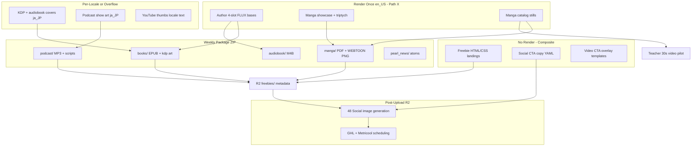

# Image Asset → Deliverable Mapping

**Authority:** Pearl_Architect coordinator session 2026-05-30  
**Companion artifact:** `artifacts/catalog/image_bank_coverage_plan_nonmanga_2026-05-30.tsv`  
**Scope:** Non-manga-interior image slots only. **Manga interior panels are owned by Prompt 3 (Pearl_Dev)** — see deferral section below.

---

## Purpose

Maps each image-bank slot type to the book, manga, podcast, video, marketing, and freebie deliverables that consume it, and describes how Wave-1 weekly-package assembly threads assets together without rendering (planning only).

---

## Governing policies

| Policy | Application to this mapping |
|--------|----------------------------|
| **COVER-REGISTRY-01** | Book-side author bases live in `config/authoring/author_cover_art_registry.yaml`; manga has no cover registry. Two-stage cover: FLUX imagery → PIL text composite. |
| **IMG-RENDER-DUAL-PATH-V1-01** | Pearl Star = primary Tier-2 canonical path; RunComfy = locale-overflow when budget allows ($10/mo soft cap). This doc plans slots only — no dispatch. |
| **Path X render-once** | Author FLUX bases + manga showcase covers: render once `en_US`, ship cross-market. KDP/audiobook covers and video/marketing may require per-locale variants. |
| **Prompt 1 matrix** | `artifacts/coordination/brand_locale_surface_coverage_matrix_2026-05-30.tsv` supplies `image_bank_cover` / `image_bank_interior` required counts; interior deferred here. |

---

## Asset type → deliverable consumption matrix

### Book pipeline (Pearl Prime)

| Asset slot | Primary deliverables | Assembly path | Render path |
|------------|---------------------|---------------|-------------|
| `author_base_background` | Legacy audiobook/KDP composite input | `scripts/generate_author_cover_art_bases.py` → `generate_cover.py` PIL overlay | Pearl Star (FLUX) or PIL gradient seed |
| `author_cover_slot_symbolic` | Per-book KDP front, audiobook square export | `generate_cover.py` selects slot + brand palette tokens | Pearl Star FLUX once per author; PIL per book |
| `author_cover_slot_environmental` | Same | Same | Pearl Star |
| `author_cover_slot_abstract` | Same | Same | Pearl Star |
| `author_cover_slot_human` | Same | Same | Pearl Star |
| `kdp_cover_front` | EPUB/PDF book package, Amazon KDP listing, weekly `books/` ZIP | `run_pipeline.py --render-book` → `artifacts/covers/{author_id}/` → `build_admin_packets.py` | Pearl Star; ja/zh overflow → RunComfy |
| `audiobook_cover` | M4B/AAC audiobook axis, Audible/Apple metadata | Brand-Admin audiobook axis MVP (`ws_brand_admin_v2_real_content_build_audiobook_axis`) | Pearl Star |

**Wave-1 (`stillness_press` US1):** 12 pen-name author 4-slot FLUX bases are the blocking book-cover bank gap (0/48 on disk). Existing 4 kdp + 2 audiobook wizard seeds are demo seeds, not catalog-scale.

**Wave-1 JP1:** Reuses author bases (Path X); needs 800 kdp + 800 audiobook cells for `ja_JP` — currently 0 present.

---

### Manga pipeline (retail / showcase covers only)

| Asset slot | Primary deliverables | Assembly path | Render path |
|------------|---------------------|---------------|-------------|
| `triptych_teacher_showcase` (portrait/scene/symbolic) | Brand wizard teacher pages, LoRA training refs, investor showcase | `generate_teacher_showcase_triptych.py` → `brand-wizard-app/public/assets/manga_covers/` | Pearl Star (**complete** — 13/13 teachers) |
| `manga_cover_showcase` (front/three_quarter/profile/topic) | Manga series listing art, WEBTOON canvas metadata, brand-admin manga axis PDF cover page | Catalog packaging + `build_admin_packets.py` manga axis | Pearl Star en_US; RunComfy locale expansion |
| `manga_cover_back` | Print KDP wrap (aspirational) | `specs/manga_cover_full_assembly.md` — not on disk | none (deferred) |
| `showcase_cover` | Teacher marketing stills (13 in `public/assets/covers/`) | Separate from manga_covers taxonomy | Pearl Star |

**Not in this mapping:** `manga_panel`, `manga_image_bank` reuse BGs, character model sheets for interior composition → **Prompt 3 artifact**.

---

### Video / podcast pipeline

| Asset slot | Primary deliverables | Assembly path | Render path |
|------------|---------------------|---------------|-------------|
| `youtube_thumbnail` | YouTube long-form + Shorts listing | VCE `run_render.py` thumb extract or FLUX bank | Pearl Star |
| `youtube_end_card` / `cta_overlay` | Last-10s overlay, Shorts/TikTok/IG text | `config/video/video_cta_templates.yaml` at mux | none (template overlay) |
| `podcast_cover_art` | Podcast RSS/Apple/Spotify show art | `config/podcast/cover_art_design_system.yaml` | none (compositor) or Pearl Star if raster added |
| `video_bank` (global 3) | VCE b-roll, brand-agnostic wizard demos | `brand-wizard-app/public/assets/video_bank/vb_*.png` | Pearl Star (**met**) |
| `teacher_video_bank` | FLUX resolver per teacher for 30s vertical | Intended `artifacts/video/image_banks/{teacher}/` — **manifests broken** | Pearl Star |
| `teacher_30s_vertical` (composite) | Teacher × Manga 30s deliverable (12 teachers) | `scripts/video/run_render.py` + manga catalog stills | Pearl Star ComfyUI stills + ffmpeg |

**Wave-1:** ahjan / `stillness_press` en_US script exists; feedstock = `assets/manga_catalog/stillness_press` (~1906 PNG). Render pilot defaults to joshin / `cognitive_clarity` ja_JP per TEACHER-MANGA-30S spec.

---

### Marketing / social pipeline

| Asset slot | Primary deliverables | Assembly path | Render path |
|------------|---------------------|---------------|-------------|
| `social_cta_topic_config` (15×8) | 48 Social post copy, GHL funnels, Metricool scheduling | `config/funnel/social_cta_config.yaml` → external 48 Social engine | none (copy) |
| `social_image_per_book` (~40/book) | Instagram/TikTok/Pinterest quote cards, carousels, hooks | 48 Social reads R2 `{brand}/{week}/` manifest | External (48 Social) |
| `v32_social_text_wiring` | YouTube hooks, Pinterest titles, quote card text | `config/marketing/v32_social_wiring.yaml` | none |
| Brand wizard demo MP4s | Sales demos, onboarding previews | `brand-wizard-app/public/assets/video/` (22 MP4s) | Pre-rendered motion |

**Gap:** Weekly package `DELIVERABLE_TYPES` has no `social_images` axis — social is downstream of R2 upload + 48 Social pull, not in the Wave-1 ZIP.

---

### Freebie / funnel pipeline

| Asset slot | Primary deliverables | Assembly path | Render path |
|------------|---------------------|---------------|-------------|
| `freebie_landing_hero` | 15 topic lead-magnet pages | `brand-wizard-app/public/free/{slug}/index.html` | none (CSS) |
| `somatic_exercise_app_visual` | 42 inline breathwork/somatic tools | `somatic_exercise_freebee_apps/*.html` | none (browser composited) |
| `lead_magnet_cover` | PDF freebies (companion_core_v2, etc.) | `phoenix_v4/freebies/freebie_renderer.py` WeasyPrint | none (MD→PDF) |
| `og_share_image` | Social link previews for freebies + breathwork LPs | Missing on all 42 surfaces | none today; optional Pearl Star if added |

Freebie lane is **topic-scoped**, not `brand_id`-scoped — Wave-1 stillness topics reuse global 15-slug pool.

---

## Wave-1 weekly-package assembly thread

Reference package: `stillness_press` × `2026-W22` (Brand-Admin-V2 Phase 2 MVP).

### Assembly sequence (operator-attended Wave 1)

1. **Book axis:** Generate 12 stillness pen-name 4-slot FLUX bases (Pearl Star, operator-present) → PIL-composite per-title kdp/audiobook at catalog render → land in weekly `books/` + `audiobook/`.
2. **Manga axis:** Reuse existing triptych + 14 showcase PNGs + catalog panels for PDF/WEBTOON (no new cover render required for US1) → `manga/` deliverable.
3. **Podcast axis:** Edge TTS audio from scripts; **podcast cover art** is a separate gap (0 raster) — compositor or one Pearl Star show-art run per locale.
4. **Video axis (parallel):** ahjan 30s vertical uses manga catalog stills; YouTube thumbs extracted at render or from FLUX bank — not in weekly ZIP today.
5. **Freebie axis:** Static HTML already live; optional `og:image` Pearl Star run is polish, not blocking.
6. **Marketing axis:** Upload weekly manifest to R2 → 48 Social generates ~40 images/book externally → not gated on in-repo image bank.

### JP1 delta vs US1

| Step | US1 (`en_US`) | JP1 (`ja_JP`) |
|------|---------------|---------------|
| Author bases | Generate 48 FLUX slots | Reuse US1 bases (Path X) |
| Manga covers | 14 showcase PNGs present | 45 catalog cover-named assets; 0 in `manga_covers/` — RunComfy locale wave |
| Book kdp/audiobook | 4+2 demo seeds | 0 present — RunComfy queue priority 1 |
| Podcast art | Scripts planned | Locale-specific show art required |
| Freebie HTML | 4 topic pages (en) | 0 ja pages — localization ws, not image bank |
| Social | English CTA copy | Spec 10-language table; YAML not wired |

---

## Deferral: manga interior (Prompt 3)

**Do not double-count** interior panel slots in this plan.

| Owner | Artifact (expected) | Slots |
|-------|---------------------|-------|
| Pearl_Dev Prompt 3 | TBD — manga-interior image-bank slot plan | `manga_panel`, episode panel grids, bubble overlays, character pose refs in `artifacts/manga/image_bank/` |

Prompt 1 matrix rows for `image_bank_interior` (e.g. 14 required for `stillness_press` en_US) are referenced for cross-check only. Present interior count (~56 in `manga_panels/`) is inventoried in the Pearl_Dev artifact, not repeated here.

---

## Priority render queue (planning — no dispatch)

| Priority | Slot domain | Target | Render path | Blocker |
|----------|-------------|--------|-------------|---------|
| P0 | Book author 4-slot FLUX | `stillness_press` 12 pen-names | Pearl Star | 0/48 on disk |
| P0 | Manga locale expansion | 54 brand×locale cells ja/zh | RunComfy after Pearl Star cohort | IMG-RENDER queue activation |
| P1 | KDP/audiobook ja_JP | `stillness_press` JP1 | RunComfy | 0/1600 cells |
| P1 | Podcast show art | Wave-1 brand×locale | Compositor or Pearl Star | No raster SSOT |
| P2 | Teacher 30s vertical | ahjan then joshin pilot | Pearl Star | `teacher_30s_vertical_v1` preset missing |
| P2 | Teacher video banks | 12 teachers | Pearl Star | Manifest paths broken |
| P3 | og:image freebie polish | 42 surfaces | Pearl Star optional | Non-blocking |
| — | Triptych teacher showcase | 13 teachers | — | **Complete** |
| — | Global video_bank | 3 files | — | **Complete** |

---

## Cross-references

- `artifacts/catalog/image_bank_coverage_plan_nonmanga_2026-05-30.tsv` — slot-level present/gap counts
- `artifacts/coordination/brand_locale_surface_coverage_matrix_2026-05-30.tsv` — Prompt 1 surface matrix (interior/cover prose counts)
- `artifacts/qa/parallel_image_generation_plan_2026-05-09.md` — render queue sequencing
- `docs/specs/IMG_RENDER_DUAL_PATH_V1_SPEC.md` — dual-path policy
- `docs/GLOBAL_CATALOG_FANOUT_EXECUTION_PLAN.md` — US1/JP1 Wave-1 brand definitions
