# Phoenix Omega Agent System Audit

**Date:** 2026-04-09  
**Agents acting:** Pearl_Architect + Pearl_PM  
**Project:** `proj_state_convergence_20260328`  
**Scope:** Organizational Pearl agents (Pearl_GitHub, Pearl_Dev, …) — not the ITE *pipeline* agents (Visual Agent, QC Agent, etc.) unless explicitly cross-referenced.

---

## Executive summary

The repo has **strong formalization for three operational lanes** (GitHub, integrations, cited research) via `skills/*/SKILL.md`, while **routing and coordination agents** rely on state files (`docs/PEARL_*_STATE.md`) and **domain agents** rely on authority specs plus ad hoc prompts (e.g. `artifacts/coordination/PEARL_*_ITE_PROMPT.md`). The **`SUBSYSTEM_AUTHORITY_MAP.tsv` is incomplete relative to the full roster**: several Pearl agents appear in `docs/DOCS_INDEX.md`, `artifacts/coordination/ACTIVE_WORKSTREAMS.tsv`, and coordination prompts but **lack a `subsystem_id` row**. Recommendation: **do not merge** Pearl_PM with Pearl_Architect; **do not merge** Pearl_Dev with Pearl_Prime; **optional** skill-within-agent pattern for Pearl_Editor under a broader “authoring” persona is possible but **not required** if Pearl_Editor keeps `teacher_mode` ownership.

**Critical naming clarity:** `specs/IMPLICIT_THERAPEUTIC_ENGINE_DEV_SPEC.md` §14 defines **manga pipeline agents** (Visual Identity Agent, Genre Agent, …). Those are **not** the same naming plane as **Pearl_Dev** / **Pearl_Writer**. This audit treats them separately to prevent roster drift.

---

## Evidence anchors (read before debating conclusions)

| Source | What it proves |
|--------|----------------|
| `docs/SESSION_UNITY_PROTOCOL.md` | STARTUP_RECEIPT / CLOSEOUT_RECEIPT; minimum read set; handoff rules |
| `docs/PEARL_ARCHITECT_STATE.md` | Architect vs PM; first reads by task shape |
| `docs/PEARL_PM_STATE.md` | Active vs blocked workstreams; PM priorities |
| `artifacts/coordination/SUBSYSTEM_AUTHORITY_MAP.tsv` | subsystem → `owner_agent` (partial coverage of full roster) |
| `artifacts/coordination/ACTIVE_WORKSTREAMS.tsv` | Historical frequency of multi-agent pairing |
| `docs/AGENT_FILE_PERSISTENCE_PROTOCOL.md` | Which agents must persist commits/dumps |
| `skills/pearl-github/SKILL.md`, `skills/pearl-int/SKILL.md`, `skills/deep-research/SKILL.md` | Gold-standard skill depth |
| `docs/DOCS_INDEX.md` | Task routing table naming Pearl agents explicitly |

---

## Part A — Agent necessity evaluation

### A.0 Workstream invocation frequency (completed + active rows)

Derived from `artifacts/coordination/ACTIVE_WORKSTREAMS.tsv` (`owner_agent` column). This is a **lower bound** (many specs assign owners without a workstream row).

| Agent | Appearances (approx.) | Notes |
|-------|----------------------|--------|
| Pearl_GitHub | High | Nearly every consolidation / recovery lane |
| Pearl_PM | Medium | Often paired for governance or triage |
| Pearl_Dev | Medium–high | Manga, video, inventory, voice, Pearl News routing |
| Pearl_Research | Active + blocked | `ws_research_citation_gaps_*`, `ws_research_pipeline_activation_*` |
| Pearl_Writer | Low | e.g. pen name + brand-admin enhancement |
| Pearl_Editor | Low–medium | Source bank repair; pen name |
| Pearl_Int | Low | Salvage recovery; podcast gaps in specs |
| Pearl_Prez | Low | Brand-admin / investor package |
| Pearl_News | Low | Named in `ws_pearl_news_llm_routing_*` |
| Pearl_Architect | Low | Named in `ws_pearl_news_llm_routing_*` |
| Pearl_GitHub + X | Many | Default pairing pattern |

**Agents with subsystem map ownership but sparse TSV naming:** Pearl_Prime, Pearl_Video, Pearl_Localization, Pearl_Marketing — see Part A.1.

### A.1 Per-agent assessment (14 roster entities)

Scoring legend: **a)** kept formalized **b)** add SKILL.md **c)** merge **d)** promote tier **e)** demote to sub-skill **f)** retire

#### 1. Pearl_GitHub

1. **Necessary?** Yes. Distinct git/CI/governance surface; `skills/pearl-github/SKILL.md` lists sister agents but owns all push/PR paths (`skills/pearl-github/SKILL.md` § sister agents and file ownership).
2. **Cost of no SKILL.md:** N/A — skill exists; without it, wrong-base pushes and mass-delete merges recur (`skills/pearl-github/references/repo_memory.md` incidents).
3. **Disposition:** **a) KEPT.** Gold standard.

#### 2. Pearl_Int

1. **Necessary?** Yes. Credential and integration boundary separate from code (`skills/pearl-int/SKILL.md` § security boundaries).
2. **Cost:** N/A — formalized; without it, secret leakage and registry drift.
3. **Disposition:** **a) KEPT.**

#### 3. Pearl_Research (skill file `skills/deep-research/SKILL.md`)

1. **Necessary?** Yes. Cited research cascade + regional routing; distinct from manuscript writing (`skills/deep-research/SKILL.md` § integration with Phoenix Omega).
2. **Cost:** Without skill, sandbox file loss — explicitly documented (`docs/AGENT_FILE_PERSISTENCE_PROTOCOL.md` lines 20–24 cite Pearl_Research losses).
3. **Disposition:** **a) KEPT**; **d) PROMOTED** in priority because `docs/PEARL_PM_STATE.md` lines 57–61 show active citation work blocking pipeline activation.

#### 4. Pearl_PM

1. **Necessary?** Yes. “Where work should continue” vs Architect’s “where work belongs” (`docs/PEARL_ARCHITECT_STATE.md` lines 17–23, `docs/PEARL_PM_STATE.md` lines 17–23).
2. **Cost of SKILL.md:** Sessions re-read `ACTIVE_WORKSTREAMS.tsv` and PM state; risk of priority inversion without a checklist-driven skill.
3. **Disposition:** **b) FORMALIZE** `skills/pearl-pm/SKILL.md` (see Improvement Spec).

#### 5. Pearl_Architect

1. **Necessary?** Yes. Subsystem authority + drift patterns (`docs/PEARL_ARCHITECT_STATE.md` lines 35–52).
2. **Cost:** Routing errors (wrong spec, parallel UI) without a catalogued drift list in a skill.
3. **Disposition:** **b) FORMALIZE** `skills/pearl-architect/SKILL.md`.

#### 6. Pearl_Prime

1. **Necessary?** Yes. Owns `core_pipeline` and `pearl_prime` in `artifacts/coordination/SUBSYSTEM_AUTHORITY_MAP.tsv` lines 2–3; DOCS_INDEX task table repeatedly routes “Pearl Prime” work (`docs/DOCS_INDEX.md` lines 31–35).
2. **Cost:** Spec assignments without a skill — e.g. podcast Gap 7 assigns **Pearl_Prime** to assemble/render/orchestrator (`docs/PODCAST_PIPELINE_INTEGRATION_SPEC.md` lines 655–660).
3. **Disposition:** **b) FORMALIZE**; **d) PROMOTED** for ROI (cross-cuts Arc-First + writer overlay specs).

#### 7. Pearl_Dev

1. **Necessary?** Yes. Owns `manga_pipeline` and `ite` (`artifacts/coordination/SUBSYSTEM_AUTHORITY_MAP.tsv` lines 5, 13); ITE implementation prompt is dev-shaped (`artifacts/coordination/PEARL_DEV_ITE_PROMPT.md` lines 1–22).
2. **Cost:** Git vs implementation boundary confusion without skill (prompt defers git to Pearl_GitHub — `artifacts/coordination/PEARL_DEV_ITE_PROMPT.md` lines 21–22).
3. **Disposition:** **b) FORMALIZE.**

#### 8. Pearl_Writer

1. **Necessary?** Yes. Manuscript/atom voice distinct from editorial QA; writer spec is a standalone authority (`specs/PHOENIX_V4_5_WRITER_SPEC.md` lines 1–50 scope).
2. **Cost:** TTS and atom rules re-explained each session; persistence protocol lists Pearl_Writer (`docs/AGENT_FILE_PERSISTENCE_PROTOCOL.md` lines 7–8).
3. **Disposition:** **b) FORMALIZE** (narrow skill: “atoms + narrative prose”, not CI).

#### 9. Pearl_Editor

1. **Necessary?** Yes. Owns `teacher_mode` path families (`artifacts/coordination/SUBSYSTEM_AUTHORITY_MAP.tsv` line 4); source bank repair was editor-led (`artifacts/coordination/ACTIVE_WORKSTREAMS.tsv` row `ws_source_bank_repair_20260329`).
2. **Cost:** QA vs authoring boundary blur.
3. **Disposition:** **b) FORMALIZE**; optional **e)** “editorial skill” under a umbrella *only if* templates stay thin — **not recommended** in P0 (see merge analysis).

#### 10. Pearl_News

1. **Necessary?** Yes. `pearl_news` subsystem owner (`artifacts/coordination/SUBSYSTEM_AUTHORITY_MAP.tsv` line 6); writer spec lines 1–39 define editorial identity.
2. **Cost:** Civic journalism rules re-loaded each session.
3. **Disposition:** **b) FORMALIZE.**

#### 11. Pearl_Prez

1. **Necessary?** Yes. `brand_admin` co-authority with registry configs (`artifacts/coordination/SUBSYSTEM_AUTHORITY_MAP.tsv` line 12); distinct from consumer marketing copy (Prez is HTML/investor-facing — `artifacts/coordination/PEARL_PREZ_ITE_PROMPT.md` lines 7–14).
2. **Cost:** Brand-admin bundle drift without checklist.
3. **Disposition:** **b) FORMALIZE.**

#### 12. Pearl_Video

1. **Necessary?** Yes. `video_pipeline` owner (`artifacts/coordination/SUBSYSTEM_AUTHORITY_MAP.tsv` line 8); FFmpeg/stage semantics are specialized.
2. **Cost:** Credential and stage assumptions without a skill.
3. **Disposition:** **b) FORMALIZE** (can be shorter skill — checklist + config pointers).

#### 13. Pearl_Localization

1. **Necessary?** Yes. `translation` subsystem (`artifacts/coordination/SUBSYSTEM_AUTHORITY_MAP.tsv` line 7).
2. **Cost:** Locale registry + quality contracts are easy to violate.
3. **Disposition:** **b) FORMALIZE.**

#### 14. Pearl_Marketing

1. **Necessary?** Yes, as a **lane** — consumer positioning and briefs (`artifacts/coordination/PEARL_MARKETING_ITE_PROMPT.md` lines 1–18). **Not** in `SUBSYSTEM_AUTHORITY_MAP.tsv` → **governance gap**.
2. **Cost:** Overlap risk with Pearl_Prez without boundaries; no `subsystem_id`.
3. **Disposition:** **b) FORMALIZE** *and* **add subsystem row** proposal (e.g. `consumer_marketing`) in Improvement Spec; **not** merged with Prez in P0.

### A.2 Specific merge evaluations

| Candidate merge | Verdict | Evidence |
|-----------------|---------|----------|
| Pearl_Dev + Pearl_Prime | **REJECT** | Map splits `core_pipeline`/`pearl_prime` (Pearl_Prime) vs `manga_pipeline`/`ite` (Pearl_Dev) — `artifacts/coordination/SUBSYSTEM_AUTHORITY_MAP.tsv` lines 2–5, 13. Mixing would blur Arc-First book pipeline vs manga kernel/CI ownership. |
| Pearl_Writer + Pearl_Editor | **DEFER / optional** | Shared pen-name workstream used both (`artifacts/coordination/ACTIVE_WORKSTREAMS.tsv` pen name row) but **teacher_mode** owner is Pearl_Editor and writer spec is Pearl_Writer’s backbone (`specs/PHOENIX_V4_5_WRITER_SPEC.md`). Merge would overload one context window; prefer **two skills under a shared “Authoring” playbook** in docs only. |
| Pearl_Prez + Pearl_Marketing | **REJECT for P0** | Prez: pitch HTML (`artifacts/coordination/PEARL_PREZ_ITE_PROMPT.md`). Marketing: three-audience brief (`artifacts/coordination/PEARL_MARKETING_ITE_PROMPT.md` lines 16–39). Different artifacts and compliance rules (e.g. “never say therapy” in consumer copy — lines 41–44). |
| Pearl_PM + Pearl_Architect | **REJECT** | Explicit orthogonal roles (`docs/PEARL_ARCHITECT_STATE.md` lines 17–23). Merging would recreate routing failures the split was designed to avoid. |

---

## Part B — Skill gap analysis (remaining agents)

See **`docs/AGENT_SYSTEM_IMPROVEMENT_SPEC.md`** for SKILL.md skeletons and registry fields. Below is the consolidated requirements table.

**Note on `ei_v2`:** Map assigns `Pearl_Research` (`artifacts/coordination/SUBSYSTEM_AUTHORITY_MAP.tsv` line 9) while much implementation touches `phoenix_v4/quality/ei_v2/` — skills should document **escalation when changing learner code vs research artifacts**.

---

## Part C — Router / orchestration evaluation

### C.1 Sufficiency of current routing

**Mostly sufficient for humans** who read `docs/DOCS_INDEX.md` task table (lines 13–27 show “how to use” and Pearl-tagged rows) plus the three coordination TSVs noted in `docs/SESSION_UNITY_PROTOCOL.md` lines 44–49.

**Gaps:**

1. **No machine-readable agent roster** tied to `subsystem_id` and skill path — forces manual prompt assembly.
2. **`SUBSYSTEM_AUTHORITY_MAP.tsv` under-covers** Pearl_Marketing, Pearl_PM, Pearl_Architect, Pearl_GitHub (repo coordination appears in projects/workstreams but not as `subsystem_id`).
3. **`DOCS_INDEX.md` is very large** (navigation requires search — file header lines 1–7 state purpose and last updated).

### C.2 `AGENT_REGISTRY.yaml`

**Recommendation: YES.** Schema and initial population: `config/agents/agent_registry.yaml` (this audit deliverable).

### C.3 “Prompt router” pattern (user task → paste-ready agent prompt)

**Strengths:** Reduces wrong-base branch errors by front-loading Pearl_GitHub preflight; enforces STARTUP_RECEIPT shape (`docs/SESSION_UNITY_PROTOCOL.md` lines 13–29).

**Weaknesses:** Router can hallucinate paths; must verify file existence; must read ACTIVE_WORKSTREAMS for conflicts.

**Missing context today:** Formal `AGENT_DISPATCH_PROTOCOL.md` (outline in Improvement Spec); explicit **handoff graph** (GitHub ↔ Dev ↔ Writer).

**Formalize as skill?** Optional `skills/pearl-router/SKILL.md` **P1** — low priority if `AGENT_REGISTRY.yaml` + dispatch doc exist.

### C.4 Multi-agent coordination and handoffs

**Current state:** `ACTIVE_WORKSTREAMS.tsv` encodes multi-agent strings (e.g. `Pearl_Dev / Pearl_News / Pearl_Architect` on line 20 region of file).

**Problem:** No mandatory **sub-handoff fields** inside a single workstream (who owns the next commit).

**Recommendation:** `AGENT_HANDOFF_SPEC.md` (outline in Improvement Spec) requiring:

- Every multi-agent workstream exit references **CLOSEOUT_RECEIPT** fields from `docs/SESSION_UNITY_PROTOCOL.md` lines 82–92.
- Explicit `NEXT_ACTION` naming the **single** next executor.

---

## Part D — Prioritized recommendations

### P0 (immediate)

1. Add **`config/agents/agent_registry.yaml`** (machine-readable roster).
2. Add **`docs/AGENT_DISPATCH_PROTOCOL.md`** (router + minimum read resolver) — outline in Improvement Spec, full text next PR.
3. Formalize **Pearl_Prime** and **Pearl_Dev** skills first among domain agents — highest spec cross-reference density (`docs/PODCAST_PIPELINE_INTEGRATION_SPEC.md` lines 655–660, `artifacts/coordination/PEARL_DEV_ITE_PROMPT.md`).
4. Extend **`SUBSYSTEM_AUTHORITY_MAP.tsv`** with `repo_coordination`, `presentation_marketing` split rows — **separate small PR** after owner review (not bundled silently).

### P1

- `skills/pearl-pm/SKILL.md`, `skills/pearl-architect/SKILL.md`
- `AGENT_HANDOFF_SPEC.md`
- Router skill **if** dispatch protocol does not get followed in practice

### P2

- Auto-dispatch from path touches (`git diff` → suggest agent) — **optional** script
- Skill versioning / changelog per skill directory

---

## Mermaid — agent × subsystem × formalization

```mermaid
flowchart TB
  subgraph formalized["Formalized SKILL.md"]
    GH[Pearl_GitHub]
    INT[Pearl_Int]
    RES[Pearl_Research / deep-research]
  end
  subgraph map_sub["SUBSYSTEM_AUTHORITY_MAP owners"]
    PMrb[Pearl_PM - recommendations backlog]
    PP[Pearl_Prime - core_pipeline + pearl_prime]
    PD[Pearl_Dev - manga + ite]
    PW[Pearl_Writer - narrative only in prompts]
    ED[Pearl_Editor - teacher_mode]
    PN[Pearl_News - pearl_news]
    PL[Pearl_Localization - translation]
    PV[Pearl_Video - video_pipeline]
    PZ[Pearl_Prez - brand_admin]
    PI[Pearl_Int - trend_feeds + integrations]
    PRmap[Pearl_Research - ei_v2 map owner]
  end
  PMAd[PM + Architect - routing state docs only]
  PMkt[Pearl_Marketing - prompt only, no map row]

  GH -->|handoff: push/PR| PD
  GH -->|handoff: push/PR| ED
  INT -->|secrets / feeds| PI
  RES -->|citations / KB| PRmap
  PP -.->|spec overlap: podcast P0| PD
  PZ -.->|brand HTML vs briefs| PMkt
  PMAd -->|priority vs fit| PP
  PMAd -->|priority vs fit| PD

  classDef formal fill:#2d6a4f,stroke:#1b4332,color:#fff
  classDef unform fill:#6c757d,stroke:#495057,color:#fff
  class GH,INT,RES formal
  class PMrb,PP,PD,PW,ED,PN,PL,PV,PZ,PI,PRmap,PMAd,PMkt unform
```

**Legend:** Solid lines = common git or data handoffs. Dotted = potential overlap / coordination tension (not org merge).

---

## ITE §14 note (avoid roster confusion)

Pipeline agent responsibilities are enumerated in `specs/IMPLICIT_THERAPEUTIC_ENGINE_DEV_SPEC.md` lines 686–749 (Visual Identity Agent through QC Agent). These names **must not** be collapsed with Pearl organizational agents without an explicit mapping table — future Improvement Spec may add a **“pipeline agent → Pearl owner”** column for implementation tickets only.

---

## CLOSEOUT reference

When this audit lands, update `artifacts/coordination/ACTIVE_WORKSTREAMS.tsv` row `ws_agent_system_audit_20260409` to `completed` with commit SHA evidence per `docs/SESSION_UNITY_PROTOCOL.md` lines 106–108.
