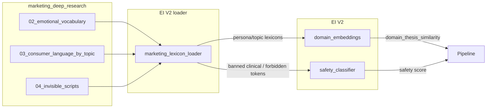

# Integrate marketing_deep_research into EI V2

**Purpose:** Single source of truth for EI V2 persona/topic language and compliance from marketing research files when present; built-in lexicons as fallback. Dev handoff — scope locked.

**Implementation:** Loader `phoenix_v4/quality/ei_v2/marketing_lexicons.py`; config `config/quality/ei_v2_config.yaml` § `marketing_sources`; observability `artifacts/ei_v2/marketing_integration.log` (JSONL). One global toggle `marketing_sources.enabled: false` disables all marketing integration.

**Dashboard:** Reusable Marketing tab for Streamlit: `scripts/ei_v2_marketing_dashboard_tab.py`. Call `render_marketing_tab(log_path=None, repo_root=None)` from your app, or run `streamlit run scripts/ei_v2_marketing_dashboard_tab.py` for a standalone view. Shows last 100 log events, file hashes, lexicon source, fallback reason; calibration metrics when `calibration` events are present in the log.

---

## Dashboard integration and next steps

- **Marketing tab:** Use `scripts/ei_v2_marketing_dashboard_tab.py` in your Streamlit v1 dashboard for live log tail, file hash status, and (when available) calibration metrics.
- **Deploy:** Set `marketing_sources.enabled: true` in `ei_v2_config.yaml`; monitor first 10 audiobook evals.
- **Alerting:** Add a Streamlit button to tail logs and optionally email on delta breaches (e.g. domain Δ > 0.12 or safety Δ > 0.10) if you write calibration results to the log.
- **Scale:** Wire marketing lexicons to TTS persona/topic alignment for self-help book content where needed.
- **v3 ideas:** Auto-calibration (fit weights to last N evals), lexicon drift detection.

---

## Current state

**Marketing research (`marketing_deep_research/`):** Final scaffolds with provenance. Key files:

- **03_consumer_language_by_topic.yaml** — per-topic consumer_phrases, banned_clinical_terms, persona_subtitle_patterns.
- **04_invisible_scripts.yaml** — persona × topic invisible_script (140 entries).
- **02_emotional_vocabulary_patch.yaml** — forbidden_title_tokens, vocabulary_analysis (topic_affinity, conversion_signal).

**EI V2 (`phoenix_v4/quality/ei_v2/`):**

- **domain_embeddings.py** uses hardcoded `_PERSONA_LEXICONS` and `_TOPIC_LEXICONS` for `_persona_affinity()` and `_topic_coherence()` in `domain_thesis_similarity()` (called from ei_v2/init.py with persona_id / topic_id).
- **safety_classifier.py** uses hardcoded `_CLINICAL_PATTERNS` and promotional lists; no loading from marketing.
- **config.py** loads only `config/quality/ei_v2_config.yaml`; no marketing paths.

**Downstream:** ei_parallel_adapter.py and quality_bundle_builder.py already pass persona_id / topic_id; title engines use invisible_scripts from their own hardcoded data, not from marketing_deep_research.

---

## Integration strategy

Use marketing research as the single source of truth for persona/topic language and compliance when files are present; keep current hardcoded lexicons as fallback when files are missing or not yet merged.

---

## Locked decisions (dev handoff — do not change scope)

These 6 decisions are final for this implementation. Implement exactly as stated.

| # | Decision | Locked choice |
|---|----------|---------------|
| 1 | **Source strategy** | Option A for now: direct `marketing_deep_research/` (repo-relative). Option B (`config/marketing/`) reserved for later release. One config path only. |
| 2 | **Precedence** | marketing enabled + valid file => use marketing data. missing/malformed file => fallback to built-in for that component, with warning (no crash). |
| 3 | **Tokenization contract** | One shared tokenizer rule (lowercase, normalize, punctuation, min length) used by loader and tests; no drift. |
| 4 | **Safety behavior** | Add a separate `marketing_compliance` signal first; map to score via config weight only (no hardwired penalties). |
| 5 | **Gate for rollout** | Calibration test: score deltas on fixed eval set must not exceed locked thresholds (see Calibration thresholds below). |
| 6 | **Observability + rollback** | Observability records written to locked destination with locked fields (see Logging destination below). One global config switch disables all marketing integration instantly. |

---

### Locked: Calibration thresholds

Single hard rule: For each dimension in the calibration eval set, the absolute difference between score-with-marketing and score-without-marketing must not exceed the max for that dimension. Gate fails if any dimension exceeds.

| Dimension | Max absolute delta (locked) |
|-----------|-----------------------------|
| domain_thesis_similarity | 0.12 |
| safety (overall) | 0.10 |
| marketing_compliance | N/A (new signal; no baseline) |

**Eval set:** Fixed set of (passage, thesis, persona_id, topic_id) tuples; stored in repo (e.g. `tests/fixtures/ei_v2_marketing_calibration_eval.json`). Run with `marketing_sources.enabled: false`, then `true`; compare per-dimension; assert all deltas ≤ above.

---

### Locked: Logging destination

- **Path:** `artifacts/ei_v2/marketing_integration.log` (append; create parent dir if missing).
- **Format:** One JSON object per line (JSONL). No rotation required for this handoff; optional later.

**Fields per record (locked):**

| Field | Type | Description |
|-------|------|-------------|
| ts | str | ISO8601 UTC timestamp |
| event | str | `lexicon_load` or `lexicon_use` |
| source | str | `built-in` or `marketing` |
| source_path | str | When marketing: repo-relative dir (e.g. marketing_deep_research) |
| file_02_hash | str | When marketing: content hash or mtime of 02 file |
| file_03_hash | str | When marketing: same for 03 |
| file_04_hash | str | When marketing: same for 04 |
| fallback_reason | str | When fallback: reason (e.g. file_missing, schema_mismatch: topics[0].topic_id missing) |

**When to write:** On first load per process (or on cache invalidate + reload): one `lexicon_load` record. Optionally one `lexicon_use` per scoring run (if not too noisy); otherwise at least one record per process lifetime with source and hashes.

---

## Must-have UI requirements

A few minimal UI requirements are needed so this backend is usable and safe.

1. **Marketing Integration Status panel**
   - Show: `enabled`, `source_path`, active flags (`lexicons` / `safety` / `script`), cache state, file hashes/mtime.

2. **Source Health panel**
   - For 02/03/04: `valid` / `fallback` / `missing` / `malformed`, plus exact warning message.

3. **Runtime Source Indicator on EI V2 results**
   - Per run: “Using marketing data” vs “Using built-in fallback”.

4. **Calibration Gate screen**
   - Show last baseline vs current delta and pass/fail against locked threshold.

5. **One-click rollback toggle**
   - Set `marketing_sources.enabled=false` safely from UI (or generate exact command/config patch).

6. **Compliance Signal visibility**
   - Display `marketing_compliance` score separately from existing safety scores.

7. **Audit trail**
   - Persist run metadata: config flags, source hashes, fallback events, timestamp, operator.

If these 7 must-haves are in, the UI is sufficient for this integration.

---

## Should-have UI requirements (not blocking)

1. Diff view: “what changed since last run” for lexicons/safety outcomes.
2. Fixture test runner button for loader corruption tests + integration test.
3. “Open source file” links for 02/03/04 and EI config.

---

## Operator completeness (100% handoff)

The following 7 items must be **explicit in this spec** so the system meets stated operator goals. No implication; implement as written.

### 1. Completeness dashboard contract

Exact formulas and thresholds for completion % so the dashboard is unambiguous.

| Dimension | Formula | Threshold (pass) | Notes |
|-----------|---------|------------------|--------|
| **Locale** | `(locales_with_required_content / locales_in_scope) * 100` | ≥ 100% for in-scope locales (en-US, hu-HU per PRODUCTION_100_PLAN) | Required content = persona×topic coverage, invisible scripts, consumer language per locale. |
| **Language** | `(languages_with_required_content / languages_in_scope) * 100` | ≥ 100% for in-scope languages | Same as locale if 1:1; else language-level aggregate. |
| **Persona** | `(personas_with_min_atoms / personas_in_scope) * 100` | ≥ 100% | Min atoms per persona from quality/coverage rules. |
| **Topic** | `(topics_with_min_atoms / topics_in_scope) * 100` | ≥ 100% | Min atoms per topic; scope from catalog. |
| **Catalog** | `(books_meeting_quality_gates / books_in_catalog_scope) * 100` | ≥ value in config (e.g. 95%) or 100% for release | Catalog = aggregate of book-level completeness. |
| **Engine** | `(engines_with_valid_config / engines_in_scope) * 100` | ≥ 100% | Engine = TTS/format engine; valid = config present and loadable. |
| **Teacher** | `(teachers_with_approved_doctrine_and_atoms / teachers_in_scope) * 100` | ≥ 100% | Doctrine schema + min EXERCISE/HOOK/REFLECTION/INTEGRATION per teacher. |

**Source of truth for "required" counts:** Config and coverage scripts (e.g. `book_script_content_validation.py`, coverage_report). Document the exact script and config keys used for numerator/denominator in the data contract for the Completeness widget.

---

### 2. Approval blocker model

Formal states and hard release-block rules. Any approval in a blocking state prevents release/go-live.

| State | Definition | Release blocked? |
|-------|------------|------------------|
| **missing** | Source-of-truth file or checklist row absent. | Yes. |
| **pending** | File/row present but not yet submitted or signed (e.g. checklist row empty). | Yes. |
| **approved** | Checklist signed with name/date or approval record present; not past expiry. | No. |
| **expired** | Approval date older than policy (e.g. 12 months); re-approval required. | Yes. |

**Hard release-block rules (examples):**

- **Pearl News:** All Pearl News church/governance approvals must be `approved` before Pearl News launch or post. SOT: e.g. `pearl_news/governance/` + signed row in `docs/PEARL_NEWS_GO_NO_GO_CHECKLIST.md`.
- **Church / brand:** Per-domain approval (e.g. NorCal Dharma church YAML, brand compliance) must be `approved` for that domain's release.
- **Manual requirements:** Any approval explicitly marked "blocks release" in config must be `approved` before release.

**UI:** Show approval id, name, state, SOT path; if state ≠ `approved`, show red blocker and disable release/go-live actions until resolved.

---

### 3. Actionability contract

Every red (or blocked) status must map to an explicit next action so the operator knows what to do.

| Field | Required | Description |
|-------|----------|-------------|
| **Next action** | Yes | One-line description of what to do (e.g. "Run validation for locale en-US", "Sign church docs checklist", "Fix broken link in DOCS_INDEX"). |
| **Command** | Yes | Exact CLI command or UI button id (e.g. `python scripts/book_script_content_validation.py --locale en-US`, or "Run check" button). |
| **Owner** | Yes | Team or person responsible (e.g. "platform", "content", "on-call"). |
| **SLA** | Yes | Time expectation (e.g. "Fix within 24h", "Before release", "Next business day") or "Document exception". |

**Rule:** For every item in the Action queue (or Missing/Blocked queue), all four fields must be populated. No red status without a defined next action, command, owner, and SLA.

---

### 4. Freebies governance panel

First-class UI state for freebies; not buried in logs.

| Element | Description | Source / refresh |
|---------|-------------|------------------|
| **Density status** | Pass/fail vs configured density thresholds (e.g. identical_bundle < 40%, identical_cta < 50%, identical_slug_pattern < 60%). | `validate_freebie_density` + `artifacts/freebies/index.jsonl`; on demand or after pipeline run. |
| **Caps status** | CTA signature caps per brand/quarter; max_same_cta_signature, etc. | `cta_signature_caps` / `check_wave_density`; config `cta_anti_spam.yaml`. |
| **Index scope** | Label: "wave" vs "global" (e.g. current release wave vs full index). | Config or run context; display clearly so operator knows scope. |
| **Pollution detection** | Warnings for planner/index pollution: over-reuse of same bundle/CTA/slug pattern; index health. | Same as density/caps; explicit warning list (e.g. "3 topics exceed identical_bundle threshold"). |
| **Safe mode** | Indicator: "Tests not writing production index" (e.g. CI or dry-run vs production write). | Config or env; show so operator knows whether runs affect prod index. |

**UI:** Dedicated Freebies governance panel showing the above; data contract (source path, refresh, stale, failure fallback) per §6 below.

---

### 5. Agent change feed

"What auto-agent changed, why, impact, rollback link." Required for operator visibility.

| Field | Description |
|-------|-------------|
| **What changed** | Short summary (e.g. "PR #123: updated persona lexicons for topic X", "Workflow run: EI V2 calibration"). |
| **Why** | Reason or trigger (e.g. "Scheduled run", "Config change", "Agent recommendation"). |
| **Impact** | Test/score delta or affected scope (e.g. "3 tests now fail", "domain_thesis_similarity +0.05 on eval set"). |
| **Rollback link** | URL to revert (e.g. PR revert, workflow re-run) or exact command (e.g. `git revert <sha>`, "Set marketing_sources.enabled=false"). |

**Source:** GitHub API (PRs, workflow runs), EI/learning artifacts, or dedicated agent log. **UI:** Agent change feed panel or section; each row has the four fields. Data contract per §6.

---

### 6. Data contract per widget

Every panel/widget must have a defined contract. No widget ships without this.

| Widget / panel | Source path or API | Refresh interval | Stale behavior | Failure fallback |
|----------------|--------------------|------------------|---------------|------------------|
| **Completeness** | `book_script_content_validation.py --json` stdout or artifact | On tab open / manual; optional scheduled | If data older than X min (e.g. 60), show "Stale" badge and last refresh time | Show last known scorecard + error message; red banner; do not clear data |
| **Approvals** | SOT files + checklist paths (see §2) | On tab open / manual | If checklist/file mtime older than X, show "Stale" | Show "Unknown" for failed reads; treat as blocking (red) |
| **Marketing Integration Status** | `ei_v2_config.yaml` + loader cache state + `marketing_integration.log` tail | On tab open / after run | Show cache age; "Stale" if log/cache older than X | Show last known state + error; red banner |
| **Source Health (02/03/04)** | Loader result + file mtime/hash | On load or manual refresh | Same as Marketing Integration | valid/fallback/missing/malformed + warning text |
| **Action queue / Missing-Blocked** | Aggregation from completeness, approvals, checks, evidence, secrets, workflows | On Dashboard open / after any tab refresh that affects blockers | Re-aggregate when any source refreshes | Show partial list; aggregation errors as queue items (severity warning) |
| **Freebies governance** | `validate_freebie_density` output + index.jsonl + config | On tab open / after pipeline run | Show last run time; "Stale" if older than X | Show last run result + error; do not hide panel |
| **Agent change feed** | GitHub API + workflow/agent artifacts | On tab open / manual; rate-limit aware | Show last fetch time | Offline/rate-limit message; show last cached data |
| **Calibration Gate** | Calibration run output (baseline vs current) + locked thresholds | On run / manual | Show last run timestamp | Show last run + "Run calibration" button on error |
| **EI V2 results (runtime source)** | Per-run log or report field | Per run | N/A (per run) | "Unknown" if run failed |

**Rule:** Before shipping a widget, document its row in this table (or the single Data Contracts doc). Stale timeout (X) and failure fallback must be explicit.

---

### 7. Acceptance matrix

Testable criteria proving: **"UI tells me what's missing and what to do next."** Each row is a scenario and pass criterion.

| Scenario | Expected UI behavior | Pass criterion |
|----------|----------------------|----------------|
| Completeness gap exists (e.g. locale missing content) | Completeness panel shows gap (red/fail); drill-down shows missing slice; Action queue has row with next action + command + owner + SLA | Operator can see gap and run the stated fix command |
| Approval not approved (e.g. church docs pending) | Approvals panel shows state (pending/missing/expired); red blocker; release/go-live actions disabled; Action queue has row | Operator sees blocker and who owns it; cannot launch until resolved |
| Marketing source missing/malformed | Source Health shows 02/03/04 status (fallback/missing/malformed) + warning message; Runtime Source Indicator "Using built-in fallback" | No silent use of bad data; operator sees reason |
| Freebies density over threshold | Freebies panel shows fail + pollution warning; Action queue has row with fix (e.g. "Run density gate", "Adjust plan") | Operator sees density failure and next action |
| Agent/PR changed something | Agent change feed shows what changed, why, impact, rollback link | Operator can assess impact and roll back if needed |
| Any red status anywhere | Action queue lists at least one row with next action, command, owner, SLA | Every red maps to an actionable row |
| Stale data | Widget shows "Stale" or last refresh time; refresh available | Operator knows data age and can refresh |
| Run failed (pipeline, calibration, gate) | Log or panel shows error; exit code or fail reason; no silent success | Failure visible; not reported as success |

**Definition of pass:** Automated or manual test: for each scenario, put system in that state and assert the "Pass criterion" holds. The acceptance matrix is the checklist for "UI tells me what's missing and what to do next."

---

## Production-grade constraints (must implement)

### Schema contract (02 / 03 / 04)

Freeze and version one schema per file (schema_version: 1 in loader or config doc). Expected contracts:

- **02:** Top-level `global_constraints` (dict with `forbidden_title_tokens`: list of str). Optional `vocabulary_analysis` (list of dicts with word, topic_affinity, etc.). Required: `global_constraints` present.
- **03:** Top-level `topics` (list). Each item: `topic_id` (str), `consumer_phrases`, `banned_clinical_terms`, `culture_specific_phrases`, `persona_subtitle_patterns` (lists). Required: topics non-empty; each topic has topic_id and the four phrase lists (can be empty lists).
- **04:** Top-level `personas`, `topics` (lists of str), `scripts` (list). Each script: `persona_id`, `topic_id`, `invisible_script` (str). Required: scripts present; each script has all three keys.

On schema mismatch: Log a clear warning with file path and what failed (missing key, wrong type, empty required list). Fall back to built-in for that component only. Never partial silent behavior.

### Deterministic tokenization

Single shared tokenizer used by the loader and by all tests. Rules: lowercase, Unicode normalize (NFKC or NFC), strip leading/trailing punctuation from tokens, drop tokens shorter than min length (e.g. 2 chars), optional stopword list (or none for lexicons). Document the rules in one place (e.g. `marketing_lexicons.TOKENIZER_RULES` or a small `lexicon_tokenize()` in a shared util). Tests must use the same tokenizer for fixtures and assertions.

### Precedence policy

- **marketing_sources.enabled=true and all required files valid:** Use marketing lexicons / bans for components that have data.
- **Missing or malformed file:** Fall back to built-in for that component only; log reason (e.g. "file missing", "schema mismatch: topics[0].topic_id missing").
- Document in config comments in `config/quality/ei_v2_config.yaml`: "When enabled, valid files override built-in; missing/malformed file causes fallback for that component with warning."

### Cache and reload

Load once per process with a file mtime-based cache: when any of 02/03/04 paths change (mtime), invalidate and reload. Do not reread YAML on every scoring call. Expose an optional `invalidate_marketing_cache()` for tests or admin.

### Safety impact guard

Marketing bans feed a separate signal `marketing_compliance` first (e.g. score 0–1: 1 = no hit, 0 = hit). Do not fold directly into existing clinical/promotional score without calibration. Explicit weight in config (e.g. `safety_classifier.marketing_compliance_weight: 0.2`); allow tuning and rollback.

### Calibration gate

Before/after on a fixed eval set: Run EI V2 (domain_thesis_similarity + safety) on a small fixed set of passages with marketing off, then on. Require bounded delta (see Locked: Calibration thresholds). Failing the gate blocks promotion of marketing integration until tuned.

### Scope decision (single source path)

Pick one strategy for this implementation: Either **A** direct `marketing_deep_research/` (repo-relative) for active dev, or **B** merged `config/marketing/` for release stability. One config path, one source of truth.

### Rollout flags

Feature flags at EI V2 level in config:

- `use_marketing_lexicons` — domain_embeddings use loaded persona/topic lexicons when true.
- `use_marketing_safety_bans` — safety classifier uses marketing_compliance signal when true.
- `use_invisible_script_alignment` — optional; enable 4th dimension when true.

All gated by `marketing_sources.enabled`; individual flags allow turning off lexicons vs safety vs script without code change.

### Observability, fail-safe tests, rollback

- **Observability:** On each run (or on first use per process), log which lexicon source was used: built-in vs marketing, and when marketing: file paths + version/hash (e.g. mtime or content hash).
- **Fail-safe tests:** Add corruption tests: bad YAML (syntax error), missing required keys, empty lists for required arrays. Assert graceful fallback (built-in used, warning logged, no crash).
- **Release rollback:** One config toggle (`marketing_sources.enabled: false`) disables all marketing integration instantly. Document in config and runbook.

---

## Implementation plan

### 1. Marketing lexicon loader (new)

Add `phoenix_v4/quality/ei_v2/marketing_lexicons.py` (or shared helper under `phoenix_v4/quality/` if title engine will use it).

- **Schema:** Validate against frozen schema for 02/03/04. On mismatch: warn + return None for that file's data; fallback for that component only.
- **Tokenizer:** One shared `lexicon_tokenize(text)` (lowercase, NFKC, punctuation policy, min token length, no stopwords for lexicon build). Used by loader and tests.
- **Responsibilities:**
  - Accept config: single source path (A: marketing_deep_research/ or B: config/marketing/); derive 02/03/04 filenames. If path missing or files missing, return None for affected components.
  - Persona lexicons: From 04: per persona_id, tokenize all invisible_script strings, dedupe. Optionally merge 03 persona_subtitle_patterns. Return Dict[str, Set[str]].
  - Topic lexicons: From 03: per topic_id, tokenize consumer_phrases and culture_specific_phrases. Return Dict[str, Set[str]].
  - Banned clinical terms: From 03: flatten banned_clinical_terms. Forbidden tokens: From 02: global_constraints.forbidden_title_tokens.
  - Cache: Load once per process; invalidate on mtime change of any of 02/03/04. No reread per scoring call.
  - Observability: Return or log source (built-in vs marketing) and file version/hash (mtime or content hash) for the run.

### 2. Wire loader into EI V2 config

In `config/quality/ei_v2_config.yaml`: Add `marketing_sources`:

- `enabled: false` — Master rollback: one toggle disables all marketing integration.
- `source_path: "marketing_deep_research"` or `"config/marketing"` (pick A or B).
- Rollout flags: `use_marketing_lexicons`, `use_marketing_safety_bans`, `use_invisible_script_alignment` (all effective only when enabled is true).
- Config comments: Document precedence (valid files → marketing; missing/malformed → fallback for that component with warning).

Loader reads paths from loaded config; no change to `load_ei_v2_config()` signature.

### 3. Domain embeddings: use loaded lexicons when available

In `phoenix_v4/quality/ei_v2/domain_embeddings.py`:

- Keep `_PERSONA_LEXICONS` and `_TOPIC_LEXICONS` as the default fallback.
- Add e.g. `get_persona_topic_lexicons(cfg: Dict) -> Tuple[Dict, Dict]`: if cfg has marketing_sources enabled and paths set, call the marketing lexicon loader and return (persona_lexicons, topic_lexicons). If loader returns None or empty, return built-in.
- Refactor `_persona_affinity` and `_topic_coherence` to accept an optional lexicon override (or get lexicons once per call from a config-driven cache). Prefer a single “lexicon provider” (built-in vs loaded) so call sites stay simple.
- Ensure `domain_thesis_similarity()` (and callers) receive or resolve config; e.g. pass cfg from ei_v2/init.py and use the provider there so domain_embeddings stays stateless per call.

### 4. Safety classifier: marketing_compliance signal

In `phoenix_v4/quality/ei_v2/safety_classifier.py`:

- When `use_marketing_safety_bans` is true and loader returns banned clinical + forbidden tokens, compute a separate signal `marketing_compliance` (e.g. 1.0 = no hit, 0.0 = hit). Do not merge into existing clinical score without calibration.
- Config: `safety_classifier.marketing_compliance_weight` (e.g. 0.2) to blend marketing_compliance into overall safety score.
- When marketing disabled or no data: no new behavior.

### 5. Optional: invisible-script alignment score

New optional dimension: For a given (persona_id, topic_id), load the single invisible_script from 04. Score passage (e.g. token overlap or a small heuristic similarity) against that script. Add as an optional 4th term in domain_thesis_similarity or as a separate composite in ei_v2/init.py with a small weight. Scope: Optional; can be Phase 2. Requires loader to expose “get invisible_script(persona_id, topic_id)”.

### 6. Optional: consumer-language alignment

Defer to Phase 2 if time-constrained: Score passage for “consumer language” vs “clinical”; reward tokens in 03 consumer_phrases / persona_subtitle_patterns, penalize or flag tokens in banned_clinical_terms.

### 7. Source path (scope decision)

Implement one strategy only. Choose at dev start: **A** source_path: marketing_deep_research (repo-relative) for active dev, or **B** source_path: config/marketing for release. Single config key; no ad hoc dual support. Document in docs that EI V2 optionally consumes that path for lexicons and compliance; link to merge checklist.

### 8. Tests and validation

- **Unit tests:** Loader with minimal valid YAML fixture; use shared tokenizer; expect correct dicts/sets.
- **Fail-safe (corruption) tests:** Bad YAML syntax, missing required keys, empty required lists. Assert: graceful fallback (built-in used, warning logged), no crash, no partial silent use of bad data.
- **EI V2 integration test:** With config pointing at fixture, assert domain_thesis_similarity and safety use fixture data; with marketing off or paths missing, assert behavior matches current EI V2.
- **Calibration gate:** Fixed eval set; run with marketing off then on; assert bounded delta per Locked: Calibration thresholds.

---

## File touch list

| Action | File |
|--------|------|
| Add | phoenix_v4/quality/ei_v2/marketing_lexicons.py (loader) |
| Edit | config/quality/ei_v2_config.yaml (add marketing_sources section) |
| Edit | phoenix_v4/quality/ei_v2/domain_embeddings.py (use loader; fallback to built-in) |
| Edit | phoenix_v4/quality/ei_v2/safety_classifier.py (optional marketing bans) |
| Edit | phoenix_v4/quality/ei_v2/__init__.py (pass cfg into domain path; optional script weight) |
| Add (optional) | Invisible-script alignment in domain_embeddings or init |
| Add | Tests for loader and EI V2 with marketing fixtures |
| Edit | Docs (DOCS_INDEX or GITHUB_GOVERNANCE) to mention marketing → EI V2 |

---

## Definition of done

- Schema contract for 02/03/04 frozen and versioned; mismatch → warn + fallback, no partial silent behavior.
- One shared deterministic tokenizer; loader and tests use it.
- Precedence documented in config; cache (mtime) + load once per process; observability (source + file version/hash) logged.
- Marketing bans as separate `marketing_compliance` signal; weight in config; calibration gate (bounded delta on eval set) passed.
- Single source path (A or B) chosen; rollout flags and one master `enabled` toggle for instant rollback.
- Fail-safe and integration tests; docs updated.
- **UI:** All 7 must-have UI requirements implemented (Marketing Integration Status, Source Health, Runtime Source Indicator, Calibration Gate screen, one-click rollback toggle, Compliance Signal visibility, Audit trail).
- **Operator completeness (100% handoff):** All 7 operator items explicit and implemented: (1) Completeness dashboard contract (formulas/thresholds for loc/lang/persona/topic/catalog/engine/teacher), (2) Approval blocker model (missing/pending/approved/expired + hard release-block rules), (3) Actionability contract (every red → next action, command, owner, SLA), (4) Freebies governance panel (density/caps/index-scope/pollution/safe mode), (5) Agent change feed (what changed, why, impact, rollback link), (6) Data contract per widget (source, refresh, stale, failure fallback), (7) Acceptance matrix (testable “what’s missing and what to do next” criteria).
