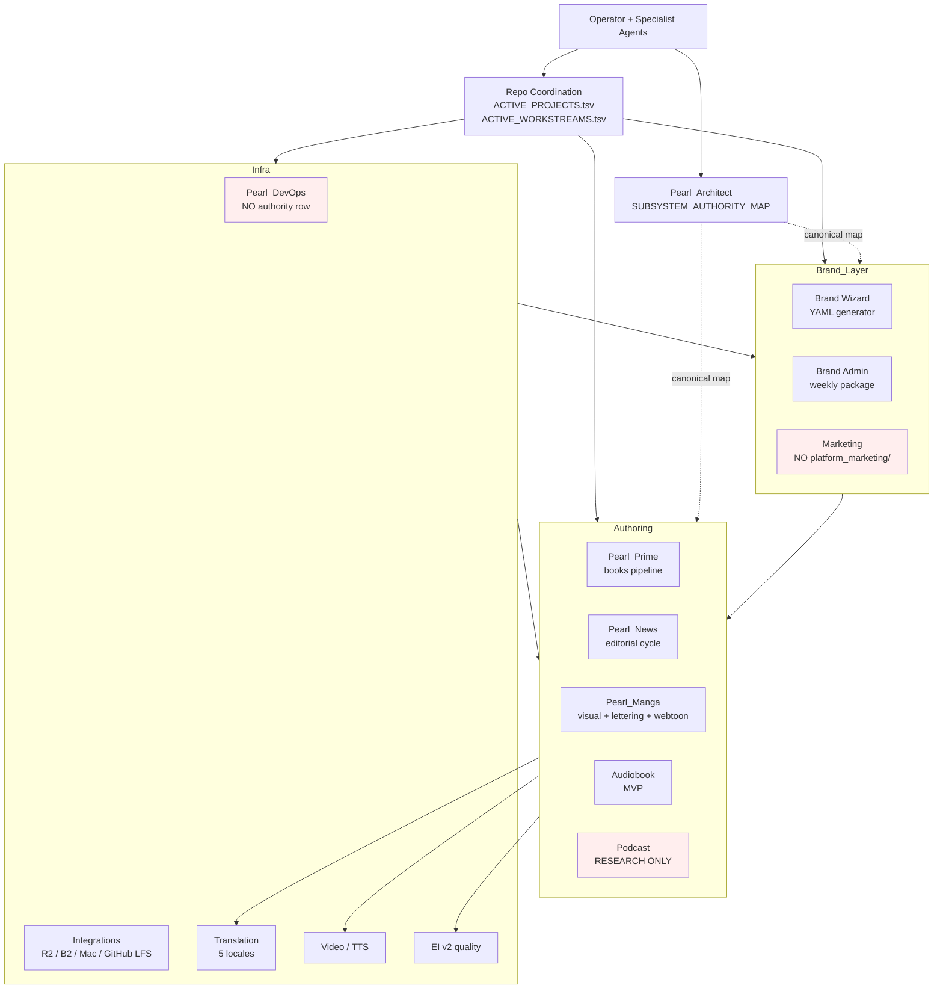
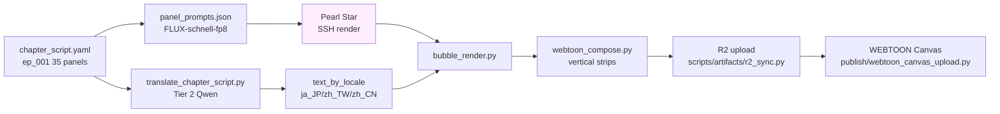
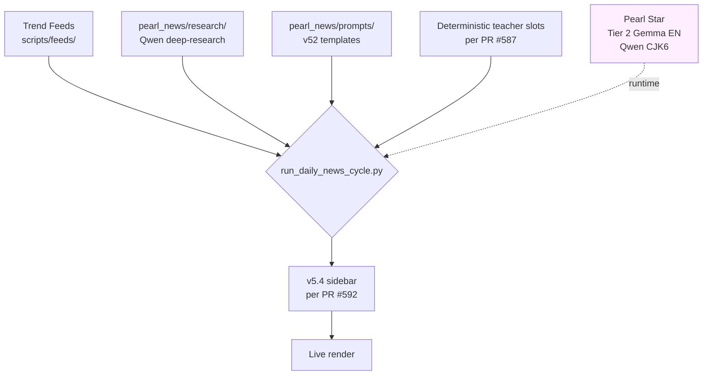
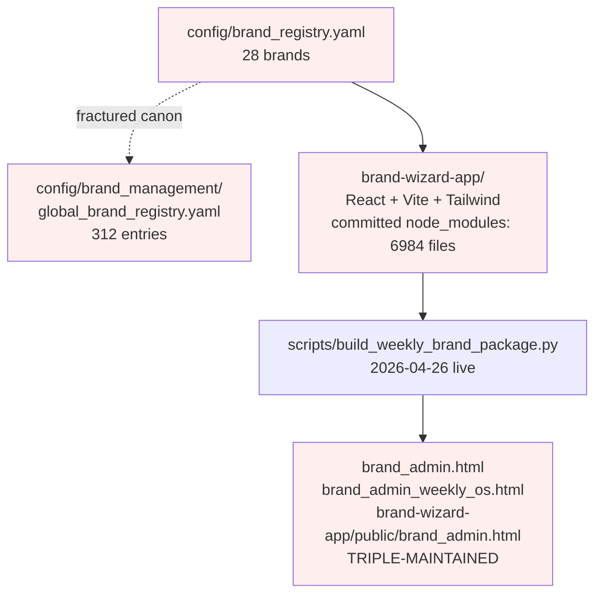
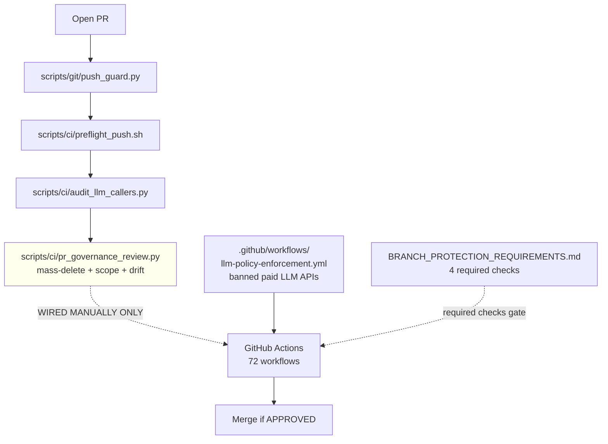
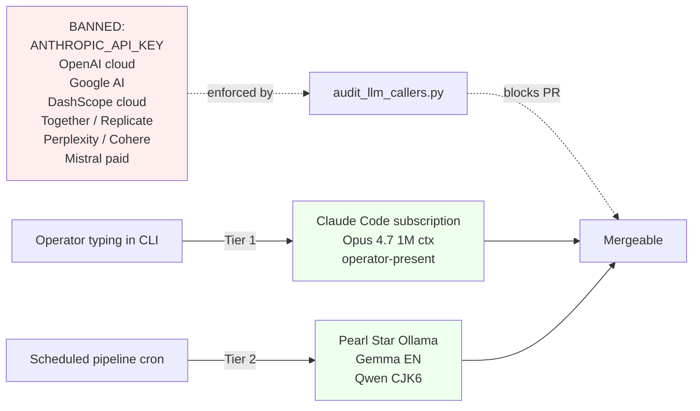
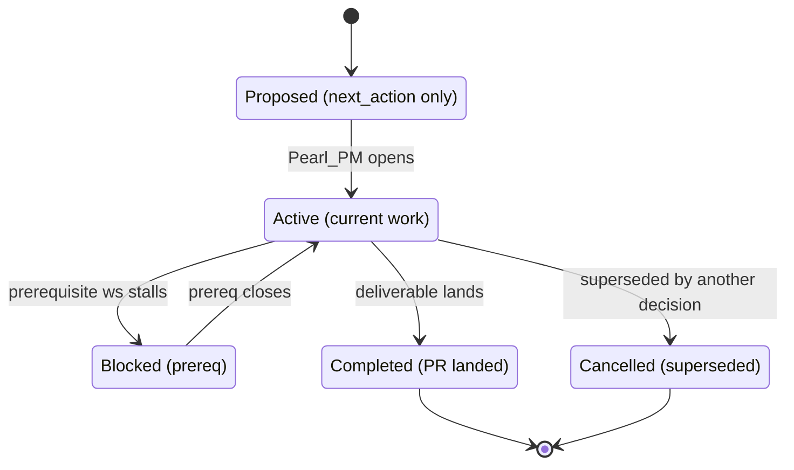
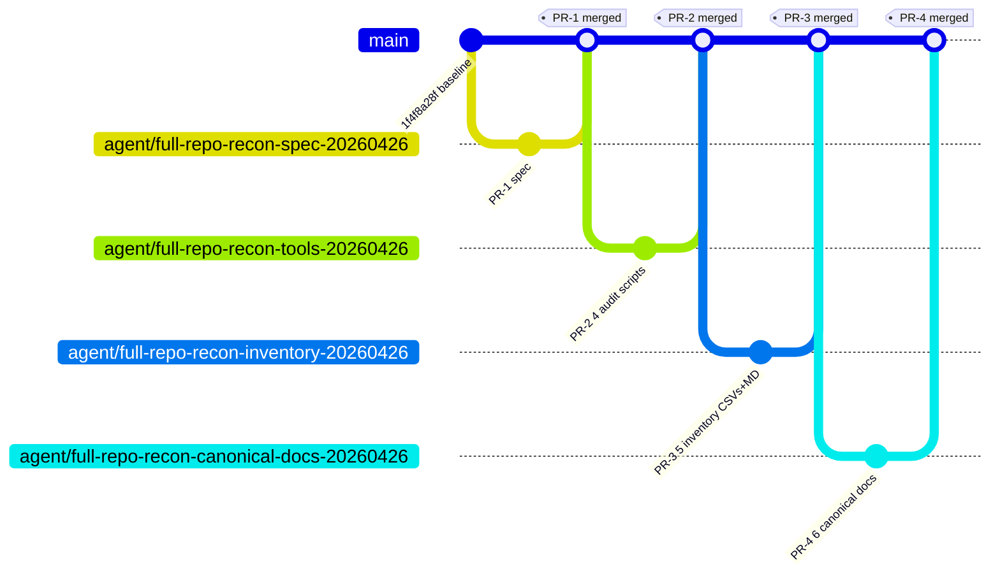
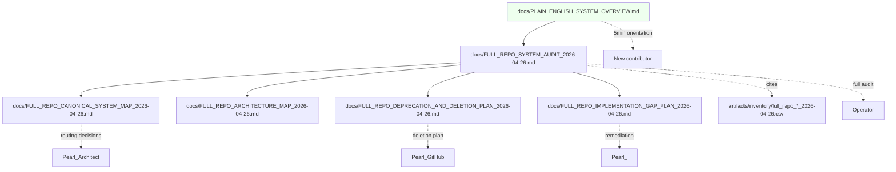

# Full Repo Architecture Map — 2026-04-26

**Purpose:** visual reference for system architecture at Phoenix Omega's
2026-04-26 baseline (`origin/main` HEAD `1f4f8a28f`).

Diagrams below render in any GitHub markdown viewer or Mermaid-aware tool.

---

## 1. Top-level subsystem graph



Red boxes = subsystems with structural gaps surfaced by this audit (DevOps absent
from authority map; Marketing missing `platform_marketing/`; Podcast research-only).

## 2. Pearl Prime book pipeline data flow

```mermaid
flowchart LR
    Research[docs/research/<br/>marketing_deep_research/]
    Brand[config/brand_registry.yaml<br/>config/brand_author_assignments.yaml]
    Teacher[SOURCE_OF_TRUTH/teacher_banks/<br/>config/authoring/pen_name_teacher_profiles.yaml]
    Atoms[atoms/{persona}/{topic}/{engine}/CANONICAL.txt<br/>17090 entries]
    Arcs[config/source_of_truth/master_arcs/]
    Specs[specs/PHOENIX_ARC_FIRST_CANONICAL_SPEC.md<br/>specs/PHOENIX_V4_5_WRITER_SPEC.md]

    Research --> Brand
    Brand --> Teacher
    Teacher --> Atoms

    Atoms --> CLI{run_pipeline.py<br/>canonical CLI}
    Arcs --> CLI
    Specs -.governs.-> CLI

    CLI --> Slots[Slot grid:<br/>STORY sec 2/5/9<br/>JOURNEY sec 4/8<br/>SCENE]
    Slots --> Compose[compose_section_packet<br/>compose_from_enriched_book]
    Compose --> Audit[section_packet_audit.json<br/>quality_summary.json]
    Audit --> Render[book.txt<br/>render_dir]

    style CLI fill:#ffd
```

Spine path: spec at `PEARL_PRIME_BESTSELLER_WRITING_OVERLAY_SPEC.md:570-577`.
Phase 2 wiring (BG-PR-09 update 2026-04-26) is gated on `ws_bestseller_pipeline_default_path_b_20260425`.

## 3. Manga ep_001 ship pipeline (proj_manga_first_ship_20260425)



Pink box = operator-driven Pearl Star Mac (per `proj_manga_first_ship_20260425`
GATE-OP-2). All other steps are repo-driven scripts.

## 4. Pearl News daily editorial flow



## 5. Brand Wizard + Brand Admin flow



Red boxes = audit-surfaced governance issues (C-1 brand-count canon, C-4 triple
HTML maintenance, brand-wizard-app/node_modules committed).

## 6. Storage layer

```mermaid
flowchart LR
    Code[GitHub<br/>42257 tracked files]
    LFS[GitHub LFS<br/>select binary dirs]
    R2[Cloudflare R2<br/>rendered manga<br/>webtoon strips<br/>video assets<br/>audiobook masters]
    B2[Backblaze B2<br/>pivot in progress]
    Mac[Pearl Star Mac<br/>render workspace<br/>SSH pearlstar.tail7fd910.ts.net]

    Code -.r2_sync.py.-> R2
    Code -.in progress.-> B2
    Code -.GATE-OP-2 marker.-> Mac
    Mac -.uploads.-> R2
    Mac -.uploads.-> B2

    Reg[docs/INTEGRATION_CREDENTIALS_REGISTRY.md] -.governs.-> R2
    Reg -.governs.-> B2

    style B2 fill:#ffe
```

Yellow = pivot in progress.

## 7. Governance + CI



Yellow = `pr_governance_review.py` exists but is NOT wired to a GitHub workflow;
runs manually via `pre_merge_check.sh`. **GAP-3 in implementation plan.**

## 8. LLM tier routing



## 9. Workstream lifecycle



Pearl_PM transitions ws state in `ACTIVE_WORKSTREAMS.tsv`. Audit found 7 schema-
malformed ws rows that need column-shift fix (see `IMPLEMENTATION_GAP_PLAN` GAP-1).

## 10. PR sequence for THIS audit



After PR-4 lands, operator review gates PR-5+ (deletion buckets D1-D3 + remediation
PRs GAP-1 through GAP-4).

## 11. Documentation graph (where to start)



Green = fastest entry point.
