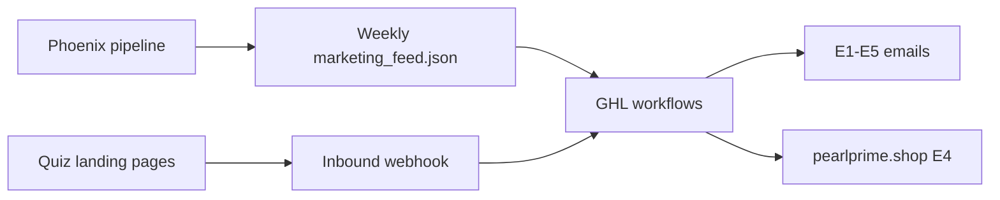

# GoHighLevel Integration Guide

**Audience:** GHL administrator.  
**Start here first:** [ghl/GHL_ADMIN_START_HERE.md](./ghl/GHL_ADMIN_START_HERE.md) (plain-English story + checklist).

---

## 1. Architecture



- **Feed path:** Phoenix publishes one JSON file per brand per week. GHL reads URLs, titles, and CTAs from it.
- **Quiz path:** Static pages POST contact JSON to an **Inbound Webhook** (no API key).
- **Shop:** Paid offers point to **pearlprime.shop** (Snipcart), not Amazon, unless the feed item says otherwise.

---

## 2. One-time GHL setup

### 2.1 Sub-account

1. Log in: https://app.gohighlevel.com/
2. Open the brand **location / sub-account**.
3. Connect social accounts (or Metricool per brand admin spec).

### 2.2 Import workflows

Follow [ghl/PROOF_LOOP_WORKFLOW_TEMPLATE.md](./ghl/PROOF_LOOP_WORKFLOW_TEMPLATE.md) to create:

- WF1 Proof Loop (E1–E5)
- WF2 Tier bonus drip (optional free assets before offer)
- WF3 Series upsell
- WF4 Re-engagement (90d)

### 2.3 Connect the weekly feed

Your project owner sends a URL like:

```text
https://<host>/pearl-prime-content/{brand_id}/{locale}/{week}/marketing_feed.json
```

Phoenix builds this file:

```bash
python3 scripts/marketing/build_funnel_book_url_index.py   # persona×brand shop URLs (en_US)
python3 scripts/marketing/build_marketing_feed.py --brand-id stillness_press --locale en_US
python3 scripts/marketing/publish_marketing_feed_r2.py --brand-id stillness_press
```

E4 `cta_url` resolves from `config/marketing/funnel_book_url_index.json` (fast index; not the 120MB `sku_url_map.yaml`).

Operator dry-run: `./scripts/marketing/setup_ghl_feed_stack.sh stillness_press en_US`

In GHL:

1. **Automation** → workflow that reads external data (HTTP GET, custom webhook, or your agency’s feed connector).
2. Schedule: **Monday 06:00** (or poll the same URL — file is replaced in place).
3. Map **`cta_url`**, **`pricing`**, **`content_type`** on every item.

### 2.4 Quiz inbound webhook

See [GHL_ADMIN_HANDOFF_FREEBIE_CAPTURE.md](./GHL_ADMIN_HANDOFF_FREEBIE_CAPTURE.md). Return `PHOENIX_GHL_FUNNEL_WEBHOOK=...` to the owner.

### 2.5 Custom fields (create once)

| Suggested label | JSON / source | Notes |
|-----------------|---------------|--------|
| Quiz ID | `quiz_id` | From quiz webhook |
| Topic | `topic` | e.g. `anxiety`, `compassion_fatigue` |
| Funnel slug | `funnel_slug` | URL slug |
| Score band | `score_band` | low / medium / high |
| Feed week | `feed_week` | e.g. `2026-W26` |

Use **UUID** field ids from GHL Settings → Custom Fields when using Contacts API ([burnout handoff](../funnel/burnout_reset/GHL_HANDBOFF.md)).

### 2.6 Tags (recommended)

| Tag | When |
|-----|------|
| `source_freebie_quiz` | Quiz webhook capture |
| `freebie_captured` | Any free tool download |
| `severity_low` / `medium` / `high` | From quiz score_band |
| `quiz_{topic}` | e.g. `quiz_anxiety` |
| `buyer` | Post-purchase on pearlprime.shop |
| `ready_for_e4` | Feed item `pricing: paid` present |

---

## 3. Feed format (marketing_feed.json)

Schema authority: [config/marketing/marketing_feed_schema.yaml](../config/marketing/marketing_feed_schema.yaml).

### 3.1 Top-level shape

```json
{
  "schema_version": 3,
  "brand_id": "stillness_press",
  "locale": "en_US",
  "week": "2026-W26",
  "published_at": "2026-06-23T06:00:00Z",
  "shop_base_url": "https://pearlprime.shop",
  "items": []
}
```

### 3.2 Item shape (minimum you must map)

```json
{
  "id": "stillness_press__anxiety__e1_tool",
  "content_type": "somatic_exercise",
  "pricing": "free",
  "cta_url": "https://brand-admin-onboarding.pages.dev/free/anxiety-nervous-system-reset/?utm_source=ghl_e1",
  "title": "Nervous System Reset — 4-7-8",
  "email_slot": "e1",
  "topic": "anxiety",
  "archetype_id": "breath_timer_interactive",
  "funnel_variant": "tight"
}
```

| Field | Required | GHL use |
|-------|----------|---------|
| `cta_url` | **Yes** | Button link in email/SMS |
| `pricing` | **Yes** | `free` = nurture; `paid` = allow E4 |
| `content_type` | **Yes** | Pick email template branch |
| `email_slot` | Recommended | `e1`, `e2`, `bonus_pre_story`, `e3`, `e4`, `e5` |
| `title` | Recommended | Subject / preview text |
| `body` | Optional | HTML or plain snippet |
| `topic` | Recommended | Segmentation |
| `archetype_id` | Recommended | WF variant rules |
| `funnel_variant` | Optional | `tight` or `welcome_depth` |

**Not in the feed** (webhook capture only): `quiz_id`, `funnel_slug`, `score`, `score_band` — see [GHL_ADMIN_HANDOFF_FREEBIE_CAPTURE.md](./GHL_ADMIN_HANDOFF_FREEBIE_CAPTURE.md).

### 3.2a Topic coverage

The builder reads all topics from `config/funnel/freebie_to_book_map.yaml` (15 topics for Stillness Press). No `--topic` flags required for the full wave:

```bash
PYTHONPATH=. python3 scripts/marketing/build_marketing_feed.py --brand-id stillness_press --locale en_US
```

Expect **~109 items**: 15× E1, 15× E2, 15× E3, 15× E4, 15× E5, plus `bonus_pre_story` (Variant B topics) and `post_e5` tier bonuses.

### 3.3 content_type values

| Value | Typical slot | Notes |
|-------|--------------|-------|
| `somatic_exercise` | e1, e2 | Interactive HTML tool |
| `guided_audio` | bonus_pre_story | Never E1 (research default) |
| `assessment_html` | e1, e2 | Quiz-style tool |
| `story` | e3 | Story only — no CTA to shop |
| `book_offer` | e4 | pearlprime.shop product |
| `series_offer` | e5 | Multi-book upsell |
| `checklist_pdf` | post_e5 drip | WF2 tier bundle |

---

## 4. Email timing (canonical)

| Email | Offset | Content |
|-------|--------|---------|
| E1 | 0 | First exercise (`email_slot: e1`) |
| E2 | +24h | Second exercise (`e2`) |
| bonus | +48h | Optional audio/assessment (`bonus_pre_story`) — WF2 |
| E3 | +72h | Story — **no pitch** |
| E4 | +120h | Paid offer — **only if** feed has `pricing: paid` item for slot `e4` |
| E5 | +288h | Series upsell |

Supersedes older +96h/+144h notes in `FULL_FUNNEL_PLAN.md`.

Merge tag copy: [email_sequences/proof_loop_sequence.md](./email_sequences/proof_loop_sequence.md).

---

## 5. Funnel variants

Some personas/topics use a longer pre-offer nurture (**Welcome & Depth**) instead of tight E1–E3.

Config: [config/marketing/ghl_persona_variant_map.yaml](../config/marketing/ghl_persona_variant_map.yaml) (when present).

| Variant | When | Difference |
|---------|------|------------|
| `tight` | Default (executives, Gen Z) | E1 → E2 → E3 → E4 |
| `welcome_depth` | Caregivers, healthcare, grief, compassion fatigue, somatic | Extra bonus email before E3 |

WF1 branches on contact field `funnel_variant`.

---

## 6. Weekly operator loop

| Day | Phoenix | GHL admin |
|-----|---------|-----------|
| Monday | New `marketing_feed.json` published | Nothing (auto-read) |
| Any day | Quiz pages updated on Cloudflare | Nothing |
| On setup | — | Import workflows, paste URLs, test contact |

---

## 7. Validation

```bash
# After owner runs setup script with webhook URL:
python3 scripts/freebies/verify_ghl_webhook_push.py
python3 scripts/freebies/smoke_freebie_capture.py
bash scripts/integration/ghl_health_check.sh
```

---

## 8. Related docs

| Doc | Purpose |
|-----|---------|
| [ghl/GHL_ADMIN_START_HERE.md](./ghl/GHL_ADMIN_START_HERE.md) | Simple checklist |
| [ghl/PROOF_LOOP_WORKFLOW_TEMPLATE.md](./ghl/PROOF_LOOP_WORKFLOW_TEMPLATE.md) | WF1–WF4 steps |
| [FUNNEL_EMAIL_AUTOMATION_MAP.md](./FUNNEL_EMAIL_AUTOMATION_MAP.md) | Tier bundles + slot map |
| [GHL_ADMIN_HANDOFF_FREEBIE_CAPTURE.md](./GHL_ADMIN_HANDOFF_FREEBIE_CAPTURE.md) | Quiz webhook |
| [48_SOCIAL_GHL_BRAND_ADMIN_SPEC.md](./48_SOCIAL_GHL_BRAND_ADMIN_SPEC.md) | 48 Social + R2 context |
| [funnel/burnout_reset/GHL_HANDBOFF.md](../funnel/burnout_reset/GHL_HANDBOFF.md) | Contacts API funnel app |

---

**Version:** 2026-06-23
