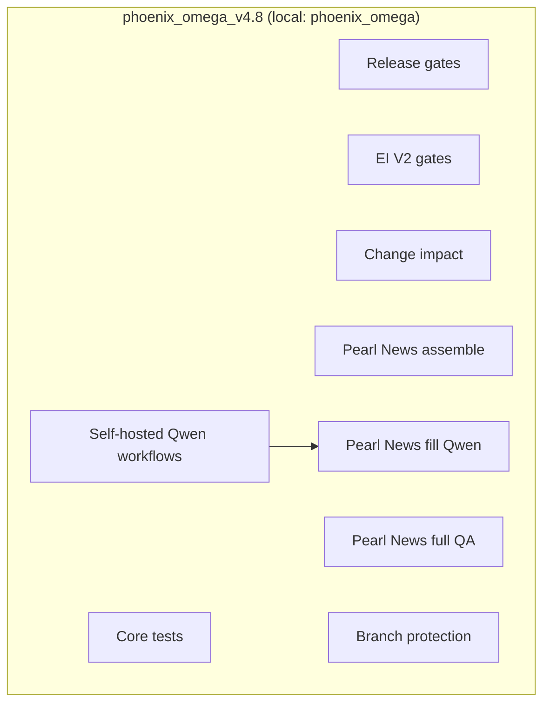

# GitHub Operations Framework

**Purpose:** Single place to map workflows, triggers, secrets, and runner expectations for **Ahjan108/phoenix_omega_v4.8** so GitHub operations are repeatable and error-free.

**You found this from:** [docs/DOCS_INDEX.md](./DOCS_INDEX.md). Use this doc whenever you do PRs, merges, pushes, or runner/workflow work in this repo.

**Authority:** [DOCS_INDEX.md](./DOCS_INDEX.md). Related: [BRANCH_PROTECTION_REQUIREMENTS.md](./BRANCH_PROTECTION_REQUIREMENTS.md), [GITHUB_SUPPORT_SYSTEM_SPEC.md](./GITHUB_SUPPORT_SYSTEM_SPEC.md), [GITHUB_GOVERNANCE_INCIDENT_RUNBOOK.md](./GITHUB_GOVERNANCE_INCIDENT_RUNBOOK.md).

---

## Monthly Stable Baseline And Rollback Runbooks

Create a stable baseline tag from green `main` once per month. See [RELEASE_POLICY.md](./RELEASE_POLICY.md).

Keep rollback references current in [ROLLBACK_RUNBOOKS_INDEX.md](./ROLLBACK_RUNBOOKS_INDEX.md).

---

## Remote-Only Commit Review

A weekly workflow, [.github/workflows/remote-commit-review.yml](../.github/workflows/remote-commit-review.yml), reports commits on `main` from the last 7 days that were not made via a merged PR. Triage those results within 24 hours.

---

## Repo identity

| GitHub repo | Default branch | Local path | Note |
|-------------|----------------|------------|------|
| **Ahjan108/phoenix_omega_v4.8** | main | phoenix_omega | Canonical production repo for Phoenix system code, governance, Pearl News, marketing, catalog, EI V2, manga, and operator docs. |

---

## Architecture (overview)



---

## Workflow matrix: phoenix_omega_v4.8

| Workflow file | Name | Trigger | Runner | Required for branch protection? |
|---------------|------|---------|--------|----------------------------------|
| core-tests.yml | Core tests | push, PR to main | ubuntu-latest | Yes |
| release-gates.yml | Release gates | push, PR to main | ubuntu-latest | Yes |
| ei-v2-gates.yml | EI V2 gates | push, PR (path-filtered), schedule | ubuntu-latest | Yes |
| change-impact.yml | Change impact | push, PR to main | ubuntu-latest | Yes |
| teacher-gates.yml | Teacher gates | push, PR (path-filtered) | ubuntu-latest | Optional (path-filtered) |
| brand-guards.yml | Brand guards | push, PR (path-filtered) | ubuntu-latest | Optional |
| github-governance-check.yml | GitHub governance check | PR | ubuntu-latest | No |
| docs-ci.yml | Docs CI | push, PR | ubuntu-latest | No |
| simulation-10k.yml | Simulation 10k | schedule, dispatch | ubuntu-latest | No |
| marketing-config-gate.yml | Marketing Config Validation Gate | push, PR (path-filtered) | ubuntu-latest | No |
| production-observability.yml | Production observability | schedule, dispatch | ubuntu-latest | No |
| production-alerts.yml | Production failure alerts | schedule, dispatch | ubuntu-latest | No |
| auto-merge-bot-fix.yml | Auto-merge bot-fix | PR (labeled bot-fix) | ubuntu-latest | No |
| weekly-pipeline.yml | Weekly pipeline | schedule, dispatch | ubuntu-latest | No |
| ml-editorial-weekly.yml | ML Editorial weekly | schedule, dispatch | ubuntu-latest | No |
| ml-loop-continuous.yml | ML loop continuous | schedule, dispatch | ubuntu-latest | No |
| ml-loop-daily-promotion.yml | ML loop daily promotion | schedule, dispatch | ubuntu-latest | No |
| ml-loop-weekly-recalibration.yml | ML loop weekly recalibration | schedule, dispatch | ubuntu-latest | No |
| locale-gate.yml | Locale gate | push, PR | ubuntu-latest | No |
| translate-atoms-qwen-matrix.yml | Translate atoms (Qwen matrix) | schedule, dispatch | ubuntu-latest | No |
| research_feeds_ingest.yml | Research feeds ingest | schedule, dispatch | ubuntu-latest | No |
| pages.yml | pages build and deployment | push (e.g. main) | ubuntu-latest | No |
| pearl-news-assemble.yml | Pearl News assemble | push, PR, dispatch | ubuntu-latest | No |
| pearl-news-fill-qwen.yml | Pearl News fill Qwen | workflow_dispatch | self-hosted | No |
| pearl-news-full-qa.yml | Pearl News full QA | push, PR, dispatch | ubuntu-latest | No |
| marketing_continuous.yml | Marketing continuous ingest | schedule (hourly :15) | self-hosted | No |
| marketing-briefs-and-proposals.yml | Marketing briefs + proposals (daily) | schedule (daily 8am UTC), dispatch | self-hosted | No |
| ei-v2-learning.yml | EI V2 daily learning | schedule (daily 5am UTC), dispatch | ubuntu-latest | No |
| catalog-book-pipeline.yml | Catalog book pipeline (weekly) | schedule (Mon 6am UTC), dispatch | self-hosted | No |
| max-quality-catalog.yml | Max Quality Catalog | workflow_dispatch | self-hosted | No |

**Concurrency groups (automation cadence):**

| Workflow | Concurrency group | cancel-in-progress | Rationale |
|----------|-------------------|--------------------|-----------|
| marketing_continuous.yml | `marketing-continuous` | true | Hourly ingest; latest-only avoids stacked runs. |
| catalog-book-pipeline.yml | `catalog-book-pipeline` | false | Weekly job; let it finish. |
| marketing-briefs-and-proposals.yml | `marketing-briefs-proposals` | true | Daily; prefer latest-only. |
| max-quality-catalog.yml | `max-quality-catalog-<shard>` | false | Manual shard runs should finish once started. |
| ei-v2-learning.yml | `ei-v2-learning` | false | Learning run should complete. |

**Self-hosted hardening status:**

- `marketing_continuous.yml`: concurrency + Qwen API preflight when non-ingest-only + retry-once ingest loops.
- `marketing-briefs-and-proposals.yml`: concurrency + Qwen API preflight + retry-once.
- `catalog-book-pipeline.yml`: Qwen API preflight + retry-once loops for build and EI learn.
- `max-quality-catalog.yml`: concurrency + Qwen API preflight + direct shard execution without external lock import.
- `pearl-news-fill-qwen.yml`: self-hosted Qwen path for manual Pearl News expansion; keep secrets and runtime evidence current.

**Phoenix self-hosted Qwen policy:** self-hosted workflows in this repo rely on workflow `concurrency`, in-step Qwen API preflight/warmup, retry-once loops where appropriate, and workflow-run evidence.

**Branch protection (main):** Intended live shape is one active `main` ruleset, or temporary multiple active `main` rulesets with identical required contexts. Require exactly **Core tests**, **Release gates**, **EI V2 gates**, **Change impact**. `Release gates` stays PR-required in lightweight form; heavier release checks stay off the PR path. `Workers Builds: pearl-prime` is non-blocking and must not be required for merge. See [BRANCH_PROTECTION_REQUIREMENTS.md](./BRANCH_PROTECTION_REQUIREMENTS.md). Machine-readable policy: [config/governance/required_checks.yaml](../config/governance/required_checks.yaml).

---

## Canonical ownership

| Feature / capability | Primary repo | Workflows | Notes |
|----------------------|--------------|-----------|--------|
| Phoenix (EI V2, Core, Release, Change impact, Teacher, Brand, ML loop, etc.) | phoenix_omega_v4.8 | All workflows in this repo | Canonical repo for production automation and governance. |
| Pearl News (assemble, fill, QA, WordPress) | phoenix_omega_v4.8 | `pearl-news-assemble.yml`, `pearl-news-fill-qwen.yml`, `pearl-news-full-qa.yml` | Canonical Pearl News workflows live in this repo. |

---

## Secrets and runners

- **Secrets:** Per-workflow tokens as needed. Self-hosted marketing, catalog, and Pearl News Qwen workflows use `QWEN_BASE_URL`, `QWEN_MODEL`, and **`DASHSCOPE_API_KEY`** (preferred GitHub secret for the DashScope key) or legacy `QWEN_API_KEY` (workflows accept either). WordPress posting uses `WORDPRESS_SITE_URL`, `WORDPRESS_USERNAME`, `WORDPRESS_APP_PASSWORD`.
- **Runner:** Mixed. Most workflows are GitHub-hosted (`ubuntu-latest`); `marketing_continuous.yml`, `marketing-briefs-and-proposals.yml`, `catalog-book-pipeline.yml`, `max-quality-catalog.yml`, and `pearl-news-fill-qwen.yml` run on self-hosted infrastructure.
- **Ownership map:** [OWNERSHIP_MATRIX.md](./OWNERSHIP_MATRIX.md)

### Self-hosted contention

If a workflow in this repo uses a Qwen-compatible endpoint on self-hosted infrastructure, it must follow the Phoenix self-hosted policy:

- concurrency group
- preflight + warmup + retry loop
- `enable_thinking: false` for production draft/judge/translation calls
- workflow-run evidence for any readiness claim

---

## What runs where

- **Operator laptop / Cursor:** code editing, review, and lightweight static checks only. Do not run pipeline, render, GPU/LLM, or QA-batch workloads locally.
- **Pearl Star:** all GPU/LLM-heavy execution. Dispatch through `pscli enqueue` under the [Robust Agent Protocol](./ROBUST_AGENT_PROTOCOL.md); raw Bash, direct SSH, direct ComfyUI calls, and direct Ollama execution are not production dispatch surfaces.
- **GitHub Actions:** orchestration and review. Pearl Star is registered as a self-hosted runner, so a commit, pull request, schedule, or manual dispatch can trigger heavy work without consuming laptop resources. `.github/workflows/manga-pipeline.yml` (`pearl-star-gpu`) and `.github/workflows/pearl-news-daily.yml` (`pearl-star`) are live examples.
- **R2:** durable binary storage. [`scripts/artifacts/r2_sync.py`](../scripts/artifacts/r2_sync.py) is the canonical upload, verification, and pull-on-demand surface. Git retains keys, sizes, SHA-256 digests, and manifests; generated image, audio, video, render, and cache binaries belong in R2 rather than new repository trees.

The July 2026 disk/offload execution pack recorded two environmental blockers before this policy change: the operator-laptop cleanup requires the original laptop data and Keychain credentials, while tracked Waves 3–4 require verified R2 round trips before 267 and 79 files respectively can be removed. See `artifacts/coordination/handoffs/local-disk-cleanup-r2-backup_2026-07-22.md` and `artifacts/coordination/handoffs/lfs-r2-offload-waves-2-4_2026-07-22.md`. These blockers do not weaken the policy: no binary is deleted until its R2 manifest verifies.

---

## System functions (procedures)

### Standard PR flow

1. Branch from `origin/main`: `git fetch origin && git checkout -b codex/<topic> origin/main`
2. Make changes, then run preflight: `scripts/ci/preflight_push.sh` (if present)
3. Commit, push branch: `git add -A && git commit -m "<type>: <scope>" && git push -u origin codex/<topic>`
4. Open PR to main; wait for the canonical required checks (Core tests, Release gates, EI V2 gates, Change impact); merge. Cloudflare preview noise such as `Workers Builds: pearl-prime` is not a merge requirement.

**Merge command:** Use `gh pr merge <N> --squash` for routine merges. **`--admin` is not required when the live-ruleset required check (currently `Verify governance`) is green**, regardless of `mergeStateStatus: UNSTABLE` from non-required failing checks (e.g. `Workers Builds: pearl-prime`). Reserve `--admin` for genuine ruleset blocks. See [artifacts/audits/workers_builds_pearl_prime_audit_2026-04-27.md](../artifacts/audits/workers_builds_pearl_prime_audit_2026-04-27.md) §1 for the premise correction.

See [GITHUB_SUPPORT_SYSTEM_SPEC.md](./GITHUB_SUPPORT_SYSTEM_SPEC.md) §5–6.

### Merge to main when local main is behind

If you committed on a feature branch and pushed, but merging to main fails because local main is behind remote:

```bash
cd /path/to/phoenix_omega
git checkout main
git pull origin main
git merge codex/<your-branch> -m "Merge codex/<your-branch>: <short description>"
git push origin main
```

Or push your branch and merge via GitHub PR; then locally: `git checkout main && git pull origin main`.

### Start self-hosted runner

On the machine where the repo runner is installed:

```bash
cd /path/to/actions-runner
./run.sh
```

Run in background or a dedicated terminal. Keep the configured Qwen-compatible endpoint reachable when triggering self-hosted Qwen workflows.

### Recovery: rejected push (non-fast-forward)

Do **not** force-push. Integrate remote changes then push:

```bash
git pull origin main
# resolve conflicts if any
git push origin main
```

For governance or ruleset issues, see [GITHUB_GOVERNANCE_INCIDENT_RUNBOOK.md](./GITHUB_GOVERNANCE_INCIDENT_RUNBOOK.md).

---

## Before you push

- [ ] Not on `main` (use a feature branch for changes).
- [ ] Branch name matches convention (e.g. `codex/<topic>`).
- [ ] Run `scripts/ci/preflight_push.sh` if available.
- [ ] No token or secret files staged.

---

## Optional: machine-readable registry

A registry file [config/governance/github_repos_registry.yaml](../config/governance/github_repos_registry.yaml) (if present) lists workflow file names, required checks, and expected secret names for scripts or tooling. The framework doc above is the human-readable source of truth.
