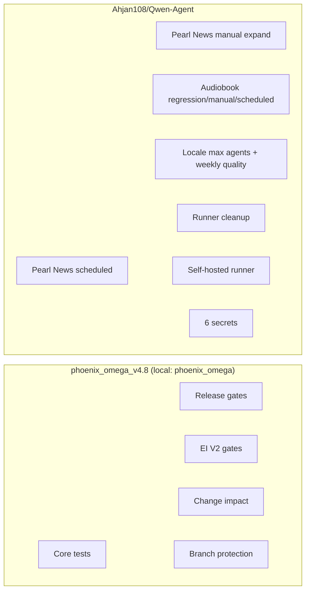

# GitHub Operations Framework

**Purpose:** Single place to map repos, workflows, triggers, secrets, and runners for **Ahjan108/phoenix_omega_v4.8** and **Ahjan108/Qwen-Agent** so GitHub operations are repeatable and error-free.

**You found this from:** [docs/DOCS_INDEX.md](./DOCS_INDEX.md) (task table: "Do GitHub operations (both repos)" or "For developers: start here"). Use this doc whenever you do PRs, merges, pushes, or runner/workflow work in either repo.

**Authority:** [DOCS_INDEX.md](./DOCS_INDEX.md). Related: [BRANCH_PROTECTION_REQUIREMENTS.md](./BRANCH_PROTECTION_REQUIREMENTS.md), [GITHUB_SUPPORT_SYSTEM_SPEC.md](./GITHUB_SUPPORT_SYSTEM_SPEC.md), [PEARL_NEWS_OPTION_B_RUNBOOK.md](./PEARL_NEWS_OPTION_B_RUNBOOK.md), [GITHUB_GOVERNANCE_INCIDENT_RUNBOOK.md](./GITHUB_GOVERNANCE_INCIDENT_RUNBOOK.md).

---

## Monthly Stable Baseline And Rollback Runbooks

Create a stable baseline tag from green `main` once per month. See [RELEASE_POLICY.md](./RELEASE_POLICY.md).

Keep rollback references current in [ROLLBACK_RUNBOOKS_INDEX.md](./ROLLBACK_RUNBOOKS_INDEX.md).

---

## Remote-Only Commit Review

A weekly workflow, [.github/workflows/remote-commit-review.yml](../.github/workflows/remote-commit-review.yml), reports commits on `main` from the last 7 days that were not made via a merged PR. Triage those results within 24 hours.

---

## Repo identity

| GitHub repo | Default branch | Local path | Note |
|-------------|----------------|------------|------|
| **Ahjan108/phoenix_omega_v4.8** | main | phoenix_omega | Phoenix system. phoenix_omega_v4.8 = this repo on GitHub. |
| **Ahjan108/Qwen-Agent** | main | Qwen-Agent (sibling or elsewhere) | Self-hosted runtime for Pearl News + Audiobook + Localization; fork of QwenLM/Qwen-Agent. |

---

## Architecture (overview)



---

## Workflow matrix: phoenix_omega_v4.8

| Workflow file | Name | Trigger | Runner | Required for branch protection? |
|---------------|------|---------|--------|----------------------------------|
| core-tests.yml | Core tests | push, PR to main | ubuntu-latest | Yes |
| release-gates.yml | Release gates | push, PR to main | ubuntu-latest | Yes |
| ei-v2-gates.yml | EI V2 gates | push, PR (path-filtered), schedule | ubuntu-latest | Yes |
| change-impact.yml | Change impact | push, PR to main | ubuntu-latest | Yes |
| teacher-gates.yml | Teacher gates | push, PR (path-filtered) | ubuntu-latest | Optional (path-filtered) |
| brand-guards.yml | Brand guards | push, PR (path-filtered) | ubuntu-latest | Optional |
| github-governance-check.yml | GitHub governance check | PR | ubuntu-latest | No |
| docs-ci.yml | Docs CI | push, PR | ubuntu-latest | No |
| simulation-10k.yml | Simulation 10k | schedule, dispatch | ubuntu-latest | No |
| marketing-config-gate.yml | Marketing Config Validation Gate | push, PR (path-filtered) | ubuntu-latest | No |
| production-observability.yml | Production observability | schedule, dispatch | ubuntu-latest | No |
| production-alerts.yml | Production failure alerts | schedule, dispatch | ubuntu-latest | No |
| auto-merge-bot-fix.yml | Auto-merge bot-fix | PR (labeled bot-fix) | ubuntu-latest | No |
| weekly-pipeline.yml | Weekly pipeline | schedule, dispatch | ubuntu-latest | No |
| ml-editorial-weekly.yml | ML Editorial weekly | schedule, dispatch | ubuntu-latest | No |
| ml-loop-continuous.yml | ML loop continuous | schedule, dispatch | ubuntu-latest | No |
| ml-loop-daily-promotion.yml | ML loop daily promotion | schedule, dispatch | ubuntu-latest | No |
| ml-loop-weekly-recalibration.yml | ML loop weekly recalibration | schedule, dispatch | ubuntu-latest | No |
| locale-gate.yml | Locale gate | push, PR | ubuntu-latest | No |
| translate-atoms-qwen-matrix.yml | Translate atoms (Qwen matrix) | schedule, dispatch | ubuntu-latest | No |
| research_feeds_ingest.yml | Research feeds ingest | schedule, dispatch | ubuntu-latest | No |
| pages.yml | pages build and deployment | push (e.g. main) | ubuntu-latest | No |
| audiobook-regression.yml | Audiobook regression | workflow_dispatch | ubuntu-latest + self-hosted | No |
| marketing_continuous.yml | Marketing continuous ingest | schedule (hourly :15) | self-hosted | No |
| marketing-briefs-and-proposals.yml | Marketing briefs + proposals (daily) | schedule (daily 8am UTC), dispatch | self-hosted | No |
| ei-v2-learning.yml | EI V2 daily learning | schedule (daily 5am UTC), dispatch | ubuntu-latest | No |
| catalog-book-pipeline.yml | Catalog book pipeline (weekly) | schedule (Mon 6am UTC), dispatch | self-hosted | No |

**Concurrency groups (automation cadence):**

| Workflow | Concurrency group | cancel-in-progress | Rationale |
|----------|-------------------|--------------------|-----------|
| marketing_continuous.yml | `marketing-continuous` | true | Hourly ingest; latest-only avoids stacked runs. |
| catalog-book-pipeline.yml | `catalog-book-pipeline` | false | Weekly job; let it finish. |
| marketing-briefs-and-proposals.yml | `marketing-briefs-proposals` | true | Daily; prefer latest-only. |
| ei-v2-learning.yml | `ei-v2-learning` | false | Learning run should complete. |

**Self-hosted hardening status (phoenix_omega):**

- `marketing_continuous.yml`: concurrency + runner preflight + retry-once ingest loops.
- `marketing-briefs-and-proposals.yml`: lock held in the same step/process as heavy commands + preflight + retry-once.
- `catalog-book-pipeline.yml`: LM preflight + in-step LM lock + retry-once loops for build and EI learn.

**LM Studio lock (self-hosted runner):** Jobs that use the local LM Studio acquire a process-level lock via [Qwen-Agent/scripts/lm_studio_lock.py](../Qwen-Agent/scripts/lm_studio_lock.py) (three tiers: light/medium/heavy). This prevents resource contention between concurrent jobs on the same runner. **Important:** lock must be acquired in the same step/process that runs the heavy command (do not acquire in one step and run heavy work in a later step). See lock file for compatibility matrix.

**Branch protection (main):** Intended live shape is one active `main` ruleset, or temporary multiple active `main` rulesets with identical required contexts. Require exactly **Core tests**, **Release gates**, **EI V2 gates**, **Change impact**. `Release gates` stays PR-required in lightweight form; heavier release checks stay off the PR path. `Workers Builds: pearl-prime` is non-blocking and must not be required for merge. See [BRANCH_PROTECTION_REQUIREMENTS.md](./BRANCH_PROTECTION_REQUIREMENTS.md). Machine-readable policy: [config/governance/required_checks.yaml](../config/governance/required_checks.yaml).

---

## Workflow matrix: Qwen-Agent

| Workflow file | Name | Trigger | Runner | Secrets |
|---------------|------|---------|--------|---------|
| pearl_news_scheduled.yml | Pearl News scheduled | schedule (6am/6pm UTC), workflow_dispatch | self-hosted | All 6 below |
| pearl_news_manual_expand.yml | Pearl News manual (expand) | workflow_dispatch | self-hosted | All 6 below |
| locale_max_agents.yml | Locale max-agents run | workflow_dispatch | self-hosted | QWEN_BASE_URL, QWEN_API_KEY, QWEN_MODEL |
| audiobook_regression.yml | Audiobook regression | workflow_dispatch + PR(path) | ubuntu-latest + self-hosted | QWEN_BASE_URL, QWEN_API_KEY, QWEN_MODEL |
| audiobook_scheduled.yml | Audiobook scheduled (Qwen-only) | schedule + workflow_dispatch | self-hosted | QWEN_BASE_URL, QWEN_API_KEY, QWEN_MODEL |
| audiobook_manual.yml | Audiobook manual run (Qwen-only) | workflow_dispatch | self-hosted | QWEN_BASE_URL, QWEN_API_KEY, QWEN_MODEL |
| locale_quality_weekly.yml | Locale Quality — Weekly EI V2 Loop | schedule + workflow_dispatch | ubuntu-latest | None required |
| runner_artifacts_cleanup.yml | Runner artifacts cleanup | schedule + workflow_dispatch | self-hosted | None required |
| deploy-docs.yml | Deploy to GitHub Pages | push(paths) + workflow_dispatch | ubuntu-latest | Pages permissions |

**Secrets (Settings → Secrets and variables → Actions):** WORDPRESS_SITE_URL, WORDPRESS_USERNAME, WORDPRESS_APP_PASSWORD, QWEN_BASE_URL, QWEN_API_KEY, QWEN_MODEL.
Note: audiobook/localization workflows currently rely on QWEN* env vars; if new workflows add non-default endpoints/auth, update this table.

Branch protection: not specified in this framework; Qwen-Agent typically does not require status checks for main.

---

## Canonical ownership

| Feature / capability | Primary repo | Workflows | Notes |
|----------------------|--------------|-----------|--------|
| Phoenix (EI V2, Core, Release, Change impact, Teacher, Brand, ML loop, etc.) | phoenix_omega_v4.8 | All workflows in phoenix_omega | No Pearl News workflows in this repo. |
| Pearl News (scheduled + manual expand) | Qwen-Agent | pearl_news_scheduled.yml, pearl_news_manual_expand.yml | Canonical workflows live in Qwen-Agent only. phoenix_omega does not contain pearl_news_*.yml. |

---

## Secrets and runners

### phoenix_omega_v4.8

- **Secrets:** Per-workflow (e.g. observability, ML, production alerts may use tokens). Self-hosted marketing/catalog workflows also use `QWEN_BASE_URL`, `QWEN_API_KEY`, `QWEN_MODEL` when LM preflight/warmup is enabled. See workflow files and [AUTONOMOUS_IMPROVEMENT_AND_ML_SYSTEM.md](./AUTONOMOUS_IMPROVEMENT_AND_ML_SYSTEM.md).
- **Runner:** Mixed. Most workflows are GitHub-hosted (`ubuntu-latest`); `marketing_continuous.yml`, `marketing-briefs-and-proposals.yml`, and `catalog-book-pipeline.yml` run on self-hosted.
- **Ownership map:** [OWNERSHIP_MATRIX.md](./OWNERSHIP_MATRIX.md)

### Qwen-Agent

- **Secrets (6):** WORDPRESS_SITE_URL, WORDPRESS_USERNAME, WORDPRESS_APP_PASSWORD, QWEN_BASE_URL, QWEN_API_KEY, QWEN_MODEL.
- **Runner:** Self-hosted on the machine where LM Studio runs. Typical path: `Qwen-Agent/actions-runner/`. Start: `cd /path/to/Qwen-Agent/actions-runner && ./run.sh`. Ensure LM Studio is running when workflows that use `--expand` are triggered.
- **LM Studio config reference:** [LM_STUDIO_CONFIG.md](./LM_STUDIO_CONFIG.md) (runtime recommendations and stability settings).

### Cross-repo self-hosted contention

If any `phoenix_omega` workflow is moved to self-hosted and uses LM Studio, it must follow the same heavy-job policy as Qwen-Agent:

- concurrency group + LM lock
- heavy window guard
- preflight + warmup + retry loop
- `enable_thinking: false` for production draft/judge/translation calls

---

## System functions (procedures)

### Standard PR flow (phoenix_omega)

1. Branch from `origin/main`: `git fetch origin && git checkout -b codex/<topic> origin/main`
2. Make changes, then run preflight: `scripts/ci/preflight_push.sh` (if present)
3. Commit, push branch: `git add -A && git commit -m "<type>: <scope>" && git push -u origin codex/<topic>`
4. Open PR to main; wait for the canonical required checks (Core tests, Release gates, EI V2 gates, Change impact); merge. Cloudflare preview noise such as `Workers Builds: pearl-prime` is not a merge requirement.

See [GITHUB_SUPPORT_SYSTEM_SPEC.md](./GITHUB_SUPPORT_SYSTEM_SPEC.md) §5–6.

### Merge to main when local main is behind

If you committed on a feature branch and pushed, but merging to main fails because local main is behind remote:

```bash
cd /path/to/phoenix_omega
git checkout main
git pull origin main
git merge codex/<your-branch> -m "Merge codex/<your-branch>: <short description>"
git push origin main
```

Or push your branch and merge via GitHub PR; then locally: `git checkout main && git pull origin main`.

### Push to Qwen-Agent main

When changing only Qwen-Agent (e.g. workflow or Pearl News code):

1. Confirm you are in the Qwen-Agent repo and on main (or the branch you intend to push).
2. `git pull origin main` (avoid rejected push).
3. `git add <files> && git commit -m "<message>" && git push origin main`.

### Start self-hosted runner (Qwen-Agent)

On the machine where LM Studio runs:

```bash
cd /path/to/Qwen-Agent/actions-runner
./run.sh
```

Run in background or a dedicated terminal. Keep LM Studio running if you trigger workflows that use LLM expansion.

### Safe localization run defaults (Qwen-Agent)

Use these defaults for `locale_max_agents.yml` to avoid long silent hangs:

- `locale_set=core` (6 production locales only)
- `max_agents=2` (safe for local LM Studio throughput; up to 6 on fast hardware)
- `timeout_sec=120` (hard stop per teacher shard — each shard = 1 LLM call ~20s)
- `mode=translate+validate`

The batch runner shards by **teacher** (not topic) so each shard = exactly 1 LLM call (~20s), well within the 120s timeout (6x safety margin). Features: LM Studio preflight check, accurate heartbeat (active vs queued), early abort after 5 consecutive failures, error output surfacing. The LM Studio lock prevents concurrent heavy jobs from resource-starving each other.

### Runner _diag "file already exists" fix (Qwen-Agent)

If the workflow fails with a message like `The file '.../actions-runner/_diag/pages/...log' already exists`:

1. Stop the runner (Ctrl+C in the terminal where `./run.sh` is running).
2. Clear diagnostic files:
   ```bash
   rm -rf /path/to/Qwen-Agent/actions-runner/_diag/pages/*
   ```
   If the error persists, clear all: `rm -rf /path/to/Qwen-Agent/actions-runner/_diag/*`
3. Start the runner again: `cd /path/to/Qwen-Agent/actions-runner && ./run.sh`

### Recovery: rejected push (non–fast-forward)

Do **not** force-push. Integrate remote changes then push:

```bash
git pull origin main
# resolve conflicts if any
git push origin main
```

For governance or ruleset issues, see [GITHUB_GOVERNANCE_INCIDENT_RUNBOOK.md](./GITHUB_GOVERNANCE_INCIDENT_RUNBOOK.md).

---

## Before you push (checklists)

### phoenix_omega

- [ ] Not on `main` (use a feature branch for changes).
- [ ] Branch name matches convention (e.g. `codex/<topic>`).
- [ ] Run `scripts/ci/preflight_push.sh` if available.
- [ ] No token or secret files staged.

### Qwen-Agent

- [ ] Confirm repo and branch (e.g. main if pushing directly).
- [ ] `git pull origin main` first if others may have pushed.
- [ ] No accidental phoenix-only files (e.g. from phoenix_omega) in the commit.

---

## Optional: machine-readable registry

A registry file [config/governance/github_repos_registry.yaml](../config/governance/github_repos_registry.yaml) (if present) lists repos, workflow file names, required checks, and expected secret names for scripts or tooling. The framework doc above is the human-readable source of truth.
