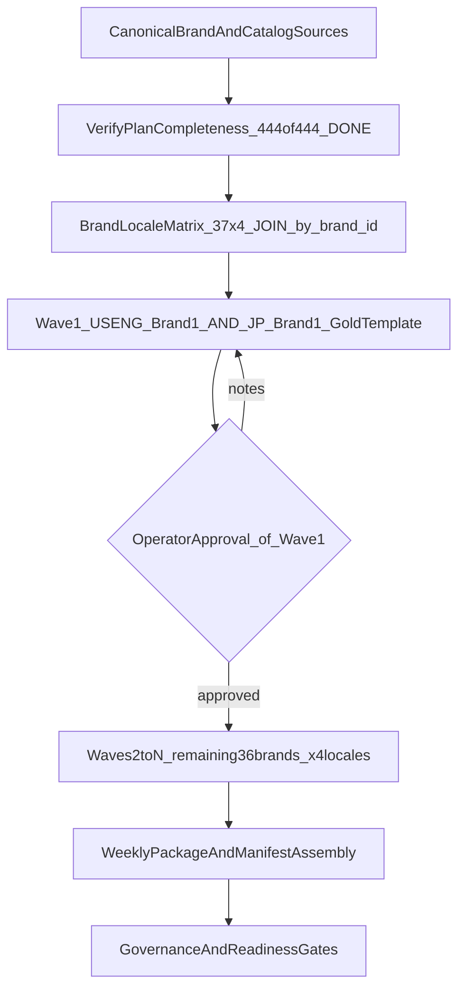

# Global Catalog Fan-Out — Execution Plan (canonical)

**Status:** active execution blueprint (supersedes the 2026-05-28 draft)
**Author:** Pearl_PM
**Authority:** `docs/PEARL_ARCHITECT_STATE.md` (WORLDWIDE-CATALOG-GO-LIVE-V1-PROGRAM-01 + AMENDMENT-2026-05-27 + BR-CANON-01/02) · `docs/SYSTEMS_STATE_20260527.md`
**Anchor:** main HEAD `543956d4d` (2026-05-28)

> This is an **execution blueprint for the content-generation layer.** The *planning* layer is already banked (Layer 1, PR #1355 → 444/444 plan cells). Do NOT rebuild finished plans — verify them, then generate.

---

## Objective

Generate complete catalog **content** (books, manga series/titles, podcast scripts, image-bank coverage) for **37 manga-canon brands × 4 launch locales**, with `US-ENG Brand 1` + `JP Brand 1` as the validated gold templates for the fan-out.

### Scope clarity (anti-drift — READ FIRST)
- **The "37 brands" = `config/manga/canonical_brand_list.yaml` ONLY.** This is the operator-visible canon per BR-CANON-02.
- **It is NOT 4 separate regional brand rosters.** "Taiwan / China / Japan" = the *same 37 brands localized*. `brand_id` is the cross-locale JOIN key (BR-CANON-02). Minting region-specific brands would violate Path X — **forbidden.**
- **`config/brand_registry.yaml` (≈28 keys) is the SEPARATE book-pipeline axis (24×13=312).** Do NOT conflate it with the 37 manga canon. The fan-out "37" is manga canon.
- **4 launch locales:** `en_US`, `ja_JP`, `zh_TW`, `zh_CN` (Tier-1 markets per master catalog plan; the other 9 locales are later phases).

---

## Source-of-Truth Inputs (canonical)

Verify (do not rebuild) before any generation:
- `config/manga/canonical_brand_list.yaml` — the 37 brands (THE canon)
- `config/manga/manga_brand_series_plan.yaml` — manga series plan (note: legacy file has 13/37; the generated SSOT is 37/37 — see "Known drift")
- `config/brand_admin/manga_canon_planned_volumes.yaml` — per-brand planned volumes (book/manga/podcast/audiobook)
- `config/podcast/brand_podcast_plans.yaml` — podcast plan source
- `artifacts/catalog/worldwide_catalog_plan_en_US_2026-05-10.tsv` — en_US allocation (verified canonical; the `_2026-05-11` filename does not exist)
- `artifacts/catalog/high_confidence_catalog_v1.tsv` — 801 $-maker configs
- `artifacts/catalog/plan_completeness_37x4_20260527.tsv` — Layer 1 completeness proof (444/444)
- `artifacts/coordination/ACTIVE_PROJECTS.tsv` — program state

---

## Execution-Layer Reality (the part the draft omitted)

Content generation depends on **Pearl Star** (operator's box) reached over **Tailscale**, NOT LAN:

- Every agent/job touching Pearl Star MUST first run:
  ```
  eval "$(python3 scripts/ci/load_integration_env_from_keychain.py)"
  ```
  This sets the real endpoints. **Do NOT hardcode the stale `192.168.1.112` LAN IP** — that bug caused a false "unreachable" on the first brand-1 build.
- Verified-working endpoints (2026-05-28):
  - `COMFYUI_URL=http://pearlstar.tail7fd910.ts.net:8188` (images — HTTP 200)
  - `QWEN_BASE_URL=http://pearlstar.tail7fd910.ts.net:11434/v1` (CJK prose — qwen2.5:14b)
  - `GEMMA_BASE_URL=…:11434/v1` (en batch — gemma3:27b)
  - `COSYVOICE_URL=…:9880` (CJK TTS)
  - SSH alias `pearl_star` → `pearlstar`
- Pre-flight gate for any generation job: `curl -s --max-time 8 "$COMFYUI_URL/system_stats"` must return 200.

### LLM tier routing (CLAUDE.md — MANDATORY)
| Content | Tier | Engine |
|---|---|---|
| en_US prose (operator-present review) | Tier 1 | Claude = Pearl_Writer |
| en_US batch (unattended) | Tier 2 | Gemma on Pearl Star |
| ja_JP / zh_TW / zh_CN prose | Tier 2 | Qwen on Pearl Star (CJK6) |
| Images (covers, panels) | — | ComfyUI on Pearl Star ($0); RunComfy fallback ≤ $10/mo cap |
| CJK TTS | — | CosyVoice2 on Pearl Star; Edge-TTS free fallback |
| **Banned** | — | all paid cloud LLM APIs (`scripts/ci/audit_llm_callers.py` must = 0) |

---

## Delivery Architecture (planning-level)



---

## Workstreams (reframed: verify-then-generate)

### WS1 — Brand/Locale Coverage Matrix ✅ DONE (verify only)
- 37 brands × 4 locales × {books, manga, podcast, image_bank} matrix.
- **Already 444/444** (Layer 1, PR #1355). Reconcile only the known drift (below).
- Action: re-run `scripts/catalog/validate_plan_completeness_37x4.py` before each wave; confirm still 444/444.

### WS2 — Books content (all brands)
- Plan exists (allocation TSV + high_confidence). **Generation** is the open work.
- Per brand: write book TEXT (HOOK scene-first), build EPUB + ComfyUI cover (two-stage: FLUX imagery, PIL text overlay — never title in prompt, per COVER-REGISTRY-01).
- Readiness states: planned → draft → review → ready.

### WS3 — Manga full catalog (100% series/titles)
- Manga series plan exists (1,350 series YAMLs). **Generation** = scripts + panel renders.
- Per series: chapter beats + panel descriptions → ComfyUI render (V2 multi-model per MANGA-LAYERED-PIPELINE-V2-01) → KDP PDF + WEBTOON strip.
- Reuse existing `composed_v4` panels where present (don't re-render).

### WS4 — Podcast scripts (all brands)
- Plan exists (podcast 148/148 from #1355). **Generation** = episode scripts per `config/podcast/` format contracts + locale variants.

### WS5 — Image bank (all brands)
- Slot taxonomy: reuse existing manifests under `artifacts/video/image_banks/` + `artifacts/manga/<brand>/composed_v4_qwen/`.
- Per brand: characters + covers + panels via ComfyUI. Define asset→deliverable packaging map ("assemble into pics and books").

### WS6 — Wave strategy + sequencing
- **Wave 1:** full end-to-end content for `US-ENG Brand 1` (stillness_press) + `JP Brand 1` (stillness_press ja_JP). **~80% in flight** (en_US shipped `543956d4d`; images+ja completion agent running).
- **Gate:** Wave 1 must be **operator-approved** before Waves 2..N. (Validation before scaling — not "use templates," but "blocked until signoff.")
- **Waves 2..N:** remaining 36 brands × 4 locales, batched by locale (en_US first, then ja_JP/zh_TW/zh_CN), unattended on Pearl Star (Gemma en / Qwen CJK / ComfyUI images).
- Per-brand-locale = its own PR (reviewable; never mega-PR). Checkpoint to `artifacts/catalog/fanout_progress_37x4.tsv` (resumable).

### WS7 — Governance / quality / policy
- Tier routing enforced (table above). Catalog/index gen stays deterministic (no-LLM where scripts require it).
- Per-brand readiness gate before "complete": EPUB validates rc=0; manga PDF+WEBTOON assemble; podcast scripts present; covers rendered; manifest entries non-null.
- OPD-153 (Workers Builds noise OK) + OPD-145 (split-at-build) + `--admin --squash` merge pattern.

---

## Known drift (fix opportunistically, do not block fan-out)
- `config/manga/manga_brand_series_plan.yaml` legacy file = 13/37 brands but still feeds 6 scripts incl. the brand-admin planned-volume generator → under-counts manga for 24 brands. Migration flagged (chip). The generated 37×4 SSOT is the truth.
- Series/episode titles are `TBD` at plan stage (expected; filled at generation).

---

## Success criteria
- Every in-scope brand (37) has generated content for books + manga series/titles + podcast scripts + image bank, in all 4 locales.
- `US-ENG Brand 1` + `JP Brand 1` = complete end-to-end gold templates, operator-approved.
- Manga catalog reaches 100% rendered across in-scope brands.
- Readiness traceable via `brand_admin_v2.html` (non-null downloads across the board) + manifest/index outputs.

---

## Current execution state (2026-05-28)
| Layer | Maps to | Status |
|---|---|---|
| Layer 1 (PLAN) | WS1–WS5 planning | ✅ 444/444 (PR #1355) |
| Layer 2 (VALIDATE) | Wave 1 | 🚀 en_US shipped (#1356); images+ja completion agent running |
| Gate | Wave 1 operator approval | ⏳ pending |
| Layer 3 (FAN OUT) | Waves 2..N | 🔴 gated on Layer 2 + approval |

*Supersedes the 2026-05-28 draft. Layer 3 agents read scope + tier routing + Pearl Star runbook from THIS file.*
