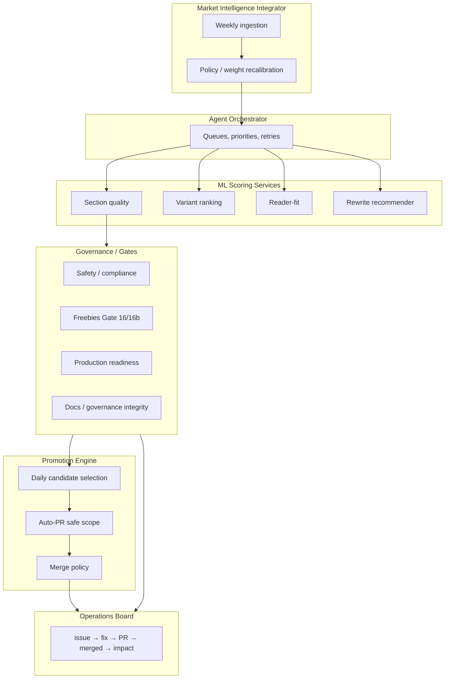

# Autonomous Improvement Spec (24/7 + Daily + Weekly)

**Purpose:** Continuous multi-agent improvement for prose/books: 24/7 generate–score–simulate–propose, daily gate-passing promotion, weekly market-strategy recalibration.  
**Authority:** This spec; config in `config/ml_loop/`; scripts in `scripts/ml_loop/`.  
**Related:** [PRODUCTION_OBSERVABILITY_LEARNING_SPEC.md](PRODUCTION_OBSERVABILITY_LEARNING_SPEC.md), [ML_EDITORIAL_MARKET_LOOP_SPEC.md](ML_EDITORIAL_MARKET_LOOP_SPEC.md), [AUTO_MERGE_POLICY.md](AUTO_MERGE_POLICY.md).

---

## 1. Objective

Run a continuous multi-agent improvement system with:

- **24/7:** Generate, score, simulate, propose fixes (fast, safe iteration).
- **Daily:** Promote only gate-passing candidates; auto-PR for allowlisted scope.
- **Weekly:** Ingest market feedback; retune strategy/weights; publish report and baseline.

---

## 2. Cadence model

| Cadence | Activity |
|---------|----------|
| **Continuous (24/7)** | Generate, score, simulate, propose fixes; fast gates; queue pass candidates; send failures to operations board. |
| **Daily** | Promote only gate-passing candidates; auto-PR for safe scope; merge policy; log impact. |
| **Weekly** | Ingest market feedback; recompute weights; segment/channel positioning; weekly report and new baseline. |

Practical schedule (from background):

- **Hourly:** Sim + scoring + candidate generation.
- **Every 4 hours:** Shadow validation summary (optional).
- **Daily:** Promotion window + auto-PR + gated merge.
- **Weekly:** Deep recalibration and report only.

---

## 3. System architecture

- **Agent Orchestrator:** Manages queues, priorities, retries.
- **ML Scoring Services:** Section quality (clarity/pacing/arc drift), variant ranking (title/subtitle/opening), reader-fit, rewrite recommender (see [ML_EDITORIAL_MARKET_LOOP_SPEC.md](ML_EDITORIAL_MARKET_LOOP_SPEC.md)).
- **Governance/Gates:** Safety/compliance, freebies (Gate 16/16b), production readiness, docs/governance integrity.
- **Promotion Engine:** Daily candidate selection, auto-PR for allowlisted paths, merge policy enforcement.
- **Market Intelligence Integrator:** Weekly ingestion of marketing signals; policy/weight recalibration.
- **Operations Board:** Issue → fix → PR → merged → impact ([observability operations board](PRODUCTION_OBSERVABILITY_LEARNING_SPEC.md)).

---

## 4. Agent roles (24/7)

| Role | Responsibility |
|------|----------------|
| **Detector Agent** | Find failures, regressions, drift (from sim, gates, scoring). |
| **Editor Agent** | Generate targeted rewrites (from rewrite recommender). |
| **Variant Agent** | Create and rank title/subtitle/opening variants. |
| **Fit Agent** | Predict segment-fit and route (reader-fit). |
| **Governance Agent** | Run policy checks; block unsafe changes. |
| **PR Agent** | Create low-risk PRs with evidence (allowlist only). |
| **Impact Agent** | Compute before/after deltas; log to operations board. |

These roles are implemented as steps or modules within the continuous loop and daily promotion scripts (not necessarily separate processes).

---

## 5. Data contracts (required artifacts)

All artifact rows must include where applicable: **ts**, **book_id** (or issue id), **source**, **decision**, **confidence**, **evidence_path**.

| Artifact | Purpose |
|----------|---------|
| `artifacts/ml_editorial/section_scores.jsonl` | Section quality scores (see ML_EDITORIAL_MARKET_LOOP_SPEC). |
| `artifacts/ml_editorial/variant_rankings.jsonl` | Variant rankings. |
| `artifacts/ml_editorial/reader_fit_scores.jsonl` | Reader-fit scores. |
| `artifacts/ml_editorial/rewrite_recs.jsonl` | Rewrite recommendations. |
| `artifacts/ml_editorial/market_actions.jsonl` | Market positioning actions. |
| `artifacts/observability/operations_board.jsonl` | Issue → fix → PR → merged → impact. |
| `artifacts/ei_v2/marketing_integration.log` | Marketing integration events. |
| `artifacts/ml_loop/promotion_queue.jsonl` | Daily promotion candidates (gate-passing). |
| `artifacts/ml_loop/continuous_candidates.jsonl` | Latest continuous-loop candidates (hourly). |
| `artifacts/ml_loop/weekly_report.json` | Weekly recalibration summary and baseline. |

Standard row fields (add to existing schemas where missing): **ts** (ISO 8601 UTC), **book_id** or **issue_id**, **source** (e.g. `detector_agent`, `section_scoring`, `governance_agent`, `pr_agent`), **decision** (e.g. `promote`, `hold`, `fix`, `pr_opened`, `fail`), **confidence** (0–1), **evidence_path** (path to artifact or run URL). Optional: **suggested_fix**, **reason**.

---

## 6. Continuous loop (24/7)

1. **Trigger:** New commits, artifact changes, or **hourly** schedule (fallback).
2. **Run:** Fast sim set + ML scoring (section, variant, fit, rewrite).
3. **Generate:** Candidates and rewrite proposals.
4. **Run fast gates:** Schema, safety, compliance, basic quality (no slow systems test in hourly run).
5. **Send:** Pass candidates → daily promotion queue (`artifacts/ml_loop/promotion_queue.jsonl` or equivalent).
6. **Send:** Failures → operations board with exact suggested fix.

Config: `config/ml_loop/promotion_policy.yaml` (queue paths, confidence floor).  
Script: `scripts/ml_loop/run_continuous_loop.py`.

---

## 7. Daily promotion loop

1. **Evaluate** queued candidates against baseline and gates.
2. **Require:** Gate pass, confidence floor, no compliance flags, bounded calibration drift (see `config/ml_loop/drift_thresholds.yaml`).
3. **Auto-PR** only for allowlisted paths/scopes (see [AUTO_MERGE_POLICY.md](AUTO_MERGE_POLICY.md)).
4. **Auto-merge** only when required checks pass and policy matches.
5. **Log** impact after merge to operations board.

Script: `scripts/ml_loop/run_daily_promotion.py`.  
Delegates to `scripts/observability/agent_open_fix_pr.py` for dependency/config fixes when applicable.

---

## 8. Weekly market recalibration

1. **Ingest** weekly marketing outcomes and intelligence (e.g. EI V2 log, performance artifacts).
2. **Recompute** weights for ranking, fit, and rewrite priority (write to config or `artifacts/ml_loop/weekly_weights.json`).
3. **Update** segment/channel positioning actions (market_actions).
4. **Publish** weekly report and new baseline (`artifacts/ml_loop/weekly_report.json`).
5. **Do not** bypass safety/governance gates.

Script: `scripts/ml_loop/run_weekly_market_recalibration.py`.

---

## 9. Safety / governance policy

- **Global autonomy kill switch:** Config toggle (e.g. `config/ml_loop/promotion_policy.yaml` or observability) disables auto-PR and auto-merge.
- **Separate marketing_compliance signal** with config weight (EI V2 / ML editorial).
- **Rollback in one action:** Disable promotions + revert last policy/model; document in runbook.
- **Immutable audit trail:** All agent actions logged (observability audit_log, ml_loop audit).
- **No direct push to main:** PR path only; branch protection enforced.

---

## 10. Promotion rules

- **Low-risk (auto-PR allowed):** Config, tests, metadata, constrained rewrite patches (allowlist in promotion_policy).
- **High-risk:** Require human approval (prose, core content, governance paths).
- **Confidence thresholds:** Ranker/fit minimum confidence; rewrite expected_gain floor (in promotion_policy and drift_thresholds).
- **Drift thresholds:** Locked per-dimension max delta; exceed → block promotion (see `config/ml_loop/drift_thresholds.yaml`).

---

## 11. UI / dashboard requirements

1. **Loop status:** Detect → fix → PR → checks → merged → impact (operations board).
2. **Agent queue view** with blockers (promotion_queue + operations board).
3. **Governance blockers panel:** Docs integrity, Gate 16/16b, Gate 17, etc.
4. **KPI trigger board:** What fired and why (from observability KPI evaluator).
5. **Weekly recalibration summary** (weekly_report.json).
6. **Manual override:** Pause/resume/rollback (kill switch + runbook).
7. **Operations board tab** with full traceability.

Contract: Dashboard consumes `artifacts/observability/operations_board.jsonl`, `artifacts/ml_loop/promotion_queue.jsonl`, `artifacts/ml_loop/weekly_report.json`, and KPI trigger output.

---

## 12. KPI targets

Defined in `config/ml_loop/kpi_targets.yaml`. Used for WoW and promotion decisions.

| KPI | Target |
|-----|--------|
| Weak-section rate | Down WoW |
| Variant win-rate | Uplift vs baseline |
| Reader-fit | Uplift by target segment |
| Conversion/completion proxy | Uplift |
| Compliance incident rate | Non-increasing |
| Rollback rate | Below threshold |
| Mean time issue→merge | Improvement |

---

## 13. Repo file plan

| Item | Path |
|------|------|
| Continuous loop | `scripts/ml_loop/run_continuous_loop.py` |
| Daily promotion | `scripts/ml_loop/run_daily_promotion.py` |
| Weekly recalibration | `scripts/ml_loop/run_weekly_market_recalibration.py` |
| Agent open fix PR | `scripts/ml_loop/agent_open_fix_pr.py` (wrapper or delegate to observability) |
| Promotion policy | `config/ml_loop/promotion_policy.yaml` |
| KPI targets | `config/ml_loop/kpi_targets.yaml` |
| Drift thresholds | `config/ml_loop/drift_thresholds.yaml` |
| Operations board | `artifacts/observability/operations_board.jsonl` (existing) |
| Spec | `docs/ML_AUTONOMOUS_LOOP_SPEC.md` (this doc) |

---

## 14. Definition of done

- [ ] 24/7 loop running with queue and required artifacts.
- [ ] Daily promotion running with safe auto-PR path.
- [ ] Weekly market recalibration running with published report.
- [ ] Governance/safety enforced with zero bypass.
- [ ] UI exposes full state, blockers, and next actions (contract implemented).
- [ ] 4 consecutive weeks of stable KPI improvement without compliance regression (operational target).

---

## 15. Optional final proof (workflow_dispatch + artifacts)

To confirm each workflow runs green and expected artifacts are produced:

1. **Local verification (no GitHub):**  
   `bash scripts/ml_loop/verify_workflows_and_artifacts.sh`  
   Runs continuous loop, daily promotion (dry-run), and weekly recalibration; checks `artifacts/ml_loop/weekly_report.json`, `baseline.json`, and `artifacts/observability/operations_board.jsonl`.

2. **Trigger workflow_dispatch (requires `gh` CLI and auth):**  
   `bash scripts/ml_loop/verify_workflows_and_artifacts.sh --trigger`  
   Same as above, then runs `gh workflow run "ML loop continuous"`, `gh workflow run "ML loop daily promotion"`, `gh workflow run "ML loop weekly recalibration"`.  
   Or trigger manually: GitHub → Actions → select workflow → "Run workflow".

3. **Expected artifacts after runs:**  
   - `artifacts/ml_loop/weekly_report.json` (ts, source, decision, weak_section_rate, baseline, kpi_targets).  
   - `artifacts/ml_loop/baseline.json`.  
   - `artifacts/observability/operations_board.jsonl` (rows with ts, book_id, source, decision, confidence, evidence_path, suggested_fix).  
   - `artifacts/ml_loop/continuous_candidates.jsonl` and `promotion_queue.jsonl` when section_scores contain gate-passing candidates (no weak_flags, confidence ≥ floor).
