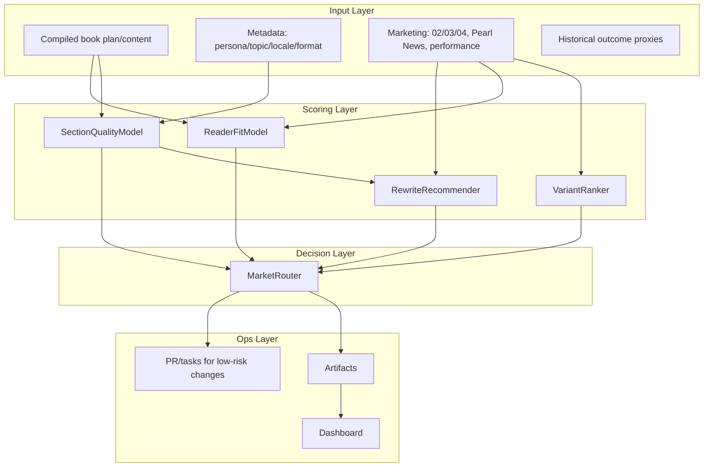

# ML Editorial + Marketing Intelligence Loop (v1)

**Purpose:** Automated loop that scores book/prose quality, ranks variants, predicts reader-fit, recommends rewrites, and feeds market-positioning/distribution decisions.  
**Authority:** This spec; config in `config/ml_editorial/`; outputs in `artifacts/ml_editorial/`.  
**Integration:** Marketing intelligence from `config/marketing/` (02/03/04 equivalents), EI V2 lexicons, and [EI_V2_MARKETING_INTEGRATION_SPEC.md](EI_V2_MARKETING_INTEGRATION_SPEC.md).

---

## 1. Goal and scope

| # | Capability | Description |
|---|------------|-------------|
| 1 | Detect weak sections | Clarity, pacing, emotional arc drift per chapter/segment |
| 2 | Rank variants | Draft/title/subtitle/opening variants by persona/topic/locale |
| 3 | Predict reader-fit | Fit score per persona/topic/locale |
| 4 | Recommend rewrites | Targeted rewrites by weak-dimension and brand voice |
| 5 | Market positioning | Use signals to automate positioning/distribution recommendations |

---

## 2. System architecture



- **Input layer:** Compiled book plan/content, metadata (persona_id, topic_id, locale, language, format), marketing intelligence (`config/marketing/` 02/03/04), Pearl News trends, performance artifacts, historical outcome proxies (CTR, conversion, completion, retention).
- **Scoring layer:** SectionQualityModel (clarity, pacing, arc drift), VariantRanker (title/subtitle/opening), ReaderFitModel (persona/topic/locale), RewriteRecommender (constrained by brand/marketing).
- **Decision layer:** MarketRouter maps quality+fit+variant signals to positioning/distribution actions (priority segment, channel mix, price band, campaign angle, hold/revise/publish).
- **Ops layer:** Writes to `artifacts/ml_editorial/`, opens PR/tasks for low-risk changes, dashboard exposes status and blockers.

---

## 3. Data contracts (required artifacts)

All artifacts are JSONL (one JSON object per line). Timestamp field `ts` is ISO 8601 UTC.

### 3.1 `artifacts/ml_editorial/section_scores.jsonl`

| Field | Type | Required | Description |
|-------|------|----------|-------------|
| book_id | string | yes | Book identifier |
| chapter_id | string | yes | Chapter or segment id |
| clarity_score | number | yes | 0–1 |
| pacing_score | number | yes | 0–1 |
| arc_drift_score | number | yes | 0–1 (higher = more drift) |
| weak_flags | array of string | yes | e.g. `["clarity", "pacing"]` |
| ts | string | yes | ISO 8601 UTC |

**Schema (JSON Schema):**

```yaml
type: object
required: [book_id, chapter_id, clarity_score, pacing_score, arc_drift_score, weak_flags, ts]
properties:
  book_id: { type: string }
  chapter_id: { type: string }
  clarity_score: { type: number, minimum: 0, maximum: 1 }
  pacing_score: { type: number, minimum: 0, maximum: 1 }
  arc_drift_score: { type: number, minimum: 0, maximum: 1 }
  weak_flags: { type: array, items: { type: string } }
  ts: { type: string, format: date-time }
```

### 3.2 `artifacts/ml_editorial/variant_rankings.jsonl`

| Field | Type | Required | Description |
|-------|------|----------|-------------|
| book_id | string | yes | Book identifier |
| variant_type | string | yes | `title` \| `subtitle` \| `opening` |
| variant_id | string | yes | Id of the variant |
| rank_score | number | yes | Higher = better |
| confidence | number | yes | 0–1 |
| ts | string | yes | ISO 8601 UTC |

Optional: `persona_id`, `topic_id`, `locale` for context.

### 3.3 `artifacts/ml_editorial/reader_fit_scores.jsonl`

| Field | Type | Required | Description |
|-------|------|----------|-------------|
| book_id | string | yes | Book identifier |
| persona_id | string | yes | Persona id |
| topic_id | string | yes | Topic id |
| locale | string | yes | Locale code |
| fit_score | number | yes | 0–1 |
| confidence | number | yes | 0–1 |
| ts | string | yes | ISO 8601 UTC |

### 3.4 `artifacts/ml_editorial/rewrite_recs.jsonl`

| Field | Type | Required | Description |
|-------|------|----------|-------------|
| book_id | string | yes | Book identifier |
| chapter_id | string | yes | Chapter/segment id |
| issue_type | string | yes | e.g. clarity, pacing, arc_drift |
| recommendation | string | yes | Short rewrite suggestion |
| constraint_set | string or array | no | Brand/style/compliance constraints ref |
| expected_gain | number | no | 0–1 expected improvement |
| ts | string | yes | ISO 8601 UTC |

### 3.5 `artifacts/ml_editorial/market_actions.jsonl`

| Field | Type | Required | Description |
|-------|------|----------|-------------|
| book_id | string | yes | Book identifier |
| recommended_segment | string | no | Priority persona/topic/locale |
| positioning_angle | string | no | Campaign/messaging angle |
| distribution_channels | array of string | no | e.g. ["google_play", "findaway"] |
| priority | string | no | high \| medium \| low |
| rationale | string | no | Why this action |
| ts | string | yes | ISO 8601 UTC |

---

## 4. Model specs

### 4.1 Weak-section detector (SectionQualityModel)

- **Inputs:** Chapter text + structure/arc metadata (e.g. BAND, slot type).
- **Outputs:** 0–1 scores for clarity, pacing, arc_drift; weak_flags when dimension &lt; threshold.
- **Rule:** Any dimension &lt; config threshold → flag with reason. Thresholds in `config/ml_editorial/ml_editorial_config.yaml` under `section_quality.thresholds`.

### 4.2 Variant ranker (VariantRanker)

- **Inputs:** Variant text + persona/topic/locale context; marketing lexicons (04 invisible_scripts, 03 consumer_phrases).
- **Outputs:** rank_score + confidence.
- **Rule:** Top-1 only if confidence ≥ floor (config); else "needs human review".

### 4.3 Reader-fit predictor (ReaderFitModel)

- **Inputs:** Book features (topic, persona, arc), persona/topic/locale features, marketing lexicons.
- **Outputs:** fit_score + confidence.
- **Rule:** Low confidence → route to exploration strategy (e.g. A/B or hold).

### 4.4 Rewrite recommender (RewriteRecommender)

- **Inputs:** weak_flags, brand/style constraints, marketing language policy (02/03 banned terms).
- **Outputs:** Targeted rewrite suggestions (not full regeneration).
- **Rule:** Enforce forbidden-token and compliance constraints from 02/03.

### 4.5 MarketRouter (Decision layer)

- **Inputs:** Section scores, variant rankings, reader-fit scores, rewrite recs, optional KPI trends.
- **Outputs:** market_actions.jsonl (recommended_segment, positioning_angle, distribution_channels, priority, rationale).
- **Rule:** Use config policy for hold/revise/publish and channel mix.

---

## 5. Marketing intelligence integration

| Source | Use in loop |
|--------|--------------|
| `config/marketing/` (03 consumer language) | Consumer phrase alignment, banned terms; variant ranking and rewrite constraints |
| `config/marketing/` (04 invisible_scripts) | Persona/topic resonance for ranking and reader-fit |
| `config/marketing/` or 02 emotional vocabulary | Lexical compliance in rewrites and variant ranker |
| EI V2 marketing lexicons | Same 02/03/04 data via `phoenix_v4.quality.ei_v2.marketing_lexicons` when enabled |
| MarketRouter | Model outputs + KPI trends → positioning/distribution per segment |

---

## 6. Automation workflow

1. **Nightly:** Scoring run on new/changed books (section_scores, optional reader_fit for recent books).
2. **Weekly orchestration:**
   - Re-rank variants (variant_rankings).
   - Recompute reader-fit (reader_fit_scores).
   - Generate rewrite recommendations (rewrite_recs).
   - Emit market actions (market_actions).
3. **If policy allows:** Open PR for safe text/config updates (allowlist in config); log rationale + expected_gain + rollback path.
4. **Logging:** Before/after impact on core KPIs (see kpi_targets).

---

## 7. Human-in-the-loop policy

- **Auto-apply:** Low-risk only (copy tweaks, metadata updates, non-core prose patches per allowlist).
- **Review required:** High-impact prose rewrites; any output with confidence below floor; model drift beyond calibration gate.
- **Every auto-change:** rationale + expected_gain + rollback path in artifact and PR description.

---

## 8. KPI targets

Defined in `config/ml_editorial/kpi_targets.yaml`. Used for week-over-week targets and calibration gate.

| Category | Metric | Target |
|----------|--------|--------|
| Quality | weak_section_rate | Down week-over-week |
| Quality | arc_drift_violations | Below threshold |
| Variant | top_ranked_variant_win_rate | Vs baseline |
| Reader fit | fit_score_uplift | In target persona/topic cohorts |
| Market | conversion_proxy_uplift | Uplift |
| Market | completion_retention_proxy_uplift | Uplift |
| Market | compliance_flags | Fewer |

---

## 9. Safety and governance

See **[ML_EDITORIAL_SAFETY_AND_GOVERNANCE.md](ML_EDITORIAL_SAFETY_AND_GOVERNANCE.md)** for full detail.

- **Kill switch:** Global toggle in `config/ml_editorial/ml_editorial_config.yaml` (`ml_actions_enabled: false` disables automated writes/PRs).
- **Allowlist:** Only paths in `automation.allowlist_paths` may be written by automation.
- **Audit log:** Every model decision and action logged to `artifacts/ml_editorial/audit_log.jsonl` (action, outcome, ts, detail).
- **Rollback:** Procedure documented in safety doc; optional rollback script.
- **Calibration gate:** Block rollout if drift exceeds locked thresholds in `config/ml_editorial/kpi_targets.yaml` (same pattern as EI V2 marketing calibration).

---

## 10. File plan (repo)

| Item | Path |
|------|------|
| Section scoring | `scripts/ml_editorial/run_section_scoring.py` |
| Variant ranking | `scripts/ml_editorial/run_variant_ranking.py` |
| Reader fit | `scripts/ml_editorial/run_reader_fit.py` |
| Rewrite recs | `scripts/ml_editorial/run_rewrite_recs.py` |
| Market router | `scripts/ml_editorial/run_market_router.py` |
| Config | `config/ml_editorial/ml_editorial_config.yaml` |
| KPI targets | `config/ml_editorial/kpi_targets.yaml` |
| Artifacts | `artifacts/ml_editorial/*.jsonl` |
| Dashboard | UI tab "ML Editorial & Market Intelligence": [scripts/dashboard/ml_editorial_tab.py](../scripts/dashboard/ml_editorial_tab.py) (`get_ml_editorial_summary`, `render_ml_editorial_tab`) |
| Safety and governance | [ML_EDITORIAL_SAFETY_AND_GOVERNANCE.md](ML_EDITORIAL_SAFETY_AND_GOVERNANCE.md) |

---

## 11. Acceptance criteria

1. **Artifacts:** All 5 artifact outputs (section_scores, variant_rankings, reader_fit_scores, rewrite_recs, market_actions) are generated by the weekly run and conform to the schemas above.
2. **Dashboard:** A dedicated tab or view shows scores, recommendations, actions, and blockers (or a contract script that produces the data for such a tab).
3. **Weekly run:** Produces at least one actionable distribution/positioning recommendation per run when input data exists.
4. **A/B:** At least one controlled A/B cycle completed with measurable uplift (documented in artifacts or runbook).
5. **Auditability:** All model decisions and auto-actions written to audit_log; rollback path documented and verified.

---

## 12. Definition of done

- [ ] All 5 artifact outputs generated on schedule (nightly scoring, weekly full run).
- [ ] Dashboard shows scores, recommendations, actions, and blockers.
- [ ] Weekly run produces actionable distribution/positioning recommendations.
- [ ] At least one controlled A/B cycle completed with measurable uplift.
- [ ] Full auditability and rollback verified.
