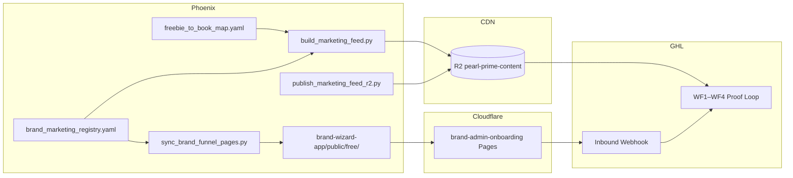

# GHL Multi-Brand Funnel Workflow

**Audience:** Operator + dev agent  
**Authority:** `config/marketing/brand_marketing_registry.yaml`  
**Pilot brands (2026-06-24):** `stillness_press`, `devotion_path`, `way_stream_sanctuary`

End-to-end checklist from repo changes → live funnel pages → GHL nurture → weekly feed refresh.

---

## Architecture (one picture)



| Layer | What | Where |
|-------|------|-------|
| Feed (E1–E5) | Weekly `marketing_feed.json` schema v3 | R2 CDN |
| Funnel pages | 15 interactive TOF landings per brand | CF Pages `/free/...` |
| Capture | `phoenix_lead.js` → inbound webhook | GHL per brand |
| Nurture | WF1–WF4 merge tags from feed | GHL per sub-account |

---

## Phase 1 — Engineering (repo)

### 1.1 Brand registry

Ensure `config/marketing/brand_marketing_registry.yaml` has:

- `ghl_enabled: true`
- `funnel_path_prefix` (`null` = legacy `/free/{slug}/`; else `/free/{prefix}/{slug}/`)
- `webhook_env` (per-brand Keychain / secret name)
- `default_persona`, `teacher_id`, `display_name`

### 1.2 Generate funnel pages

```bash
python3 scripts/marketing/sync_brand_funnel_pages.py --brand-id devotion_path
python3 scripts/marketing/sync_brand_funnel_pages.py --brand-id way_stream_sanctuary
```

Stillness uses canonical templates at `brand-wizard-app/public/free/{slug}/` (no prefix).

### 1.3 Build + validate feeds

```bash
./scripts/marketing/setup_ghl_feed_stack.sh devotion_path en_US
./scripts/marketing/setup_ghl_feed_stack.sh way_stream_sanctuary en_US
# All pilot brands:
python3 scripts/marketing/build_all_marketing_feeds.py
```

Verify: 15 topics, E1+E5 per topic, brand-prefixed E1 `cta_url`, correct E4 shop URLs.

### 1.4 Tests

```bash
python3 -m pytest tests/test_brand_marketing_registry.py tests/test_build_marketing_feed.py -q
```

### 1.5 PR + merge

```bash
git fetch origin
git checkout -b agent/<task> origin/main   # golden branch
# ... changes ...
PYTHONPATH=. python3 scripts/git/push_guard.py
scripts/ci/preflight_push.sh
git push -u origin HEAD
gh pr create ...
# After CI green (ignore Workers Builds: pearl-prime — OPD-153):
gh pr merge <N> --squash
```

**CI note:** `Workers Builds: pearl-prime` fails on every PR (Cloudflare Git integration; non-blocking). Only `Verify governance` is ruleset-required.

---

## Phase 2 — Publish feeds (R2 CDN)

### 2.1 One-time provision (per bucket)

GitHub Actions → **Provision pearl-prime-content (GHL feed)** → run with `brand_id` + `locale`.

Or locally (Keychain loaded):

```bash
eval "$(python3 scripts/ci/load_integration_env_from_keychain.py)"
./scripts/marketing/provision_pearl_prime_content_ghl.sh <brand_id> <locale>
```

### 2.2 Publish weekly artifact

```bash
python3 scripts/marketing/publish_marketing_feed_r2.py \
  --brand-id devotion_path --locale en_US --week 2026-W26
```

### 2.3 Feed URL shape (stable path; new JSON each Monday)

```text
https://pub-4bac5d0b30be4b16824cd1eaa84ae9f5.r2.dev/pearl-prime-content/{brand_id}/en_US/{week}/marketing_feed.json
```

| Brand | Items (2026-W26) | E4 shop |
|-------|------------------|---------|
| `stillness_press` | ~109 | pearlprime.shop |
| `devotion_path` | 120 | pearlprime.shop (Sai Maa SKUs) |
| `way_stream_sanctuary` | 109 | `/download/...` proxy |

### 2.4 Verify CDN

```bash
curl -sI "<feed-url>" | head -1          # HTTP 200
curl -s "<feed-url>" | python3 -c "import json,sys; d=json.load(sys.stdin); print(d['schema_version'], len(d['items']))"
```

---

## Phase 3 — Deploy funnel pages (Cloudflare Pages)

**Trigger:** merge to `main` touching `brand-wizard-app/**`  
**Workflow:** `.github/workflows/brand-admin-onboarding-pages.yml`  
**Live host:** `https://brand-admin-onboarding.pages.dev`

| Brand | Funnel base |
|-------|-------------|
| Stillness | `/free/{slug}/` |
| Devotion Path | `/free/devotion_path/{slug}/` |
| Waystream | `/free/way_stream_sanctuary/{slug}/` |

### 3.1 Post-merge smoke (3 pages per brand)

```bash
# Devotion — expect Open Vessel Press + pearlprime.shop CTA
curl -s "https://brand-admin-onboarding.pages.dev/free/devotion_path/anxiety-nervous-system-reset/" | rg "data-brand-id|Open Vessel|pearlprime"

# Waystream — expect Waystream branding + /download/ CTA (not pearlprime)
curl -s "https://brand-admin-onboarding.pages.dev/free/way_stream_sanctuary/burnout-energy-audit/" | rg "data-brand-id|Waystream|/download/"
```

Pages ship with `data-ghl-webhook=""` until Phase 4.

---

## Phase 4 — GHL admin (per brand, parallel)

### 4.1 Forward package

| Brand | Handoff | Email |
|-------|---------|-------|
| Stillness | [GHL_TOTAL_INTEGRATION_HANDOFF_20260623.md](./GHL_TOTAL_INTEGRATION_HANDOFF_20260623.md) | [GHL_ADMIN_FORWARD_EMAIL_20260623.txt](./GHL_ADMIN_FORWARD_EMAIL_20260623.txt) |
| Devotion Path | [GHL_TOTAL_INTEGRATION_HANDOFF_DEVOTION_PATH_20260624.md](./GHL_TOTAL_INTEGRATION_HANDOFF_DEVOTION_PATH_20260624.md) | [GHL_ADMIN_FORWARD_EMAIL_DEVOTION_PATH_20260624.txt](./GHL_ADMIN_FORWARD_EMAIL_DEVOTION_PATH_20260624.txt) |
| Waystream | [GHL_TOTAL_INTEGRATION_HANDOFF_WAYSTREAM_20260624.md](./GHL_TOTAL_INTEGRATION_HANDOFF_WAYSTREAM_20260624.md) | [GHL_ADMIN_FORWARD_EMAIL_WAYSTREAM_20260624.txt](./GHL_ADMIN_FORWARD_EMAIL_WAYSTREAM_20260624.txt) |

Attach 4 admin docs (same for all brands): `GHL_ADMIN_START_HERE.md`, `GHL_INTEGRATION_GUIDE.md`, `PROOF_LOOP_WORKFLOW_TEMPLATE.md`, `GHL_ADMIN_HANDOFF_FREEBIE_CAPTURE.md`.

Operator index: [OPERATOR_GHL_FREEBIE.md](./OPERATOR_GHL_FREEBIE.md)

### 4.2 GHL admin does (one-time per sub-account)

1. Create / open GHL sub-account  
2. Import WF1–WF4  
3. Paste feed URL (§2.3)  
4. Map `cta_url`, `pricing`, `content_type` on feed items  
5. Create one inbound webhook for all 15 funnel pages  
6. Test contact → confirm E1 fires  

### 4.3 Collect back

| Brand | Env var |
|-------|---------|
| Stillness | `PHOENIX_GHL_FUNNEL_WEBHOOK_STILLNESS` |
| Devotion Path | `PHOENIX_GHL_FUNNEL_WEBHOOK_DEVOTION` |
| Waystream | `PHOENIX_GHL_FUNNEL_WEBHOOK_WAYSTREAM` |

---

## Phase 5 — Inject webhooks + redeploy

### Stillness (legacy script)

```bash
./scripts/freebies/setup_ghl_webhook.sh '<webhook-url>'
```

Uses `PHOENIX_GHL_FUNNEL_WEBHOOK` + `config/freebies/ghl_funnel_capture.yaml` (15 pages at `/free/{slug}/`).

### Devotion Path / Waystream (per-brand)

```bash
URL='https://services.leadconnectorhq.com/hooks/...'
ENV_NAME=PHOENIX_GHL_FUNNEL_WEBHOOK_DEVOTION   # or _WAYSTREAM
PREFIX=devotion_path                            # or way_stream_sanctuary

security add-generic-password -s phoenix-omega -a "$ENV_NAME" -w "$URL" -U
export "$ENV_NAME"="$URL"
python3 - <<PY
import os, re
from pathlib import Path
url = os.environ["$ENV_NAME"]
root = Path("brand-wizard-app/public/free/$PREFIX")
for p in sorted(root.glob("*/index.html")):
    text = p.read_text(encoding="utf-8")
    patched = re.sub(r'data-ghl-webhook="[^"]*"', f'data-ghl-webhook="{url}"', text, count=1)
    if patched != text:
        p.write_text(patched, encoding="utf-8")
        print("patched", p)
PY
```

Commit patched HTML → merge to `main` → CF Pages redeploy (~2 min).

### 5.1 Verify capture

```bash
python3 scripts/freebies/verify_ghl_webhook_push.py   # Stillness
python3 scripts/freebies/smoke_freebie_capture.py     # if available
```

Manual: complete a quiz on live page → confirm contact in GHL sub-account.

---

## Phase 6 — Weekly operations (ongoing)

| Who | Action | When |
|-----|--------|------|
| Phoenix CI / operator | Rebuild + publish `marketing_feed.json` to R2 | Monday |
| GHL | Re-fetch same feed URL (path unchanged) | Automatic |
| GHL admin | **Nothing** | — |
| Operator | Spot-check feed item count + E1 URLs | After publish |

```bash
python3 scripts/marketing/build_all_marketing_feeds.py
python3 scripts/marketing/publish_marketing_feed_r2.py --brand-id <id> --locale en_US
```

---

## Rollout to additional brands (wave 2+)

1. Add entry to `brand_marketing_registry.yaml` (`ghl_enabled: true`, `funnel_path_prefix`, `webhook_env`)  
2. `sync_brand_funnel_pages.py --brand-id <new>`  
3. `setup_ghl_feed_stack.sh <new> en_US`  
4. PR → merge → publish R2 → forward GHL package (clone Devotion/Waystream handoff template)  
5. Inject webhook → redeploy  

Stub generator: `python3 scripts/marketing/gen_brand_marketing_registry.py --fill-missing`

---

## Known non-blockers

| Item | Status |
|------|--------|
| `Workers Builds: pearl-prime` CI red | OPD-153 — ignore for merge; optional CF dashboard disconnect |
| `data-ghl-webhook=""` before Phase 5 | Expected — capture skips gracefully |
| Grief topic | Template only — no book CTA in feed or on page |

---

## Reference PR

- **#1897** — Devotion Path + Waystream: 30 funnel pages, feeds, registry, tests

**Version:** 2026-06-24
