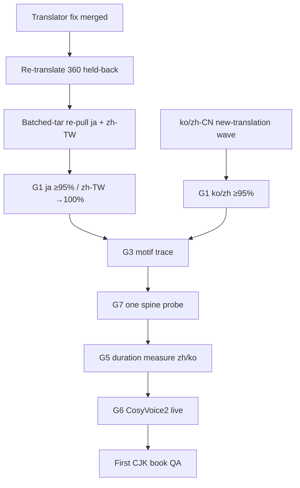

# CJK6 Book Readiness Gate

**Status:** ACTIVE SSOT — "Can CJK books start assembling yet?"  
**Owner:** Pearl_Architect + Pearl_PM  
**Ref:** OPD-20260627-001 (translation lane), OPD-20260613-001 (duration ratification)

This document defines the finish line for CJK *book assembly* (not translation alone). Each gate item lists threshold, current value, verdict, and what closes it.

**Locale scope:** ja_JP, ko_KR, zh_TW, zh_CN (+ derived zh_HK, zh_SG).  
**Derivation rule:** zh_HK and zh_SG atoms are derived from zh_TW / zh_CN respectively (Traditional→HK, Simplified→SG); they do not receive independent Pearl Star translation runs.

**en_US base atom count:** 4,909 `atoms/**/CANONICAL.txt` (no `/locales/`).

---

## Gate matrix (2026-06-29 snapshot)

| Gate | ja_JP | zh_TW | ko_KR | zh_CN | zh_HK | zh_SG |
|------|-------|-------|-------|-------|-------|-------|
| **G1 Atom coverage** | BLOCKED | PASS (≥95%) | BLOCKED | BLOCKED | derived | derived |
| **G2 Atom integrity** | BLOCKED | PASS | PASS | PASS | derived | derived |
| **G3 Arc-backing** | UNKNOWN | UNKNOWN | UNKNOWN | UNKNOWN | — | — |
| **G4 Plan fan-out + flip** | PARTIAL | PARTIAL | BLOCKED | PARTIAL | — | — |
| **G5 Duration ratification** | PARTIAL | BLOCKED | BLOCKED | BLOCKED | — | — |
| **G6 TTS / voice** | BLOCKED | BLOCKED | BLOCKED | BLOCKED | — | — |
| **G7 Build pipeline CJK** | UNKNOWN | UNKNOWN | UNKNOWN | UNKNOWN | — | — |
| **G8 Naming / titles** | PARTIAL | PARTIAL | BLOCKED | PARTIAL | — | — |

**Closest to assemblable:** **zh_TW** (95.4% atoms, integrity clean on origin; duration + voice + G3/G7 remain).

---

## G1 — Atom coverage

**Threshold:** ≥95% to start assembly QA; 100% to ship.

| Locale | On origin/main | Coverage | Pearl Star ceiling | Verdict |
|--------|----------------|----------|-------------------|---------|
| ja_JP | 4,298 | **87.6%** | 4,445 (90.5%) | BLOCKED — 360 held-back + 611 to 100% |
| zh_TW | 4,683 | **95.4%** | 4,896 (99.7%) | **PASS** (start threshold) |
| ko_KR | 227 | **4.6%** | 227 (no pull delta) | BLOCKED — new-translation wave |
| zh_CN | 1,965 | **40.0%** | 1,965 (no pull delta) | BLOCKED — new-translation wave |
| zh_HK | 243 | 4.9% | derives zh_TW | BLOCKED — follows zh_TW |
| zh_SG | 243 | 4.9% | derives zh_CN | BLOCKED — follows zh_CN |

**Closes G1:** Translator fix (prose-only) + Tier-2 re-run of 360 held-back (ja 147 + zh-TW 213) + batched-tar re-pull; then ko (~4,682 atoms) + zh-CN (~2,944 atoms) fresh translation wave on Pearl Star.

---

## G2 — Atom integrity

**Threshold:** 0 NEW parse-fail + 0 NEW over-match in committed locale atoms (parse-sweep CI green).

| Locale | Committed state | Held-back (re-translation) | Verdict |
|--------|-----------------|----------------------------|---------|
| ja_JP | 57 recently landed; parse-sweep OK | 147 (14 trunc + 133 parse/overmatch) | BLOCKED until backlog cleared |
| zh_TW | 152 landed; parse-sweep OK | 213 (27 trunc + 186 parse/overmatch) | PASS on origin |
| ko_KR / zh_CN | Identical to Pearl Star | 0 pull delta | PASS (nothing new to corrupt) |

**Root cause (confirmed):** `translate_atoms_to_locale.py` sent full variant (header + metadata + prose) to Qwen → mangled `---` delimiters and `#1590` over-match class (89% of held-back). **Fix:** prose-only translation + verbatim structure re-attach (`scripts/localization/translate_atoms_to_locale.py`).

**Closes G2:** Merge translator fix + post-translation validator; re-translate 360 held-back; re-pull with dual pre-filter.

---

## G3 — Arc-backing

**Threshold:** CJK catalog plans resolve to arc-backed, buildable rows.

**Structural note:** Master arcs are numeric curves + motif IDs (language-neutral structure). **Motif dict carries TEXT** (`central_image`, `central_question`) — if the spine renders motif text into chapter flow, CJK books leak English unless motifs are localized or injected language-neutrally.

| Check | Status | Action |
|-------|--------|--------|
| en_US master_arcs serve CJK plans directly? | Likely YES for curve/slot structure | Verify one ja_JP + zh_TW plan resolve |
| Motif text localization required? | **UNKNOWN — CRITICAL SUB-CHECK** | Trace `recurring_motif_bank.yaml` → renderer; one CJK spine probe |
| CJK-specific arc files needed? | Probably NO for curves | YES if motif text is rendered verbatim |

**Verdict:** UNKNOWN — run motif injection trace before first CJK book build.

---

## G4 — Plan fan-out + flip

**Threshold:** CJK6 plan skeletons exist AND flip to buildable (`arc-backed` + `_needs_authoring:false`).

Catalog-fanout-campaign held CJK6 waves; es_* lanes active. CJK6 fan-out deferred until translation lane current.

| Locale | Plan skeletons | Buildable flip | Verdict |
|--------|----------------|----------------|---------|
| ja_JP / zh_TW | Partial (Pearl Prime catalog rows exist) | Not fully verified | PARTIAL |
| ko_KR | Minimal (4.6% atom backing) | BLOCKED | BLOCKED |
| zh_CN | Partial (40% atom backing) | BLOCKED | BLOCKED |

**Closes G4:** Atom coverage G1 + arc resolution audit + fanout campaign re-enable for CJK6.

---

## G5 — Duration ratification (OPD-20260613-001)

**Threshold:** Measured expansion + TTS-timed narration constants ratified per locale.

| Locale | expansion_char_per_word | narration_cpm | Status |
|--------|-------------------------|---------------|--------|
| ja-JP | **2.15** (measured, n=4) | 300 (EST) | PARTIAL — expansion MEASURED; TTS rate provisional |
| zh-CN | 1.6 (UNVERIFIED) | 190 (UNVERIFIED) | BLOCKED — Pearl Star text render + CosyVoice2 timing |
| ko-KR | 2.0 (UNVERIFIED) | 350 vs 330 (config/addendum drift) | BLOCKED — measure + reconcile cpm |

**Closes G5:** Pearl Star render measurement for zh/ko expansion; CosyVoice2 timed render for all three; update `config/duration/platform_duration_profiles.yaml` + `docs/DURATION_DERIVATION_SPEC_CJK_ADDENDUM.md`.

---

## G6 — TTS / voice

**Threshold:** CosyVoice2 routing live per CJK locale for audiobook path.

| Item | Status |
|------|--------|
| CosyVoice2 on Pearl Star | Installed; **not running** (per PEARL_STAR_JOB_QUEUE_V1_SPEC) |
| Locale routing config | Partial — `COSYVOICE_URL` in integration registry |
| Piper (EN) | Separate path |

**Verdict:** BLOCKED for all CJK audiobook assembly.

**Closes G6:** Start `cosyvoice.service` on Pearl Star; wire locale→voice map; smoke-test ja/zh/ko 30s clip.

---

## G7 — Build pipeline CJK-readiness

**Threshold:** One successful CJK spine → EPUB with correct fonts; register gates calibrated for char-based text.

| Check | Status | Risk |
|-------|--------|------|
| EPUB East-Asian fonts (Hiragino JA / Heiti SC) | Not verified on recent builds | **High** — tofu if `a:ea` not set |
| F1–F6 register gates | English word-tuned | **High** — likely mis-fire on CJK char counts |
| Word-floor / chapter_flow | English WPM assumptions | **High** — needs CJK-aware thresholds or char budgets |

**Verdict:** UNKNOWN — **most likely hidden quality blocker.**

**Closes G7:** One ja_JP + one zh_TW spine build probe through QA matrix; file register-gate findings.

---

## G8 — Naming / titles

**Threshold:** Locale-native titles/subtitles for listing-ready rows.

| Locale | Native titles in SSOT | Verdict |
|--------|----------------------|---------|
| ja_JP | Partial (manga/catalog synth done) | PARTIAL |
| zh_TW | Partial (275 manga plans) | PARTIAL |
| ko_KR / zh_CN | Sparse | BLOCKED |

**Closes G8:** Naming engine CJK pass after G1 ko/zh-CN translation wave.

---

## Re-translation backlog (Tier-2, Pearl Star)

Consolidated held-back atoms pending translator fix + Qwen re-run:

| Locale | Truncation | Parse/overmatch | **Total** |
|--------|------------|-----------------|-----------|
| ja_JP | 14 | 133 | **147** |
| zh_TW | 27 | 186 | **213** |
| **Total** | **41** | **319** | **360** |

**New-translation frontier (not re-pull):**

| Locale | Atoms to translate | Est. runtime @ ~4–8 atoms/min (Qwen 14B, serial GPU) |
|--------|-------------------|------------------------------------------------------|
| ko_KR | ~4,682 | ~10–20 h GPU (multi-day serialized with manga) |
| zh_CN | ~2,944 | ~6–12 h GPU |

---

## Critical path to first CJK book

**Recommended sequence:**
1. Merge translator + parse-sweep baseline inheritance + validator (this PR).
2. Sample validate 10 held-back → bulk re-translate 360 → re-pull.
3. Parallel: G3 motif trace + G7 one-build probe on zh_TW (closest).
4. ko_KR + zh_CN new-translation wave (GPU-serialized, multi-day) — **gates CJK books at scale**.
5. G5 + G6 before audiobook ship.

---

## References

- `scripts/localization/translate_atoms_to_locale.py` — Tier-2 translator
- `scripts/localization/validate_cjk_atom.py` — post-translation validator
- `scripts/ci/check_canonical_atom_parse_sweep.py` — CI parse-sweep (+ en-baseline inheritance)
- `docs/DURATION_DERIVATION_SPEC_CJK_ADDENDUM.md` — provisional CJK duration constants
- `docs/ROBUST_AGENT_PROTOCOL.md` — RAP queue-first for Pearl Star GPU work
