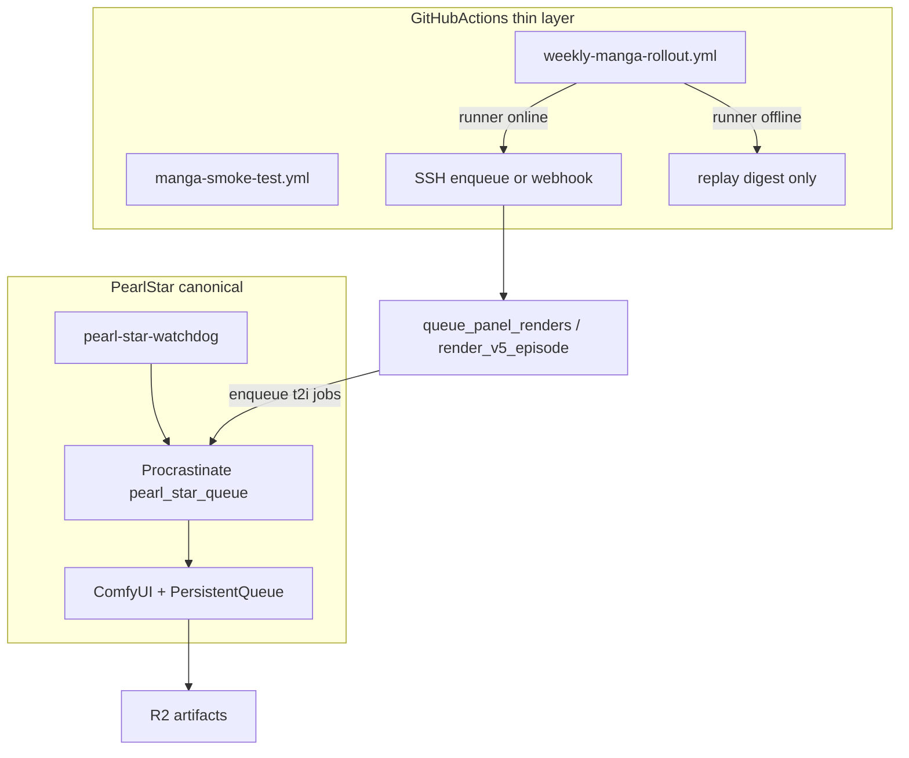

# Manga Production Operational V1 Spec

**Cap entry (follow-up ratification):** `MANGA-PRODUCTION-OPS-V1-01` — references this spec; does **not** duplicate `MANGA-LAYERED-PIPELINE-V2-01` or `PEARL-STAR-JOB-QUEUE-V1-01`.

**Date:** 2026-06-22  
**Authority:** Pearl_Architect (ratify) → Pearl_Int (install/verify) → Pearl_Dev (wiring) → Pearl_GitHub (GHA hybrid)

---

## §1 Purpose and "100% operational" definition

**Operational** means unattended manga production can run end-to-end **without GHA runner uptime**, subject to the **hardware floor**: Pearl Star powered on, Tailscale reachable, GPU healthy.

**100% bar (five gates — all must pass):**

| Gate | Evidence |
|------|----------|
| G1 Pearl Star reachability | `curl -s -m 8 "$COMFYUI_URL/system_stats"` → HTTP 200 + `devices` array ([INTEGRATION_CREDENTIALS_REGISTRY.md §0](../INTEGRATION_CREDENTIALS_REGISTRY.md)) |
| G2 Queue Phase A installed | `pscli status` < 2s; A1–A3 smokes PASS per [scripts/pearl_star/smoke/](../../scripts/pearl_star/smoke/) |
| G3 Manga t2i worker live | `t2i_flux_dev_h1a` + `t2i_qwen_image` workers registered; 1 panel job enqueued → completed PNG on disk |
| G4 Stall recovery | Injected `FORCE_STALL=1` job → watchdog kill → `pscli requeue` or auto-retry → success |
| G5 Weekly lane | `weekly_manga_rollout.py` completes one book (GPU path via queue) OR explicit `--replay-fallback` digest when Pearl Star down |

**Explicit non-claim:** queue resilience ≠ render while the box is powered off.

**Audit baseline:** [artifacts/audit/MANGA_MODE_STATUS_REPORT_20260622.md](../../artifacts/audit/MANGA_MODE_STATUS_REPORT_20260622.md)

---

## §2 Scheduling model (Hybrid C — binding)

| Layer | Role |
|-------|------|
| **Canonical** | Pearl Star Procrastinate queue dispatches all production manga panel jobs (one job = one panel per [PEARL_STAR_JOB_QUEUE_V1_SPEC §6.1](./PEARL_STAR_JOB_QUEUE_V1_SPEC.md)) |
| **GHA** | Trigger (`workflow_dispatch` / cron), smoke (replay on `ubuntu-latest`), digest/R2 upload orchestration — **never** the durable render executor for multi-hour batches |
| **Fallback** | If `check_pearl_star_runner_online.py` fails OR `COMFYUI_URL` probe fails → weekly workflow runs **replay-only** path (`run_manga_pipeline.py --backend replay`) + marks digest `degraded: pearl_star_offline` |



**Operator ratification:** Q-MPO-SCHED-01 = Hybrid C.

---

## §3 Pearl_Int preflight block (mandatory before "operational")

Per [skills/pearl-int/SKILL.md](../../skills/pearl-int/SKILL.md) §0 + registry §0:

```bash
eval "$(python3 scripts/ci/load_integration_env_from_keychain.py)"
curl -s -m 8 "$COMFYUI_URL/system_stats" | head -c 400   # must be Tailscale ts.net, NOT 192.168.1.112
ssh -o BatchMode=yes pearl_star hostname
ssh pearl_star 'nvidia-smi --query-gpu=memory.free --format=csv,noheader'
```

**Stale LAN IP:** `scripts/manga/queue_panel_renders.py` must consume `COMFYUI_URL` from Keychain only — no hardcoded `192.168.1.112`.

**Phase A install verification** (if not already done on Pearl Star): [scripts/pearl_star/install/RUNBOOK.md](../../scripts/pearl_star/install/RUNBOOK.md) steps 01→04 + systemd enable + A1–A3 smokes. Workstream **WS-1** (Pearl_Int, operator-attended).

---

## §4 Qwen / model-readiness

Cap telemetry "shard 08 ~7%" is **superseded** by [artifacts/qa/pearl_star_qwen_shard_08_complete_2026-05-10.md](../../artifacts/qa/pearl_star_qwen_shard_08_complete_2026-05-10.md) (9/9 transformer shards, SHA verified).

| Issue | Fix |
|-------|-----|
| `batch_runner.py` `resolve_dispatch_path` gates `qwen_image_*` on unified `qwen_image_2.0` checkpoint only | `qwen_shards_complete` probe (count ≥ 9) OR Comfy-Org split loader workflow |
| `qwen_image_txt2img_manga.json` used `CheckpointLoaderSimple` | Split loader: `UNETLoader` + `CLIPLoader` + `VAELoader` per [pearl_star_node_inventory.md §Qwen](../../skills/pearl-int/references/pearl_star_node_inventory.md) |
| RunComfy fallback | Decommissioned — fail-closed to Pearl Star queue with explicit operator alert |
| V5.1 layered path | Separate worker `t2i_qwen_image` with 600s/900s stall thresholds |

**Model readiness gate** (automated, runs before batch activation):

```bash
python3 scripts/image_generation/batch_runner.py --probe-only
# PASS: flux1-dev-fp8 present AND (qwen unified OR shard_count >= 9) AND ComfyUI /system_stats 200
```

---

## §5 Manga → queue wiring (WS-2, Pearl_Dev)

Extend [PEARL_STAR_JOB_QUEUE_V1_SPEC §8 Phase B step 5](./PEARL_STAR_JOB_QUEUE_V1_SPEC.md):

| Current | Target |
|---------|--------|
| `queue_panel_renders.py` POST `/prompt` loop | Enqueue `t2i_flux_dev_h1a` jobs to Procrastinate; worker calls ComfyUI H1=A graph |
| `render_v5_episode.py` direct dispatch | Orch job `manga_chapter_v51` enqueues N panel jobs; polls `pscli list --status doing` |
| Heartbeats | Worker emits per PEARL_STAR_JOB_QUEUE_V1_SPEC §5.1; watchdog handles stall |

Worker modules under [scripts/pearl_star/worker/](../../scripts/pearl_star/worker/):

- `flux_dev_manga_worker.py` — `t2i_flux_dev_h1a` (H1=A: flux1-dev-fp8, 28/3.5/dpmpp_2m/karras, 1080×1920, stall 120s/180s)
- `qwen_manga_worker.py` — `t2i_qwen_image` (stall 600s/900s)

**Enqueue CLI contract:**

```bash
python3 scripts/manga/queue_panel_renders.py --via-queue --panel-prompts <json>
# OR
python3 scripts/manga/defer_panel_job_cli.py --task t2i_flux_dev_h1a --payload '{"prompt":"..."}'
```

---

## §6 GHA weekly rollout fix (WS-3, Pearl_Dev + Pearl_GitHub)

Root causes from `wait_for_self_hosted_runner.py` + `weekly-manga-rollout.yml`:

1. **403 Forbidden:** add `permissions: { actions: read, contents: read }`
2. **1800s timeout:** split behavior:
   - `wait_runner`: soft-fail (`continue-on-error: true`), `MAX_WAIT_S: 120`
   - `manga_rollout_gpu`: `if: runner online && COMFYUI probe pass`
   - `manga_rollout_replay_digest`: `if: always() && (runner offline || COMFYUI fail)` — replay + degraded digest only
3. Remove hard dependency on multi-hour job on `pearl-star-gpu` for scheduled cron; optional GPU job is **enqueue-only** (<5 min on GHA)

Update `manga-operator-setup-verify.yml`: drop RunComfy secret checks; add optional queue health probe via SSH.

---

## §7 Production pipeline chain


Open PRs (#1195, #1236, #1276) are **content/render batches** that land after G1–G4 pass.

**Cross-links:**

- Render: [MANGA_V5_LAYERED_ARCHITECTURE.md](./MANGA_V5_LAYERED_ARCHITECTURE.md)
- Queue substrate: [PEARL_STAR_JOB_QUEUE_V1_SPEC.md](./PEARL_STAR_JOB_QUEUE_V1_SPEC.md) §3.1 T2I stall table
- Pearl_Int ops: [skills/pearl-int/SKILL.md](../../skills/pearl-int/SKILL.md), [manga_render_path_decision.md](../../skills/pearl-int/references/manga_render_path_decision.md)
- Production entry: [MANGA_PRODUCTION_PIPELINE.md](../MANGA_PRODUCTION_PIPELINE.md)

---

## §8 Operator questions (Q-MPO-*)

| ID | Question | Default |
|----|----------|---------|
| Q-MPO-SCHED-01 | Canonical scheduler | Hybrid C (ratified) |
| Q-MPO-QUEUE-INSTALL-01 | Phase A already on Pearl Star? | Verify via RUNBOOK smokes; install if FAIL |
| Q-MPO-QWEN-PROBE-01 | Shard-count vs unified ckpt for routing | Shard count ≥ 9 sufficient when workflow uses split loaders |
| Q-MPO-GHA-01 | Keep `wait_runner` at all? | Soft-fail + replay branch; max wait 120s not 1800s |
| Q-MPO-FIRST-SHIP-01 | First operational proof series | `stillness_en_01` ep_001 (V5.1) per [MANGA_V51_SHIP_READINESS](../sessions/MANGA_V51_SHIP_READINESS_2026-06-12.md) |

---

## §9 Acceptance evidence bundle

Required artifacts (no "operational" without disk proof):

- `artifacts/qa/manga_production_ops_gate_<date>.md` — G1–G5 checklist
- `artifacts/qa/pearl_star_queue_manga_smoke_<date>.md` — 10-panel enqueue → complete → reboot mid-batch → resume
- Update `artifacts/coordination/CANONICAL_ARTIFACTS_REGISTRY.tsv` (Pearl_Architect follow-up PR)

---

## §10 Implementation workstream order (post-ratification)

1. **Pearl_Int:** Pearl Star preflight + Phase A queue install verification ([RUNBOOK.md](../../scripts/pearl_star/install/RUNBOOK.md))
2. **Pearl_Dev:** Manga t2i workers + `queue_panel_renders.py` queue-first refactor
3. **Pearl_Dev:** Qwen probe/routing fix in `batch_runner.py` + workflow JSON
4. **Pearl_GitHub:** `weekly-manga-rollout.yml` hybrid split + permissions
5. **Pearl_PM:** Coordination sync — mark `ws_manga_weekly_rollout` architecture amended; close stale RunComfy paths

**Out of scope:** merge #1195/#1236/#1276; those consume the operational substrate once gates pass.
