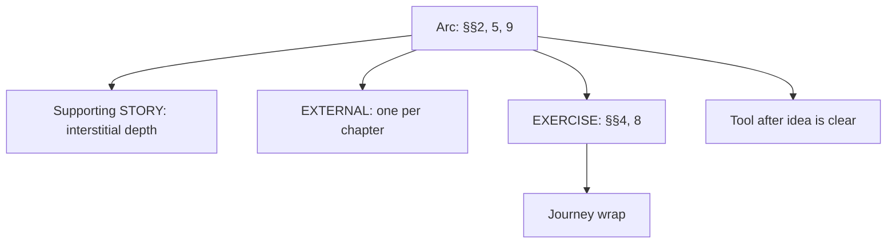

# Pearl Prime Story, Exercise, Tool, and EXTERNAL System V1

**Status:** CANONICAL doctrine/router; implementation lanes are separately labeled.  
**Evidence:** `artifacts/qa/pearl_prime_pipeline_audit_20260722/AUDIT_REPORT.md`  
**Scope:** sellable Pearl Prime books across personas, topics, engines, and locales.

## 1. Locked system layers

| Layer | Source | Responsibility | Production rule |
|---|---|---|---|
| Protagonist arc | `story_atoms/{persona}/anchored/{topic}/{engine}/` | Same-person spine and change across the book | Mandatory for every sellable persona×topic×engine cell |
| Supporting STORY | `atoms/{persona}/{topic}/STORY/` | Peer mirror, warning, atmosphere, witness, or secondary depth | Never substitutes for the arc or becomes a rival protagonist |
| EXTERNAL_STORY | `SOURCE_OF_TRUTH/accent_banks/external_stories/` | Cited external embodiment/proof | Target one per chapter; 50/40/10 audience mix |
| 311 practice | canonical practice library / teacher EXERCISE | Five-layer guided practice body | Real practice ID required |
| Journey wrap | `--exercise-journeys` | Sequenced introduction/transition around the practice | May wrap a real practice; never invents its body |
| 12-chapter exercise plan | persona×topic×locale plan, optional engine override | Orders 12 real practice IDs across the book | Required for production cells |
| Tool | TOOL / application-tool atoms | Short diagnostic, stop rule, or immediate application | Never masquerades as a five-layer exercise |
| Cited evidence | evidence banks | Research support and mechanism credibility | Does not perform story or practice work |

## 2. Beat ownership

- Somatic spine beats §§2/5/9 are arc-only.
- Supporting STORY is interstitial and cannot rescue a missing arc bank.
- EXTERNAL supplements the arc; it never replaces §§2/5/9, a practice, or a tool.
- Exercises occupy EXERCISE slots; tools follow comprehension and serve quick application.

Missing arc content is a production-eligibility failure. The current advisory research-fit gates remain advisory until the operator separately ratifies a strict flip; no generic STORY fallback is permitted as the sellable spine.

## 3. Scale targets for 1,000 books

| Inventory | Target |
|---|---:|
| EXTERNAL stories | 1,000 initial milestone; **1,200 production floor** |
| Arc frameworks | 100–200 reusable frameworks only |
| Cell-specific arc banks | Derived from every sellable persona×topic×engine cell; no fixed 100–200 cap |
| Supporting STORY | Typed depth measured by persona×topic gaps |
| Tools | 150–250 |
| Practices | Existing 311, expanded only through governed authoring |
| Journey wraps | Templates, not a story-like inventory target |

The 1,200-story floor supports reuse across the catalog; selection must enforce no within-book repeat, brand/quarter reuse caps, topical fit, and shingle diversity.

## 4. Exercise-plan identity

Canonical key: `persona × topic × locale`. Engines share the plan by default. An engine-specific override is permitted only when the engine materially changes therapeutic progression and must cite that reason. Every chapter entry references a real canonical practice ID.

## 5. Anti-duplication and authority chain

This document routes; it does not replace:

- `docs/STORY_TYPES_AND_STRUCTURES.md`
- `docs/STORY_CRAFT_CONTRACT_2026-07-07.md`
- `docs/STORY_SUPPORTING_VS_ARC_CONTRACT_2026-07-22.md`
- `scripts/ci/check_flagship_exercise_five_layer.py` + `docs/PEARL_PRIME_BESTSELLER_WRITING_OVERLAY_SPEC.md` §D7 (five-layer/311 practice doctrine — no single dedicated spec doc exists; this is the real authority pair)
- `docs/specs/PEARL_PRIME_EXERCISE_DUAL_SYSTEM_V1_SPEC.md`
- `docs/specs/PEARL_PRIME_TOOL_VS_EXERCISE_POLICY_V1_SPEC.md`
- `specs/EXTERNAL_STORIES_BANK_SPEC.md`
- `docs/PEARL_PRIME_ATOM_100PCT_COVERAGE_SSOT.md`
- `docs/PEARL_PRIME_BESTSELLER_ACCEPTANCE_SCORECARD.md` (`research_fit` cap)

## 6. Implementation boundary

No composer or register-threshold retuning is authorized. Progress comes from researched authoring, deterministic plans, honest binding, selection wiring, and gates. This workstream produces specs, plans, and dispatch prompts; mass authoring and code changes land through their named lanes.
