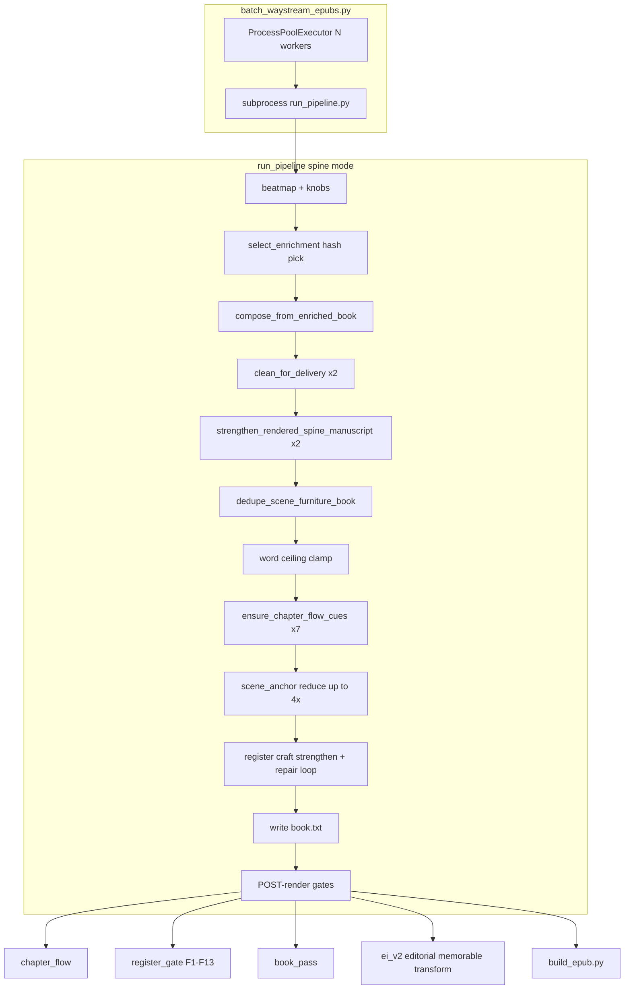

# Waystream EPUB Render Optimization V1 Plan

**Status:** PROPOSAL — docs-only; awaiting operator review of Q-OPT-* defaults  
**Date:** 2026-06-22 (artifact stamp `20260622`)  
**Authority:** Subordinate to [SESSION_UNITY_PROTOCOL.md](../SESSION_UNITY_PROTOCOL.md), [SYSTEMS_V4.md](../SYSTEMS_V4.md), [PEARL_PRIME_ONE_PATH_LOCKDOWN_V1_SPEC.md](./PEARL_PRIME_ONE_PATH_LOCKDOWN_V1_SPEC.md)  
**Planning base:** `origin/main` @ `e853dc227ed260d11ba558b874f4ee173cb86d95`

Evidence appendix: [artifacts/qa/waystream_render_bottleneck_snapshot_20260622.md](../../artifacts/qa/waystream_render_bottleneck_snapshot_20260622.md)

---

## DISCOVERY_REPORT

```
MAIN_SHA:                    e853dc227ed260d11ba558b874f4ee173cb86d95
BATCH_DEFAULT_WORKERS:       min(8, os.cpu_count() or 4) — LANDED on main
                             (scripts/release/batch_waystream_epubs.py:51)
                             CLI: --workers / env WAYSTREAM_BATCH_WORKERS
MANUSCRIPT_PASS_INVENTORY:   36+ full-book scans — see snapshot appendix
GATE_TIMING:                 F1/F4/F6/F7/F13 repair = PRE-render;
                             F1–F13 evaluation = POST-render (production)
RENDERED_BOOK_COUNT:         66 dirs / 61 book.txt / 51 job.json under
                             artifacts/rendered/waystream_batch/
                             batch_epub_state: 800 attempted → 778 ok / 22 pipeline_fail
                             (19 production quality_profile, 45 debug in rendered dirs)
ATOM_SELECTION_PATH:         hash-only, in-memory, no LLM
                             (enrichment_select.py: SHA seed + PersonaPoolRotationState)
EXISTING_COMPAT_TOOLING:     partial — coverage audits exist; no render-failure matrix
```

**PR #1850:** MERGED @ `648f20d1cf4a113d94904cbd0c9bb55012f5282d` — register composer gate fixes (F1/F4/F6/F7/F13 strengthen loop). Plan assumes this is on main.

---

## 1. Executive Summary

### Bottlenecks — validated or refuted

| Rank | Hypothesis | Verdict | Impact |
|------|------------|---------|--------|
| 1 | Sequential batch → parallel workers | **Already shipped on main** | ~Nx wall-clock (N = workers, capped 8) |
| 2 | Redundant full-manuscript scans | **Validated — top CPU bottleneck** | ~25–35 full-text traversals/book in spine strengthen loop (`scripts/run_pipeline.py:1081–1333`); est. 30–50% render CPU recoverable via unified processor |
| 3 | Atom selection (LLM/hash) | **Refuted** — hash-only, fast | Low; not on critical path |
| 4 | Quality gates post-render only | **Partially validated** | Gates correctly post-render; **gap** is no preflight dry-run of `select_enrichment` + phrase/word-floor heuristics before subprocess |
| 5 | Content/atom gaps block wave | **Validated for 22/800** | Failures are **pre-render** (atom inventory), not gate CPU — fixing atoms unblocks more than any render tweak |

### Two paths

- **Fastest path to finish 22 remaining EPUBs:** Fix atom gaps (gen_alpha REFLECTION variants, entrepreneurs EXERCISE bank) → re-run `batch_waystream_epubs.py --all --resume --force` on failed IDs only. Parallel workers already default; no code change required.
- **Fastest path to reliable 800:** Phase 1 validation (workers benchmark) + content backfill for 22 fails + Phase 2 preflight (avoid doomed renders) + unified manuscript processor (sustainable throughput for re-renders/QA).

### Already shipped vs proposed

| Item | Status |
|------|--------|
| `--workers` default `min(8, cpu_count)` | **DONE** |
| `WAYSTREAM_PIPELINE_TIMEOUT_SEC` default 300s | **DONE** |
| Register strengthen loop (PR #1850 @ `648f20d1c`) | **DONE (merged)** |
| Unified manuscript processor | **PROPOSED** Phase 2 |
| Atom compatibility analyzer + preflight | **PROPOSED** Phase 2 |
| Atom metadata.json / arc-atom affinity | **PROPOSED** Phase 3 |

---

## 2. Current Pipeline Profile (as-is)



**CPU drivers (qualitative):**

- **High:** register repair loop (F7×8, F13×5, F4×5, flow cues×7, scene_anchor×4), `clean_for_delivery`×2, post-render gate suite
- **Medium:** `strengthen_rendered_spine_manuscript`×2, `dedupe_scene_furniture_book`, word clamp/floor
- **Low:** `select_enrichment` (disk read + hash), beatmap compile, EPUB build

---

## 3. Optimization Tracks

### Phase 1 — Quick wins (this week)

| Item | Status | Change | Speedup est. | Risk | Owner | Acceptance test |
|------|--------|--------|--------------|------|-------|-----------------|
| Parallel workers | **DONE** | Validation + ops runbook only | ~Nx wall | low | Pearl_Dev | 8 workers on pilot 18; wall time vs workers=1; document `WAYSTREAM_BATCH_WORKERS` for Pearl Star |
| Skip redundant re-render | PROPOSE | Document `--resume` (skip existing EPUB) + optional `--skip-quality-gates` for **debug re-compose only** when `book.txt` + gate reports already PASS | 2–5× on re-run subset | medium | Pearl_Dev | Re-run passed book with `--skip-quality-gates`: byte-identical `book.txt` OR explicit version bump |
| Pipeline timeout tuning | PROPOSE | Ops doc for `WAYSTREAM_PIPELINE_TIMEOUT_SEC`; recommend 300 local / 420 slow hosts | — | low | Pearl_Dev | Hung job surfaces in <5m; no silent 3h block |
| Content unblock (22 fails) | PROPOSE | Pearl_Editor atom backfill — **not render code** | unblocks 22 books | low | Pearl_Editor | 22/22 render without `InsufficientVariantsError` / EXERCISE gate |

**Phase 1 workers item:** mark **DONE**; remaining work = benchmark + runbook paragraph in §7.

### Phase 2 — Medium wins (next sprint)

| Item | Unified manuscript processor | Atom compatibility analyzer |
|------|------------------------------|----------------------------|
| Scope | Collapse ~25 redundant full-book passes into 1–2 visitor passes with shared chapter split + governance_report | New `scripts/audit/analyze_atom_compatibility.py` mining render logs |
| Touch files | `phoenix_v4/rendering/book_renderer.py`, `phoenix_v4/rendering/register_output_strengthen.py`, `scripts/run_pipeline.py` spine block | New script + `artifacts/coordination/atom_compatibility_matrix.json` |
| Speedup est. | 30–50% render CPU | Avoid doomed renders (22+ future fails) |
| Determinism | Byte-identical output for same seed (Q-OPT-03 default yes); version bump if intentional prose delta | Preflight = WARN only; `--force` escape hatch |
| PR budget | ≤2 PRs Pearl_Dev | 1 PR script + 1 PR batch preflight hook |

**preflight_atom_selection design:**

1. Dry-run entry: call `select_enrichment(EnrichmentRequest(...))` with same seed/arc as batch — **no compose, no LLM**
2. Checks: `InsufficientVariantsError` catch; per-slot word count vs runtime floor; optional phrase-overlap fingerprint vs historical fail patterns from compatibility matrix
3. Output: `artifacts/rendered/waystream_batch/<book_id>/preflight_report.json` with `WARN` / `BLOCK` (BLOCK only on hard preconditions like variant floor — same as production gate)
4. Integration: `batch_waystream_epubs.py` optional `--preflight` flag before subprocess (Phase 2b)

**Extend existing tools (do not duplicate):**

- `scripts/inventory/atom_coverage_audit.py` — slot coverage matrix
- `scripts/registry/validate_variant_coverage.py` — variant floor (--strict)
- `scripts/ci/content_coverage_report.py` — CI coverage

### Phase 3 — Deep optimization (future)

| Item | Effort | Dependency | Operator gate |
|------|--------|------------|---------------|
| Atom `metadata.json` (word count, n-gram fingerprint) | 2–3 sprints | Pearl_Writer batch tagging | Amendment to ONE-PATH if selection uses metadata |
| `artifacts/coordination/arc_atom_affinity.yaml` from historical pass/fail | 1 sprint | Phase 2 matrix + 50+ production renders | Operator approves affinity-driven filtering |
| Gate-aware candidate filtering in `select_enrichment` | 1 sprint | Cap entry + Q-OPT amendment | **Opt-in filter on candidates, not random reroll** (TEACHER-POOL-SEMANTICS-01) |

---

## 4. Atom Pattern Analysis

**Is compatibility in CLI today?** **No.** No `analyze_atom_compatibility` or preflight hook in `scripts/release/batch_waystream_epubs.py`. Related but distinct: variant coverage (`validate_variant_coverage.py --strict`), atom coverage audit, tuple viability preflight in `scripts/run_pipeline.py:2531` (hard entry gate, not render-failure learning).

**Existing data for extraction:**

| Source | Fields |
|--------|--------|
| `artifacts/rendered/waystream_batch/*/job.json` | stages[], status per stage |
| `*/quality_summary.json` | gates.*.status, quality_profile, governance_report |
| `*/register_gate_report.json` | verdict, failure_counts_by_id |
| `*/book_pass_report.json` | failures[] |
| `artifacts/waystream/batch_epub_state.json` | book_id, status, error tail |

**Proposed matrix schema:**

```json
{
  "persona": "gen_alpha_students",
  "topic": "anxiety",
  "engine": "comparison",
  "arc_id": "…F006.yaml",
  "seed": "way_stream_sanctuary__…",
  "outcome": "pipeline_fail",
  "fail_gate": "InsufficientVariantsError",
  "fail_detail": "REFLECTION variants=1",
  "atom_fingerprints": {"REFLECTION": ["atom_id_…"]},
  "fail_rate": 1.0,
  "render_cpu_sec": null
}
```

---

## 5. Non-goals

- LLM in assembly, atom authoring, manga GPU, dashboard cadence (separate ws)
- Changing hash selection semantics without operator cap-entry amendment
- Paid LLM APIs in preflight or selection (CLAUDE.md Tier policy)
- Running full `--all` batch in planning/validation PRs

---

## 6. Child Workstreams (propose rows only)

| ws_id | Phase | Owner | Depends on |
|-------|-------|-------|------------|
| ws_waystream_parallel_workers_validation_20260622 | 1 | Pearl_Dev | — |
| ws_unified_manuscript_processor_20260622 | 2 | Pearl_Dev | — |
| ws_atom_compatibility_analyzer_20260622 | 2 | Pearl_Research + Pearl_Dev | render logs |
| ws_batch_preflight_integration_20260622 | 2 | Pearl_Dev | compatibility matrix |

Proposed TSV rows: [artifacts/coordination/WAYSTREAM_OPTIMIZATION_WS_PROPOSAL.tsv](../../artifacts/coordination/WAYSTREAM_OPTIMIZATION_WS_PROPOSAL.tsv)

---

## 7. Measurement Protocol

Store results in `artifacts/qa/waystream_render_benchmark_YYYYMMDD.md`:

1. **Single book:** `time` one production spine render; record wall, user CPU (`/usr/bin/time -l`), pass/fail gates
2. **Pilot 18:** `batch_waystream_epubs.py --pilot --force` at workers=1 vs workers=8
3. **Full 800:** only after Phase 1 validation — track pass rate, fail_gate histogram, total wall

Metrics: wall clock, CPU seconds, pass rate, gates failed (by F-id), pre_depth/post_depth words.

---

## 8. OPEN OPERATOR QUESTIONS

- **Q-OPT-01:** Default batch workers local vs Pearl Star? | **Default:** `min(8, cpu_count)` local; document override via `WAYSTREAM_BATCH_WORKERS`
- **Q-OPT-02:** Preflight WARN vs SKIP doomed books? | **Default:** WARN + `--force` escape hatch
- **Q-OPT-03:** Unified processor byte-identical v1? | **Default:** yes for same seed; version bump if intentional prose delta
- **Q-OPT-04:** Phase 2 before or after 800 wave? | **Default:** Phase 1 now (validation + runbook). Phase 2 after operator reviews 22 existing failure logs and approves unified processor scope.

---

## Known-Good Anchors

Do not re-author; restore by `git checkout <SHA> -- <path>` if drift.

- **PR #1850** (`648f20d1cf4a113d94904cbd0c9bb55012f5282d`) — register strengthen loop (F1/F4/F6/F7/F13). Touch paths: `phoenix_v4/rendering/register_output_strengthen.py`, `scripts/run_pipeline.py` spine strengthen block.
- **Parallel workers default** (`e853dc227` @ `scripts/release/batch_waystream_epubs.py:51`) — `min(8, os.cpu_count() or 4)`.

---

## 9. Pre-Push Checklist (for Pearl_Dev execution PRs)

```bash
git branch --show-current  # main or feature branch from origin/main
gh pr view 1850 --json mergeCommit -q .mergeCommit.oid  # expect 648f20d1c…
git show origin/main:scripts/release/batch_waystream_epubs.py | grep -A2 "DEFAULT_WORKERS"
```

---

## CLOSEOUT_RECEIPT (planning session)

```
AGENT:          Pearl_Architect
TASK:           Waystream render optimization plan (analysis → spec)
COMMIT_SHA:     (set on PR merge)
FILES_WRITTEN:  docs/specs/WAYSTREAM_EPUB_RENDER_OPTIMIZATION_V1_PLAN.md + snapshot
VERDICT:        Phase 1 workers: DONE; top bottleneck after validation = redundant manuscript passes
HANDOFF_TO:     Pearl_PM (open Phase 1 ws) → Pearl_Dev (execute after operator "go")
NEXT_ACTION:    Operator reviews Q-OPT-* defaults; dispatch Phase 1 validation prompt if workers not benchmarked on host
```
