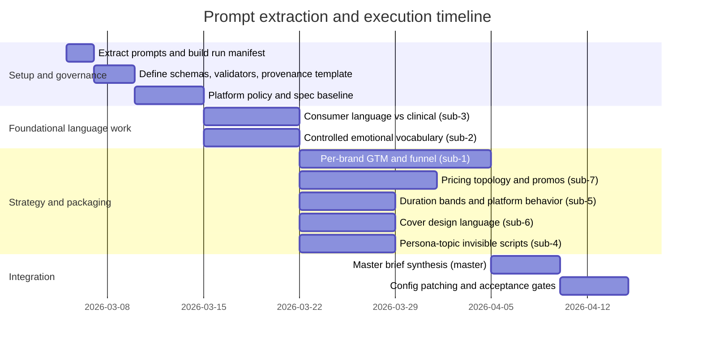

# Deep Research Report on Extracting and Executing File-Embedded Research Prompts

## Executive summary

The provided file defines a complete “research program” for a multi-brand self-help audiobook publisher—entity["company","Phoenix","audiobook publisher"]—including one master orchestration prompt plus seven concrete sub-prompts that collectively aim to build a 2025–2026, U.S.-market marketing intelligence brief and the underlying configuration assets needed to operationalize a “title engine” and go-to-market system across entity["company","Google Play Books","ebook/audiobook store"], entity["company","Spotify","audio streaming company"], and entity["company","Audible","audiobook service"]. In addition to the eight research prompts, the file also includes (a) an evidence/provenance schema and (b) a merge/quality checklist that function as execution governance rather than research questions. fileciteturn0file0

Across all prompts, the file repeatedly requires: self-contained deliverables with sources; structured outputs where possible (YAML/JSON) suitable for downstream configuration ingestion; explicit attention to platform compliance and spam/metadata risk; and “actionability” (e.g., implementable keyword lists, funnel messaging, pricing tiers, cover design rules). fileciteturn0file0

A key practical finding is that the prompts are not independent: consumer language work and “emotional vocabulary” constraints feed title/metadata generation and should be executed early, while pricing/cover/duration decisions must reflect platform-specific rules and commercial models (e.g., Spotify’s hour-based listening allocations and add-ons, Google Play’s a-la-carte purchase model and promotions, Audible’s credit-based membership value perception). citeturn10search5turn10search13turn10search12turn10search14turn1view0turn15view0turn15view1

Finally, “automatic execution” of prompts from a user-provided file introduces a known security class: prompt injection and instruction/data confusion. OWASP ranks Prompt Injection as a top risk for LLM applications, and empirical work shows prompt injection can succeed in real LLM-integrated systems absent robust controls. citeturn11search0turn11search2turn11search3 This report therefore lays out a safe extraction-and-execution framework (guardrails, schema validation, provenance logging, and controlled tool access) alongside prompt-by-prompt research plans, deliverables, and a consolidated timeline.

## Prompt inventory and extracted requirements

The file contains eight research prompts (one master and seven sub-prompts). These were treated as the “units of execution” because each is framed as a standalone instruction set to a research agent and has an explicit output expectation. fileciteturn0file0

### Prompt comparison table

| Prompt key | Exact name in file | Main outcome | Primary discipline | Priority recommendation | Effort (est.) | Key dependencies |
|---|---|---|---|---|---|---|
| master | “Master Prompt” | Integrated marketing intelligence brief + all sub-deliverables | Marketing intelligence synthesis | High, but last (integration step) | High | Requires outputs from all sub-prompts |
| sub-1 | “Sub-Prompt 1: Per-Brand GTM + Audience Funnel” | Per-archetype funnels, triggers, channel/keyword targeting | Growth + product marketing + SEO/ASO | Highest | High | Needs platform discovery primitives and persona assumptions |
| sub-2 | “Sub-Prompt 2: Controlled Emotional Vocabulary (Title Engine)” | Word/token inventory with conversion signal vs spam risk | Copy strategy + compliance + experimentation | Highest | Med–High | Needs platform metadata rules + proxy conversion data |
| sub-3 | “Sub-Prompt 3: Consumer Language vs Clinical” | Consumer phrasing clusters and “avoid/translate” guidance | Consumer health linguistics + SEO | Highest | Medium | Needs SEO keyword sources + compliance constraints |
| sub-4 | “Sub-Prompt 4: Persona × Topic Invisible Scripts” | 140 “invisible scripts” statements to power hooks/positioning | Behavioral insight + messaging | High (parallel after P0) | Medium | Uses persona definitions + consumer language findings |
| sub-5 | “Sub-Prompt 5: Duration Bands + Consumption Behavior” | Format strategy by runtime band per platform | Market research + analytics | Medium–High | Med–High | Needs platform monetization mechanics + any internal completion data |
| sub-6 | “Sub-Prompt 6: Cover Design Language by Audience” | Visual language rules by segment + platform specs | Design strategy + merchandising | Medium–High | Medium | Needs platform asset specs + competitive visual audit |
| sub-7 | “Sub-Prompt 7: Pricing Topology + Discount Psychology” | Price tiers, promo playbooks, bundling strategy by platform | Pricing strategy + competitive analysis | Highest (ties to revenue) | High | Needs platform promo rules + hourly/credit model constraints |

All prompt titles, scope, and operational constraints are taken directly from the file. fileciteturn0file0

### Verbatim prompt texts extracted from the file

The following blocks reproduce the prompt wording exactly as contained in the user-provided file. fileciteturn0file0

#### Master prompt verbatim

```text
You are a deep research agent. You will produce a complete marketing intelligence brief for Phoenix, a multi-brand self-help audiobook publisher launching 1,008 titles across 24 brands on Google Play, Spotify, and Audible in 2025–2026 (U.S. market).

OUTPUT REQUIREMENTS:
- Structured, scannable, with headings and bullets.
- Each sub-topic must include: sources, data points, actionable recommendations, and examples.
- Prefer primary sources (platform docs, earnings reports, search data). Cite sources clearly.
- Generate deliverables that can feed directly into config files / title-engine rules.

RESEARCH DELIVERABLES:
1. Per-brand GTM + audience funnel (24 archetypes)
2. Controlled emotional vocabulary for title conversion (word list, used safely)
3. Consumer language vs clinical terms (search phrasing clusters)
4. Persona × topic “invisible scripts” (messaging hooks)
5. Duration bands & consumption behavior per platform
6. Cover design language by audience (visual strategy + examples)
7. Pricing topology + discount psychology per platform

CONTEXT:
- Phoenix publishes short-form, practice-based self-help.
- It operates multiple personas/archetypes (e.g. Calm Authority, Tough Love Coach, etc.)
- Needs high-volume title generation without triggering spam detection.
- Must optimize for store search and conversion across platforms.

REQUIRED OUTPUT FORMAT:
- Output in structured format (YAML or JSON) where possible.
- Include a final section: “Implementation Notes” that maps into these config targets:
  - /configs/brand_archetypes.yaml
  - /configs/lexicon_emotion.yaml
  - /configs/lexicon_consumer_vs_clinical.yaml
  - /configs/invisible_scripts.yaml
  - /configs/duration_strategy.yaml
  - /configs/cover_language.yaml
  - /configs/pricing_topology.yaml

CRITICAL:
- Avoid hallucinations. If data isn’t available, say so and provide best proxy + how to verify.
- Highlight platform-specific constraints and risk flags.
- Keep recommendations measured and testable (A/B test suggestions).
```

#### Sub-prompt on per-brand GTM and funnel verbatim

```text
Sub-Prompt 1: Per-Brand GTM + Audience Funnel

For each of Phoenix’s 24 brand archetypes:
- Define the core problem the listener is trying to solve.
- Identify the top 3 emotional triggers + language patterns.
- Map the audience funnel:
  - Awareness: keywords + content hooks
  - Consideration: differentiators + proof points
  - Conversion: title/cover cues + urgency nudges
  - Retention: what drives repeat listening / series follow-through
- Recommend acquisition channels (SEO, paid search, in-platform recs, email, etc.)
- Provide keyword clusters with search volume estimates where available.

Output as YAML:
brand_archetypes:
  - name:
    target_persona:
    core_problem:
    emotional_triggers:
    awareness_keywords:
    consideration_messaging:
    conversion_cues:
    retention_hooks:
    channels:
```

#### Sub-prompt on controlled emotional vocabulary verbatim

```text
Sub-Prompt 2: Controlled Emotional Vocabulary (Title Engine)

Goal: Identify the top-performing emotional words that drive clicks/conversion for self-help audiobooks, without triggering spam or misleading metadata penalties.

Deliver:
- A ranked list of emotional words (fear, regret, calm, confidence, etc.)
- For each word:
  - conversion performance signal (where possible)
  - platform risk level (low/medium/high) for spam detection
  - safe usage patterns (e.g., “relief from anxiety” vs “cure anxiety fast”)
  - banned adjacent terms or phrasing to avoid
- Special emphasis on: addiction, trauma, anxiety, dieting, depression, triggers that may be flagged.

Start with these candidate words:
fear, regret, shame, stuck, overwhelmed, burned out, anxious, lonely, numb, craving, relapse, binge, spiraling, self-sabotage,
calm, peace, grounded, clarity, clarity, relief, safe, secure, confident, strong, disciplined, focused, resilient, steady,
reset, heal, repair, repair, rewire, regulate, regulation, detox, clean, correct, fix.

Output as YAML:
lexicon_emotion:
  - word:
    intent_cluster:
    conversion_signal:
    platform_risk:
    safe_patterns:
    avoid_patterns:
```

#### Sub-prompt on consumer language vs clinical verbatim

```text
Sub-Prompt 3: Consumer Language vs Clinical

Goal: Identify the difference between how real users search vs how clinicians describe issues, especially for addiction/recovery, mental health, dieting, and self-regulation.

Deliver:
- For each domain topic (anxiety, binge eating, relapse, etc.):
  - Common consumer phrases + slang
  - Clinical terms
  - Search phrasing clusters (what users actually type)
  - “Avoid list” of clinical or stigmatizing terms that reduce search performance or trigger flags
  - Recommended “bridge language” (safe, consumer-friendly but compliant)

Output as YAML:
lexicon_consumer_vs_clinical:
  - topic:
    consumer_phrases:
    clinical_terms:
    search_clusters:
    avoid_terms:
    bridge_language:
```

#### Sub-prompt on persona × topic invisible scripts verbatim

```text
Sub-Prompt 4: Persona × Topic Invisible Scripts

Goal: Generate “invisible scripts” — the hidden emotional motivations people have that they don’t say directly, but that drive audiobook purchases.

Personas:
- burned-out nurse
- recovering alcoholic
- overeating office worker
- anxious college student
- postpartum mom
- lonely middle-aged man
- productivity-obsessed founder

Topics:
- anxiety and panic
- relapse prevention
- emotional eating
- discipline and focus
- sleep and recovery
- confidence and identity
- loneliness and belonging
- grief and change
- anger and resentment
- trauma and triggers

Deliver:
- A matrix of persona × topic.
- For each cell, generate 2 “invisible scripts” statements in first person.
- Scripts must be plausible, raw, and specific (not generic affirmations).
- Skip combinations that don’t make sense; note why.

Output as YAML:
invisible_scripts:
  - persona:
    topic:
    scripts:
      - ...
      - ...
    notes:
```

#### Sub-prompt on duration bands and consumption behavior verbatim

```text
Sub-Prompt 5: Duration Bands + Consumption Behavior

Goal: Determine what audiobook lengths perform best on each platform for self-help content, and why.

Deliver:
- Define duration bands (e.g., 15–30 min, 30–60, 1–2h, 2–4h, 4–8h, 8h+)
- For each platform (Google Play, Spotify, Audible):
  - Which duration bands match user behavior (micro-sessions vs long listens)
  - How pricing, credits, subscription models affect length preference
  - Completion rates and return likelihood by length (if data exists)
  - Recommended packaging strategy for Phoenix’s catalog (series, bundles, “quick wins”)

Output as YAML:
duration_strategy:
  - platform:
    duration_bands:
      - band:
        best_for:
        rationale:
        packaging_notes:
```

#### Sub-prompt on cover design language by audience verbatim

```text
Sub-Prompt 6: Cover Design Language by Audience

Goal: Define the visual language that best converts for each audience segment, with attention to platform thumbnail behavior.

Segments:
- anxious + overwhelmed
- addiction + recovery
- dieting + binge eating
- discipline + productivity
- trauma + emotional regulation

Deliver:
- For each segment:
  - typography style (bold, soft, handwritten, condensed, etc.)
  - color palettes (high-contrast, muted, pastel, etc.)
  - imagery styles (abstract shapes, person silhouette, nature, symbols, etc.)
  - avoid-list (imagery or words that reduce trust or trigger flags)
  - examples of successful covers (describe, don’t generate images)

Also include platform format constraints (size, text legibility on thumbnails, etc.)

Output as YAML:
cover_language:
  - segment:
    typography:
    colors:
    imagery:
    avoid:
    examples:
```

#### Sub-prompt on pricing topology and discount psychology verbatim

```text
Sub-Prompt 7: Pricing Topology + Discount Psychology

Goal: Build a pricing strategy framework that maximizes conversion while maintaining long-term value perception across platforms.

Deliver:
- For each platform:
  - baseline pricing expectations for self-help by duration
  - how discounts influence perceived value vs “cheap spam” perception
  - recommended price ladders (entry, standard, premium)
  - bundling strategies (series bundles, multi-pack)
  - promo playbooks (launch discount vs evergreen)
- Include Google Play bundle rules (15/25/35% off)
- Include Spotify “free hours” model considerations
- Include Audible credit psychology and price anchoring
- Include parity constraints (price there ≤ elsewhere)

Output as YAML:
pricing_topology:
  - platform:
    duration_pricing_bands:
    discount_rules:
    price_ladders:
    bundling:
    promo_playbooks:
    risks:
```

## Categorization and priority assessment

The prompts cluster into four practical workstreams:

**Audience and discovery strategy**: sub-1 (brand funnels) plus parts of sub-3 (search phrasing) and sub-4 (hooks). This work determines who you target, how you phrase the promise, and where demand is discoverable.

**Metadata and compliance language**: sub-2 (emotional lexicon) + sub-3 (consumer vs clinical). These two are foundational for “high-volume title generation without triggering spam detection,” explicitly stated as a core system need. fileciteturn0file0 Platform policies substantiate why this is non-trivial: Google Play Books explicitly prohibits “spam, misleading & disappointing content,” including “metadata that’s confusingly similar to existing books” and other spam-like metadata practices. citeturn3view0 Spotify’s audiobook metadata guidance similarly restricts certain title/description patterns (e.g., avoiding pricing language or misleading physical-content references) and requires uniqueness (e.g., “Do not duplicate descriptions”). citeturn4view0turn5view1

**Packaging decisions (format, pricing, promotions)**: sub-5 (duration) and sub-7 (pricing), plus the platform-policy portion of sub-6 (cover specs). Here, platform business models are load-bearing constraints: Spotify provides audiobook listening time in eligible Premium plans and also sells add-ons for more hours, meaning “hours” are an explicit consumption budget. citeturn10search5turn10search13turn10search0 Google Play Books positions itself as “no subscription needed” (a-la-carte purchase), while also providing promo codes and scheduled promotional pricing within Partner Center functionality. citeturn10search14turn15view0turn15view1 Audible membership plans prominently use credits (“1 credit a month to buy any title”), which changes what “good value” feels like to customers relative to a short-form title. citeturn10search12turn10search10

**Merchandising and creative execution**: sub-6 (cover language) and sub-4 (invisible scripts). Even though these are “creative,” they are still constrained by platform asset rules (image formats, legibility) and by consumer-language findings.

### Priority recommendation and sequencing logic

A practical run order (assuming you want to minimize rework) is:

1) **Validation baseline and platform constraints** (cross-cutting): capture and codify platform rules that affect titles, descriptions, cover art, and promotions. This prevents generating content that later fails a compliance or ingestion gate. citeturn3view0turn4view0turn6view1turn7view0turn15view0turn15view1turn1view0

2) **Consumer language vs clinical** (sub-3): establishes permissible, high-intent phrasing and a “bridge language” mapping—particularly important for sensitive areas (addiction, trauma, depression) that can intersect with content policy boundaries. citeturn12search5turn12search2turn3view0

3) **Controlled emotional vocabulary** (sub-2): can now be built atop the language constraints from sub-3 and platform policy, reducing the risk of “high-volume title generation” creating “misleading titles/descriptions” or disallowed promises. citeturn3view0turn4view0turn5view0

4) **Per-brand GTM and funnel** (sub-1): uses the lexicons and policy knowledge to produce more accurate keyword clusters, funnel messaging, and conversion cues per archetype. For Spotify in particular, discovery primitives now include Audiobook Charts (weekly rankings based on listening and engagement) and other platform-native discovery surfaces that can be used as both a research dataset and a channel strategy input. citeturn18search10turn13search4

5) **Pricing, duration, cover language, invisible scripts** (sub-7, sub-5, sub-6, sub-4): these can run in parallel once core language constraints are klarified, but pricing/duration should be aligned because platform guidance sometimes links price ranges to runtime (e.g., Spotify’s metadata guide includes duration-based price guidance). citeturn4view0turn5view2turn10search5turn10search12turn10search14

6) **Master synthesis**: integrate outputs into the specified config targets.

### Missing details and ambiguities explicitly left unspecified in the file

The file is clear about *what artifacts* should be produced but does not specify several inputs that materially affect both research effort and recommendation confidence:

- **Catalog specifics**: no title list, topic taxonomy, author/narrator positioning, or current performance baselines for any part of the 1,008-title catalog (unspecified). fileciteturn0file0  
- **Definition of “conversion signal”**: whether conversion means store-page click-through, wishlist/add, purchase, completion, series follow-through, or repeat purchase is not defined (unspecified). fileciteturn0file0  
- **Data access**: access to platform analytics (e.g., Spotify for Authors insights, Google Play transaction reports, Audible/ACX dashboards) is not stated (unspecified). fileciteturn0file0  
- **Competitive set**: no explicit competitor list, “comparison shelf” titles, or target subcategories (unspecified). fileciteturn0file0  
- **Compliance posture**: whether Phoenix content includes clinical advice, health claims, or regulated claims (supplements, medical claims) is not stated (unspecified). fileciteturn0file0

These gaps do not block execution, but they change what counts as “primary evidence” vs “best-available proxy,” which the master prompt instructs you to label explicitly. fileciteturn0file0

## Secure extraction and execution framework

### Why a “prompt execution framework” is necessary

When prompts are embedded in a user-provided file, the “instructions” are, by default, untrusted text. OWASP describes prompt injection as a vulnerability category where inputs can alter the model’s behavior or outputs in unintended ways, and it is ranked as a top LLM risk. citeturn11search0turn11search3 Research on prompt injection in real LLM-integrated applications further demonstrates that injection techniques can lead to harmful outcomes like prompt theft or unauthorized behavior if systems are not designed with robust mitigation. citeturn11search2

This matters operationally even for “marketing research” prompts because a compromised or malformed prompt could: (a) override house style requirements, (b) suppress provenance requirements, (c) request disallowed data access, or (d) push unsafe health claims—resulting in policy violations or brand risk. Google Play Books’ policies explicitly include “spam, misleading & disappointing content” issues and describe enforcement via a mix of automated and human evaluation. citeturn3view0

### Recommended extraction pipeline

The following is a safe, implementation-oriented model for “extract → analyze → execute → validate → merge,” consistent with the governance blocks in the file. fileciteturn0file0

```mermaid
flowchart TD
  A[Input: prompt file\n(Markdown or plain text)] --> B[Parse & segment\n(headings, fenced blocks)]
  B --> C[Prompt registry\nID • title • verbatim text • scope]
  C --> D[Static checks\npolicy terms • unsafe claims • missing metadata]
  D --> E[Plan generation\nkey questions • sources • strategies]
  E --> F[Execution sandbox\nweb research • dataset collection • drafts]
  F --> G[Schema validation\nYAML/JSON • required fields]
  G --> H[Provenance block\nsources • date • assumptions]
  H --> I[Acceptance gates\nlint • validators • reviewer checklist]
  I --> J[Merge outputs\nconfig patches + final brief]
```

This pipeline treats the file as a *specification input* and makes execution contingent on validations (schema + policy + completeness), aligning with the file’s own explicit “avoid hallucinations” and “provide proxies + how to verify” requirements. fileciteturn0file0

### Execution guardrails aligned to credible standards

A pragmatic set of controls (technical + process) that map well to established guidance:

- **Instruction/data separation**: treat “prompt text” as data; compile/run it only through a wrapper that enforces fixed system constraints and disallows arbitrary tool use. This is a core mitigation theme in prompt injection risk discussions. citeturn11search0turn11search2  
- **Least privilege tool access**: allow only the minimal browsing, quoting, and data transformation capabilities required for the current sub-prompt (e.g., do not allow code execution or external actions for a copy-only run). OWASP lists multiple LLM risks associated with insecure output handling and sensitive information disclosure that are exacerbated when outputs can trigger actions. citeturn11search3turn11search0  
- **Provenance and reproducibility**: store execution date, sources, and key assumptions as required output. This mirrors general risk-management principles (traceability and trustworthiness) emphasized in the entity["organization","NIST","us standards institute"] AI Risk Management Framework overview. citeturn11search11  
- **Schema-first outputs**: generate YAML/JSON against a schema (required keys, allowed enums), then refuse merge if schema fails; this directly supports the file’s config-target mapping and acceptance gates. fileciteturn0file0  
- **Policy-aware copy rules**: enforce a “no medical cure claims” policy and platform-specific forbidden phrases (e.g., “price” language in certain metadata fields) before producing any title-engine outputs. Spotify’s audiobook metadata guidance explicitly disallows pricing language in titles and other misleading patterns. citeturn4view0turn5view1

### If the file were not provided

This engagement was possible because the prompts were in a readable Markdown file. In general, a prompt-execution system should accept: `.md`, `.txt`, `.docx`, `.pdf` (extractable text), and `.yaml/.json` (already structured). Minimum metadata needed for safe execution: document language; target market(s); intended platforms; required output schema/targets; forbidden claims categories; and a required provenance format (date, sources, assumptions). citeturn11search0turn11search11

## Research plans and proposed outputs per prompt

This section translates each prompt into: implied objective, explicit constraints, key questions, primary sources, search/analysis strategy, effort estimate, and proposed deliverables. Where a prompt depends on platform rules, this section prioritizes official platform documentation.

### Master prompt

**Referenced baseline context**: The U.S. audiobook market has recently reported renewed double-digit growth; the Audio Publishers Association reported 2024 U.S. audiobook sales revenue of $2.22B (+13% YoY) and noted digital formats dominate revenue. citeturn12search0 The master prompt’s platform focus is consistent with current platform investment in audiobook discovery (e.g., Spotify’s introduction of weekly Audiobook Charts based on listening behavior and engagement). citeturn18search10turn13search4

**Research plan**

- **Key questions**: What are Phoenix’s target audiences and “jobs-to-be-done” by brand; what language can be used safely; what packaging optimizes conversion by platform; what operational rules prevent spam/metadata rejection?
- **Primary sources**: Google Play Books Partner Center policies and promotions rules; Spotify for Authors upload + metadata guidance; Audible/ACX asset requirements; industry market sizing (APA, Edison). citeturn3view0turn15view0turn15view1turn9view0turn4view0turn7view0turn12search0turn12search4
- **Strategy**: run sub-prompts first; synthesize into config-ready YAML plus a narrative brief; explicitly label any proxies where direct data is unavailable.
- **Effort**: High (integration + quality control across all workstreams).
- **Suggested deliverables**: (1) marketing intelligence brief (slide deck + memo), (2) unified “ruleset” appendix for title engine + packaging, (3) config file patches for all target YAMLs in the master prompt. fileciteturn0file0

### Sub-prompt on per-brand GTM and funnel

**Referenced baseline context**: Demand and discovery channels differ by platform: Spotify is increasing in-app audiobook discovery via weekly charts and other audiobook features, meaning platform-native surfaces can serve as both channel and competitive intelligence dataset. citeturn18search10turn13search4turn9view0 For Google Play, the Partner Center offers structured promotion mechanisms (promo codes, scheduled promotional pricing), implying that “channel strategy” can include controlled discounting actions. citeturn15view0turn15view1

**Research plan**

- **Key questions**: What is the dominant “core problem” and emotional trigger per archetype; what are awareness keywords and consideration proof points; what are conversion cues that are compliant; what retention hooks drive series follow-through?
- **Primary sources**: platform documentation on content and metadata restrictions (Google Play Books policies; Spotify metadata rules), plus platform discovery primitives such as Spotify Audiobook Charts and internal upload guidance. citeturn3view0turn4view0turn18search10turn13search4turn9view0
- **Search strategy**: build archetype keyword clusters using (a) platform chart scraping (Spotify charts by genre), (b) Google keyword tools for search volume estimates (where accessible), and (c) competitor title/description mining; then validate against metadata policy constraints.
- **Effort**: High (24 archetypes × funnel stages × channel plans).
- **Suggested deliverables**: (1) `brand_archetypes.yaml` as specified, (2) archetype-by-archetype “one-pager” PDFs, (3) keyword cluster CSV with volume and intent labels, (4) test plan for A/B title variants per archetype. fileciteturn0file0

### Sub-prompt on controlled emotional vocabulary

**Referenced baseline context**: Platform rules create a concrete boundary around “emotional” language. Google Play Books prohibits spam and misleading content, including confusing metadata and low-quality content, and can enforce via automated and human review. citeturn3view0 Spotify’s audiobook metadata/asset guidance disallows some “promotional” or transient claims in titles (e.g., “Exclusive” as a claim), disallows pricing language in titles, and calls for descriptive, non-misleading metadata. citeturn4view0turn5view0turn5view1

For the “conversion signal” component, there is strong evidence in adjacent domains that emotional and especially negative language can change engagement: large-scale experiments on headlines found negative words increase click-through rates, and classic marketing research links high-arousal emotional content to greater sharing/virality. citeturn16search1turn16search0 These are not audiobook-store conversion studies; they mainly justify why lexical choice should be treated as a measurable lever and not “just copy.” (Inference flagged.)

**Research plan**

- **Key questions**: Which emotional tokens correlate with (a) discovery/search impressions, (b) store-page click-through, (c) add-to-library/purchase; which tokens are high-risk due to policy or misleading-claim adjacency; what “safe patterns” preserve intent without regulated claims?
- **Primary sources**: Google Play Books content policies (especially spam/misleading/metadata rules), Spotify audiobook metadata guidance (title and description constraints), and platform-specific prohibited-content or promotional-language policies where relevant. citeturn3view0turn4view0turn5view0
- **Search strategy**: construct a corpus of top-performing audiobook titles/descriptions per platform/genre; compute token lift vs baseline; label risk using policy-derived rules (e.g., “cure”/“guarantee” claims); validate candidates by manual review.
- **Effort**: Med–High (data collection + compliance labeling + scoring).
- **Suggested deliverables**: (1) `lexicon_emotion.yaml`, (2) risk taxonomy document (what triggers “high risk” and why), (3) example title templates per intent cluster, (4) A/B test queue and measurement model. fileciteturn0file0

### Sub-prompt on consumer language vs clinical

**Referenced baseline context**: A large body of consumer health vocabulary (CHV) research shows that consumer expressions often do not map cleanly onto clinical terminologies (e.g., UMLS), and that bridging vocabularies can improve retrieval and comprehension. citeturn12search5turn12search8 More recent work continues to focus on discovering and enriching CHV terms from real-world corpora, indicating vocabularies drift and must be maintained, not “set once.” citeturn12search2turn12search11

**Research plan**

- **Key questions**: For each domain topic (anxiety, relapse, binge eating, etc.), what are (a) common consumer phrases/slang, (b) clinical terms, (c) high-intent search clusters, (d) stigmatizing or low-performing terms to avoid, (e) compliant bridge language that preserves intent?
- **Primary sources**: CHV initiative resources and peer-reviewed CHV research; platform policies on misleading or explicit metadata; platform metadata constraints relevant to health claims. citeturn12search8turn12search5turn3view0turn4view0
- **Search strategy**: combine CHV literature with query mining (Google Trends/Keyword Planner where available) and platform autocomplete sampling; label terms by “clinical,” “consumer,” “stigmatizing,” and “regulated claim risk.”
- **Effort**: Medium.
- **Suggested deliverables**: (1) `lexicon_consumer_vs_clinical.yaml`, (2) “bridge-language style guide” for titles/descriptions, (3) compliance short-list for sensitive topics. fileciteturn0file0

### Sub-prompt on persona × topic invisible scripts

**Referenced baseline context**: This prompt is primarily generative/interpretive and will not have “primary-source” evidence for each script. However, it should be grounded in (a) consumer-language research (to avoid clinical/stigmatizing phrasing) and (b) platform constraints that restrict misleading or explicit content in metadata. citeturn12search5turn3view0turn4view0

**Research plan**

- **Key questions**: What are the plausible first-person “hidden motives” that drive purchases per persona/topic; what combinations should be skipped for plausibility; what language feels raw yet avoids disallowed claims?
- **Primary sources**: internal persona research (if available), CHV/consumer phrasing references for realism, and platform metadata rules to avoid disallowed claims and explicit content. citeturn12search5turn3view0turn4view0
- **Strategy**: produce drafts; run a “specificity filter” (ban generic affirmations; require concrete situations); run a compliance filter (no cure claims; avoid explicit content); validate with small human review panel.
- **Effort**: Medium (writing-heavy; validation required).
- **Suggested deliverables**: (1) `invisible_scripts.yaml`, (2) curated subset by brand archetype, (3) hook library for ads/landing pages. fileciteturn0file0

### Sub-prompt on duration bands and consumption behavior

**Referenced baseline context**: Public, platform-wide completion-rate data by audiobook duration is generally not published in a way that supports confident cross-platform claims; the master prompt requires explicitly acknowledging that gap and proposing proxies. fileciteturn0file0 Nonetheless, platform monetization mechanics provide strong constraints:

- Spotify’s audiobook access in Premium is explicitly based on monthly listening-hour allocations and add-ons for more hours, so “length in hours” is a first-order constraint for consumption and possibly conversion. citeturn10search5turn10search13turn10search0  
- Google Play Books emphasizes per-title purchase without subscription, so “short-form” can be priced and positioned as a discrete purchase rather than competing for subscription-hour share. citeturn10search14  
- Audible’s membership plans use credits as a recurring benefit to acquire “any audiobook,” shaping perceived value per credit for different runtimes. citeturn10search12turn10search10  

Additional proxy evidence about usage contexts also exists: Spotify-reported research (U.K.) indicates audiobooks get used while winding down for bed, commuting, and doing household chores—contexts that can inform packaging (chapters, “micro-sessions”) even if the geography differs from the target U.S. scope. citeturn19view0

**Research plan**

- **Key questions**: Which runtime bands fit each platform’s commerce model; what packaging (series, bundles, “quick wins”) optimizes perceived value; how should Phoenix position short-form practice-based content so it does not look like “low-value spam”?
- **Primary sources**: Spotify Premium audiobook-hour policies; Audible credit rules; Google Play a-la-carte positioning and promo capabilities; any platform guidance linking price to duration (Spotify metadata guide). citeturn10search5turn10search12turn10search14turn4view0turn5view2turn15view1
- **Strategy**: define duration bands; map each band to (a) use-case context and (b) monetization constraints; propose testable hypotheses; prioritize acquiring internal completion data if accessible.
- **Effort**: Med–High (limited public data; requires proxy reasoning + internal measurement plan).
- **Suggested deliverables**: (1) `duration_strategy.yaml`, (2) packaging playbook by platform, (3) measurement plan for completion/return by length. fileciteturn0file0

### Sub-prompt on cover design language by audience

**Referenced baseline context**: Platform constraints for cover assets are explicit and materially differ across ecosystems:

- Google Play’s audiobook cover guidance requires a 1:1 aspect ratio and recommends 2400×2400 pixels (JPEG/PNG). citeturn6view1  
- Spotify’s upload guidance recommends 1:1 cover art at 3000×3000 px (PNG/JPEG), and the Spotify for Authors metadata/asset guide details additional restrictions (e.g., no references to physical books, CDs, promotions; no book summary on cover). citeturn9view0turn4view0turn5view2  
- ACX’s official cover requirements specify square images, minimum 2400×2400 px, and prohibit references to physical CDs/media and promotional stickers/cellophane, among other constraints. citeturn7view0  

Separately, academic work supports the general proposition that covers influence consumer choice in online settings, though most studies are about print/ebook contexts rather than audiobook-specific thumbnails. citeturn17search1 (Inference flagged.)

**Research plan**

- **Key questions**: What visual codes (typography, color, imagery) signal trust and the right “promise” per segment; what patterns increase clarity and legibility at thumbnail size; what segment-specific “avoid lists” reduce risk or mistrust?
- **Primary sources**: platform asset specifications and disallowed-cover-content rules (Google Play, Spotify, ACX). citeturn6view1turn4view0turn7view0turn9view0
- **Strategy**: run a competitive “shelf audit” per segment and platform; codify winning patterns into segment design rules; cross-check against platform constraints.
- **Effort**: Medium (design analysis + structured ruleset, but no full production).
- **Suggested deliverables**: (1) `cover_language.yaml`, (2) annotated cover pattern library (“do/don’t” with described examples), (3) production checklist for designers. fileciteturn0file0

### Sub-prompt on pricing topology and discount psychology

**Referenced baseline context**: The prompt explicitly requires platform-by-platform pricing logic, accounting for bundling and promotions.

- Google Play supports bundle discounts for books in a series (including audiobooks) and allows up to three discount tiers (e.g., 15%, 25%, 35%). citeturn1view0  
- Google Play Partner Center supports promo codes for free or discounted ebooks/audiobooks (with operational limits such as campaigns per month and codes per campaign) and scheduled promotional pricing campaigns that adjust list price for date ranges and can be managed in bulk via CSV. citeturn15view0turn15view1  
- Spotify’s model includes hour-based listening access in Premium plans and add-ons for more hours, which introduces a “time budget” psychology, and Spotify’s audiobook metadata guide provides duration-based “general” retail price ranges (useful as a starting benchmark). citeturn10search5turn10search13turn4view0turn5view2  
- Audible’s membership is credit-based (customers get credits by plan; credits buy any audiobook), influencing price anchoring and perceived fairness for short vs long runtimes. citeturn10search12turn10search10  

**Research plan**

- **Key questions**: What are baseline “expected” prices per duration band and platform; how do discounts affect trust vs “cheap spam” perception; what bundling structures create “catalog pull-through” for short-form content; how should parity constraints be operationalized?
- **Primary sources**: Google Play promotions + bundle discount docs; Spotify premium hour rules and pricing guidance by duration; Audible membership/credits docs. citeturn1view0turn15view0turn15view1turn10search5turn10search12turn4view0
- **Strategy**: define pricing ladders; map to each platform’s monetization and discovery system; propose testable promo playbooks (launch vs evergreen) and governance rules to prevent “discount fatigue.”
- **Effort**: High (pricing is coupled to duration, promotions, and platform mechanics; requires competitive benchmarking and iterative testing).
- **Suggested deliverables**: (1) `pricing_topology.yaml`, (2) promo calendar templates, (3) parity-rule validator logic, (4) experiment backlog. fileciteturn0file0

## Consolidated timeline and task breakdown

The timeline below assumes a single “program run” to execute all prompts into config-ready artifacts and an integrated brief. It uses a 6-week baseline with parallelization; actual timing depends heavily on whether you have access to internal analytics and whether “24 archetypes” require stakeholder review cycles. fileciteturn0file0



### Task breakdown with outputs

| Work item | Output artifact(s) | Acceptance gate (examples) |
|---|---|---|
| Prompt extraction | Prompt registry (IDs, verbatim text, dependencies) | “No missing prompts”; verbatim text preserved fileciteturn0file0 |
| Platform baseline | Policy/spec matrix for titles, covers, promos | Policy citations attached; conflicts flagged citeturn3view0turn4view0turn6view1turn7view0turn15view0turn1view0 |
| Language lexicons | `lexicon_consumer_vs_clinical.yaml`, `lexicon_emotion.yaml` | Schema valid; “avoid claims” lint passes citeturn12search5turn3view0turn4view0 |
| GTM per archetype | `brand_archetypes.yaml` + keyword CSV | Coverage: 24 archetypes; each has funnel stages fileciteturn0file0 |
| Packaging | `duration_strategy.yaml`, `pricing_topology.yaml`, `cover_language.yaml` | Platform constraints included; promo rules consistent citeturn10search5turn15view1turn1view0turn4view0turn6view1turn7view0 |
| Messaging hooks | `invisible_scripts.yaml` | Specificity checks; no clinical claim leakage citeturn12search5turn3view0 |
| Integration | Full brief + config patches | Provenance block present; merge checklist satisfied fileciteturn0file0 |

### Recommended next steps

1) Execute a **platform policy/spec baseline** before any high-volume lexicon or title work, because policy constraints (spam/misleading metadata, cover restrictions, promo mechanics) materially shape what “safe usage patterns” can be. citeturn3view0turn4view0turn7view0turn15view0turn1view0  
2) Run **sub-3 then sub-2**, since consumer/clinical bridging reduces the chance that emotional-token selection drifts into stigmatizing or disallowed health-claim adjacency. citeturn12search5turn12search2turn3view0turn4view0  
3) Treat **pricing and duration** as a coupled design choice, especially on Spotify where listening-hour budgets and duration-based pricing guidance exist. citeturn10search5turn10search13turn4view0turn5view2  
4) Implement an execution harness that enforces provenance and schema validation, because file-embedded prompt execution is exposed to prompt injection risks recognized by OWASP and demonstrated in real-world research. citeturn11search0turn11search2turn11search3  
5) Define, up front, what “conversion signal” means and what measurement sources are accessible (Spotify for Authors analytics, Google Play transaction reports, etc.); the master prompt explicitly requires stating when data is unavailable and proposing proxies plus verification steps. fileciteturn0file0