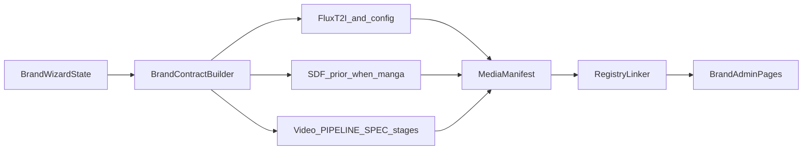

# Brand Admin Media Generation Spec

## Objective

Define the canonical media-generation contract for Brand Admin onboarding so wizard decisions produce deterministic image/video assets, pass explicit QA gates, and map cleanly into registry-backed proof surfaces.

**Implementation binding (this repo):** Brand Admin does not invent a parallel render stack. Still images and videos must be produced through the pipelines below unless a future ADR explicitly replaces them.

**Related operational pack:** [BRAND_ADMIN_ONBOARDING_IMAGE_PACK_V1_TRUST_LAYER_SPEC.md](./BRAND_ADMIN_ONBOARDING_IMAGE_PACK_V1_TRUST_LAYER_SPEC.md) — 19-slot trust-layer prompts (A), selection rubric (B), page/wizard placement map (C), registry starter shapes, rollout PR order.

**Audio / TTS (onboarding):** [BRAND_ADMIN_ONBOARDING_TTS_SPEC.md](./BRAND_ADMIN_ONBOARDING_TTS_SPEC.md) — ElevenLabs brand briefing narration, cumulative SSML/voice profile, `scripts/onboarding/generate_briefing_narration.py`.

---

## 1. Purpose, non-goals, constraints

### Purpose

- Keep media generation aligned to one authoritative input contract from the Brand Wizard.
- Define generation behavior for images and videos in one place.
- Define quality and safety gates required before assets are marked `ready`.

### Non-goals

- Building a new UI component system.
- Replacing the existing onboarding gallery architecture.
- Redesigning backend orchestration in this phase.

### Constraints

- The wizard is the authoritative source of the brand contract.
- Media generation is contract-locked: no manual drift from wizard decisions.
- Registry status controls proof rendering (`ready` inline media, otherwise proof-pending fallback).

---

## 2. Unified generation contract

All generation requests must normalize to one contract object.

### Required fields

- `brand_id`
- `lane`
- `market`
- `locale`
- `persona`
- `topic`
- `brand_posture`
- `platform_mix`
- `style_variant`

### Optional fields

- `tone_modifiers`
- `campaign_goal`
- `duration_hint` (video)
- `comparison_set_id`

### Defaults and normalization

- Unknown optional fields are ignored, not inferred.
- Empty optional arrays normalize to `[]`.
- Locale values normalize to BCP-47 form (for example `en-US`, `ja-JP`, `zh-TW`).
- Missing required fields fail request validation.

---

## 3. Text-to-image generation

Brand Admin **static** proof assets (covers, social, thumbnails, story stills, and FLUX-backed bank images that feed video) must use the repo **text-to-image (T2I)** stack — not ad-hoc prompts or external tools that bypass config.

### Canonical T2I pipeline (FLUX + config)

Authority and wiring:

- [docs/VIDEO_IMAGE_MASTER_PROMPT_SPEC.md](../docs/VIDEO_IMAGE_MASTER_PROMPT_SPEC.md) — three-part prompt template, negatives, Cloudflare Workers AI FLUX endpoint contract.
- [docs/VIDEO_AND_COVER_ART_FLUX_WIRING.md](../docs/VIDEO_AND_COVER_ART_FLUX_WIRING.md) — `flux_client.py`, `run_flux_generate.py`, `run_flux_bank_build.py`, image bank index, asset resolver integration.
- Config: `config/video/image_prompt_templates.yaml`, `config/video/brand_style_tokens.yaml`, `config/video/prompt_constraints.yaml` (and related keys referenced by those files).
- Scripts: `scripts/video/run_flux_generate.py`, `scripts/video/run_flux_bank_build.py`, `scripts/video/flux_client.py`.

### Manga / character-consistent imagery — SDF geometric prior

When registry rows require **manga panels**, **character-locked** visuals, or `product_family: manga`, T2I stills alone are insufficient. Generation must follow the **SDF (Signed Distance Field) geometric prior** and ComfyUI conditioning path defined in [specs/MANGA_MODE_SYSTEM_SPEC.md](../specs/MANGA_MODE_SYSTEM_SPEC.md) (Layer 2.5, §6.7 — `sdf_projector`, SDF → 2D depth/contour maps, ControlNet + LoRA stack). That is the repo’s **text-to-image + SDF** path for consistent character geometry at scale.

Non-manga onboarding stills (e.g. generic illustrative covers) use the FLUX T2I section above without the SDF layer unless product definition requires it.

### Output families

- `cover`
- `social`
- `thumbnail`
- `story`

### Prompt composition

Image prompts must be composed only from normalized contract fields plus approved template text, resolved through `image_prompt_templates.yaml` / `brand_style_tokens.yaml` (and manga prompt blocks per MANGA_MODE_SYSTEM_SPEC when SDF applies).

### Determinism and versioning

- `seed` is required for deterministic reproduction.
- `template_id` identifies the prompt template revision.
- `model_id` identifies the model/version used.

### QA gates (image)

A generated image may be marked `ready` only if it passes:

- Contract fidelity (matches lane/persona/topic/posture intent)
- Rendering quality (no critical artifacts/corruption)
- Brand safety/policy checks
- Format/size checks for target channel

### Rejection reasons (image)

- `contract_mismatch`
- `quality_failure`
- `policy_failure`
- `format_failure`

---

## 4. Video generation

Brand Admin **motion** proof assets must be produced through the repo **video pipeline** — the same metadata-driven engine used elsewhere, not a one-off exporter.

### Canonical video pipeline

Authority:

- [docs/VIDEO_PIPELINE_SPEC.md](../docs/VIDEO_PIPELINE_SPEC.md) — stage order (script → shot planner → asset resolver → timeline → captions → renderer → QC → provenance → metadata → distribution), schemas, and config tables.
- Artifacts: `schemas/video/` (e.g. `render_manifest_v1`, image bank asset, timeline contracts).
- Config: `config/video/` (pacing, captions, brand style tokens, channel registry, motion policy, etc.).
- Scripts: `scripts/video/` — e.g. `prepare_script_segments.py`, `run_shot_planner.py`, `run_asset_resolver.py`, `run_timeline_builder.py`, `run_render.py`, `run_qc.py`, `run_pipeline.py`, plus FLUX bank/build steps that feed the asset resolver per [docs/VIDEO_AND_COVER_ART_FLUX_WIRING.md](../docs/VIDEO_AND_COVER_ART_FLUX_WIRING.md).
- Golden fixtures: `fixtures/video_pipeline/` for regression and contract checks.

Still frames inside videos are resolved via the **image bank** and T2I path in §3; the **assembled video file** is always the output of the video pipeline stages above.

### Output families

- `video_15s`
- `video_30s`
- `video_45s`
- channel variants derived from the same contract

### Scene-template contract

- Scene plans inherit style and posture from the brand contract.
- Scene templates must declare required slots (hook, body, CTA, outro).

### Subtitle and voiceover rules

- Subtitles must align with locale and readability constraints.
- Voiceover style must match brand posture and channel-safe policy.

### QA gates (video)

A generated video may be marked `ready` only if it passes:

- Contract fidelity
- Audio/video sync and legibility checks
- Policy and safety checks
- Duration and channel-spec checks

### Rejection reasons (video)

- `contract_mismatch`
- `sync_or_legibility_failure`
- `policy_failure`
- `duration_or_channel_failure`

---

## 5. Shared safety and compliance

- Run policy checks before asset publication.
- Flag sensitive content for fallback handling.
- On policy failure, keep status non-ready and return a structured rejection reason.

---

## 6. Registry and proof linkage

Generated assets map into `config/onboarding/example_registry.json` using:

- `proof_intent`
- `production_fidelity`
- `product_family`

Primary proof is inline media from registry rows with `status: "ready"`. Non-ready rows render proof-pending fallback.

---

## 7. API and artifact contracts

### Request contract

Input payload includes normalized brand contract + generation target metadata.

### Response contract

Return structured result with:

- `status`
- `asset_path`
- `model_id`
- `template_id`
- `seed`
- `rejection_reason` (when not ready)

### Artifact conventions

- Manifest per generation batch with deterministic metadata
- Storage path convention grouped by product family/lane/locale
- Traceable run identifiers for audit and replay

---

## 8. Rollout phases

### V1 — deterministic packs

- Stable templates, fixed seeds, predictable output packs.

### V2 — guided iteration controls

- Controlled variation knobs while preserving contract lock.

### V3 — campaign automation

- Automated batch generation workflows with contract-aware guardrails.

---

## 9. Observability and acceptance criteria

### Launch metrics

- Ready-rate by family (`image`, `video`)
- Rejection-rate by reason
- Time-to-ready percentile

### SLO examples

- Generation success SLO per output family
- Maximum stale-ready tolerance for published assets

### Release gates

- No `ready` asset without recorded determinism metadata.
- No policy-failed asset in published registry state.

---

## 10. Integration design

